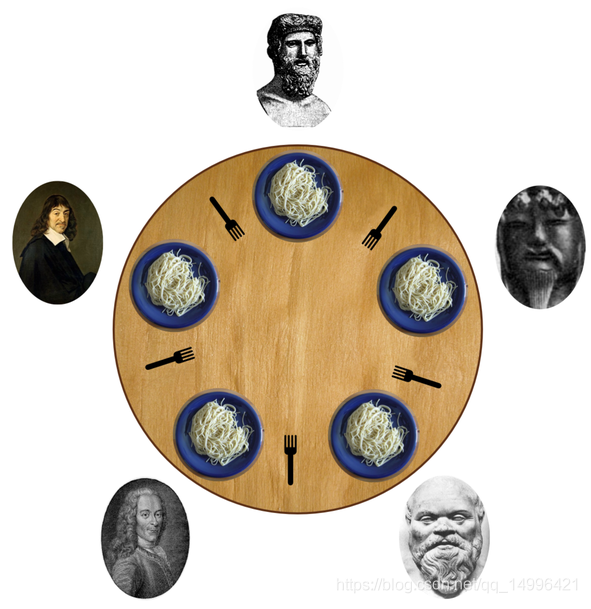

# 资源分配


在一个进程之内的资源访问,首选临界区 ,

互斥体: 多个线程对于同一个资源的有序访问,这个挺好的,

事件:可以实现多个线程同时的读取一个资源,而不是写入,也可以实现多个线程对同一个资源的有序访问,相当于互斥体

信号量: 它基于事件,限制了事件的次数,可以精确控制信号发出的个数

事件和信号量没有太大的区别


# 基础


## 临界区

对应的结构体 `CRITICAL_SECTION cs`

```
typedef struct _RTL_CRITICAL_SECTION {
    PRTL_CRITICAL_SECTION_DEBUG DebugInfo;
    LONG LockCount;
    LONG RecursionCount;
    HANDLE OwningThread;
    HANDLE LockSemaphore;
    DWORD SpinCount;
} RTL_CRITICAL_SECTION, *PRTL_CRITICAL_SECTION;
```

如何使用?

先创建一个全局的临界区

在使用的时候,初始化一下它

需要获取某个资源, 就得等待

`EnterCriticalSection(&g_cs);`

需要释放某个资源就得释放

`LeaveCriticalSection(&g_cs);//计数器-1`

最后不用了就删除

`DeleteCriticalSection(&g_cs);`

```c
// Win32-Console-01.cpp : 定义控制台应用程序的入口点。
// devC++

#include <windows.h>
#include <stdio.h>
DWORD WINAPI ThreadProc01(LPVOID lpParameter);
DWORD WINAPI ThreadProc02(LPVOID lpParameter);

CRITICAL_SECTION cs;

int main()
{
	InitializeCriticalSection(&cs);
	HANDLE hThreads[2];
	hThreads[0] = CreateThread(NULL, 0, ThreadProc01, NULL, 0, NULL);
	hThreads[1] = CreateThread(NULL, 0, ThreadProc02, NULL, 0, NULL);

	WaitForMultipleObjects(2, hThreads, TRUE, INFINITE);
	DeleteCriticalSection(&cs);
	return 0;
}

DWORD WINAPI ThreadProc01(LPVOID lpParameter)
{
	int x = 0;
	for (x = 0; x < 2; x++)
	{
		EnterCriticalSection(&cs);//获取令牌

		Sleep(100);
		printf("A:%d %d %d\n", cs.LockCount, cs.RecursionCount, cs.OwningThread);

		LeaveCriticalSection(&cs);//丢弃令牌

	}
	return 0;
}

DWORD WINAPI ThreadProc02(LPVOID lpParameter)
{
	for (int x = 0; x < 2; x++)
	{
		EnterCriticalSection(&cs);

		Sleep(100);
		printf("B:%d %d %d\n", cs.LockCount, cs.RecursionCount, cs.OwningThread);

		LeaveCriticalSection(&cs);
	}

	return 0;
}

```

## 互斥加锁

解决多个线程下对同一个代码资源的共享问题

也可以实现多个进程之间的资源访问

使用如下

先创建互斥

```c
HANDLE WINAPI CreateMutex(
  __in_opt  	LPSECURITY_ATTRIBUTES lpMutexAttributes, //安全属性,垃圾,NULL
  __in      	BOOL bInitialOwner,
            		//true 互斥信号这属于当前线程
            		//false 互斥信号不属于任何人
  __in_opt  LPCTSTR lpName //互斥的字符串名字,随便取
);
//返回线程句柄的东西,就是创建了一个内存空间
//也就是这个空间最后是要释放的
```

比如`g_hMUtex=CreateMutex(NULL,FALSE,"HB");`

通常,我们让 bInitialOwner=FALSE

因为这样实现了在任意地方创建,可以在任意地方获取

如果是TRUE的话,就让该互斥体只属于了当前线程,显得不那么灵活

该句柄是等待句柄,所以要使用的话直接就坐等互次信号 `WaitForSingleObject(hHandle);`

当使用完毕就释放  `ReleaseMutex(hHandle)`

最后的最后就关闭该句柄 `CloseHandle(hHandle)`


```c
#include <stdio.h>
#include <stdlib.h>
#include <windows.h>

int sharedVariable = 0;
HANDLE mutex;

DWORD WINAPI threadFunction(LPVOID lpParam)
{
    int threadID = *(int*)lpParam;
    // 对共享变量进行互斥访问
    WaitForSingleObject(mutex, INFINITE);
    sharedVariable++; // 访问共享变量
    printf("NO.%d 获取到 = %d\n", threadID, sharedVariable);
    ReleaseMutex(mutex);
    printf("NO.%d 丢弃\n", threadID);
    return 0;
}

int main()
{
    HANDLE threads[2];
    int threadIDs[2];
    int i;

    // 创建互斥体
    mutex = CreateMutex(NULL, FALSE, NULL);

    // 创建线程
    for (i = 0; i < 2; i++)
    {
        threadIDs[i] = i;
        threads[i] = CreateThread(NULL, 0, threadFunction, &threadIDs[i], 0, NULL);
    }

    // 等待线程完成
    WaitForMultipleObjects(2, threads, TRUE, INFINITE);

    // 关闭线程句柄
    for (i = 0; i < 2; i++)
    {
        CloseHandle(threads[i]);
    }
    // 关闭互斥体句柄
    CloseHandle(mutex);

    return 0;
}

```

如果是多个进程之间的通信

打开互斥体

```
HANDLE WINAPI OpenMutex(
  __in  DWORD dwDesiredAccess,
  __in  BOOL bInheritHandle,
  __in  LPCTSTR lpName
);
```

例子代码

```c
// Win32_Console_02.cpp : 定义控制台应用程序的入口点。
//

#include <windows.h>
#include <stdio.h>
int main()
{
	HANDLE g_hMUtex=CreateMutex(NULL,FALSE,"dqx");
	printf("hello A\n");
	return 0;
}

```

```c
// Win32_Console_02.cpp : 定义控制台应用程序的入口点。
//

#include <windows.h>
#include <stdio.h>
int main()
{
	HANDLE g_hMUtex=OpenMutex(MUTEX_ALL_ACCESS,FALSE,"dqx");
	WaitForSingleObject( g_hMUtex,-1);
	ReleaseMutex(g_hMUtex);
	printf("hello B");
	return 0;
}

```


## 事件

可以实现多个线程同时的读取一个资源 如何使用?

```
HANDLE WINAPI CreateEvent
(
  __in_opt  LPSECURITY_ATTRIBUTES lpEventAttributes, //安全属性,直接设置为NULL就可
  __in      BOOL bManualReset,
    				//有信号->无信号的过程
    				//TRUE  手动控制,也就是需要手动关闭信号,发展无法关闭信号,resetevent
    				//FALSE 自动控制,也就是WaitForSingleObject后,自动的变为无信号,于是需要手动发信号 setevent
  __in      BOOL bInitialState,//事件的状态
    				//true  一创建就有信号,别人可以通过wait获取 waitforsingleobject
    				//false 一开始没信号,也就是别人和自己都无法wait得到,必须有人setevent
  __in_opt  LPCTSTR lpName //事件的字符串名字
);

```

先创建一个互次体

最好不要去手动复位,而要自动复位,那样会存在一个线程安全的问题

```
BOOL bManualReset, 有信号->无信号的过程
    TRUE    手动控制 ,如果不去手动干扰的话,信号一旦发出,就会一直存在,适用于多个线程并发的读取一个资源
            注意是读取一个资源,可以写TRUE, 写入, 一定不TRUE
    FALSE  	自动控制,也就是WaitForSingleObject接触阻塞后,自动的变为无信号,信号消失
```

获取一个信号: `WaitForSingleObject(event, INFINITE);`

发送的信号 : 信号 无->有

```
BOOL WINAPI SetEvent(
  __in  HANDLE hEvent //创建事件时返回的句柄
);
```

消除已有的信号: 信号 有->无

```c
BOOL WINAPI ResetEvent(
  __in  HANDLE hEvent //创建事件时返回的句柄
);

```


```c
#include <stdio.h>
#include <stdlib.h>
#include <windows.h>

int sharedVariable = 0;
HANDLE event;

DWORD WINAPI T(LPVOID lpParam)
{
    int i = 0;
    int threadID = *(int*)lpParam;
    printf("NO.%d in\n", threadID);

    for (i = 0; i < 5; i++)
    {
        // 等待事件信号
        WaitForSingleObject(event, INFINITE);//抓取1个信号
        // 对共享变量进行访问
        printf("NO.%d: Got %d\n", threadID, sharedVariable);
        sharedVariable++; // 访问共享变量
        SetEvent(event);//释放1个信号
        Sleep(100);
    }

    printf("NO.%d out\n", threadID);
    return 0;
}

int main()
{
    HANDLE threads[2];
    int threadIDs[2];

    // 创建事件
    event = CreateEvent(NULL, FALSE, FALSE, NULL);

    // 创建线程
    for (int i = 0; i < 2; i++)
    {
        threadIDs[i] = i;
        threads[i] = CreateThread(NULL, 0, T, &threadIDs[i], 0, NULL);
    }

    // 设置事件信号
    SetEvent(event);

    // 等待线程完成
    WaitForMultipleObjects(2, threads, TRUE, INFINITE);

    // 关闭线程句柄
    for (int i = 0; i < 2; i++) {
        CloseHandle(threads[i]);
    }

    // 关闭事件句柄
    CloseHandle(event);

    return 0;
}

```

## 信号量

它基于事件,限制了事件的次数

创建信号量 , `g_hSemaphore = CreateSemaphore(NULL,0,3,NULL);`	  它也拥有可等候的信号句柄

```c
HANDLE WINAPI CreateSemaphore(
  __in_opt  LPSECURITY_ATTRIBUTES lpSemaphoreAttributes, //安全属性,NULL
  __in      LONG InitialCount, 		//可以解除wait阻塞的初始化次数
    								//当InitialCount=5,可以无条件通过wait,相当于有信号,每通过一次,就InitialCount--.少1
    								//当lInitialCoun=0,无法通过
  __in      LONG lMaximumCount, 	//信号量的可设置的最大个数
  __in_opt  LPCTSTR lpName		 	//信号量的字符串名字
);

```

打开信号量

```c
HANDLE OpenSemaphore(
  DWORD dwDesiredAccess, //参数表示访问权限，对一般传入SEMAPHORE_ALL_ACCESS。详细解释可以查看MSDN文档。
  BOOL bInheritHandle,	//表示信号量句柄继承性，一般传入FALSE即可。
  LPCTSTR lpName //参数表示名称，不同进程中的各线程可以通过名称来确保它们访问同一个信号量。
);
```

给信号量指定数量,释放信号

```c
BOOL WINAPI ReleaseSemaphore(
  __in       HANDLE hSemaphore, //信号量句柄,创建信号返回的句柄
  __in       LONG lReleaseCount, //新的信号量数量
  __out_opt  LPLONG lpPreviousCount //一个指针,返回原来剩余的信号量
);

```

ReleaseSemaphore 就让信号量处于一定的数量

WaitforSinglesObject 可以让信号量--

最后CloseHandle

```c
#include <stdio.h>
#include <stdlib.h>
#include <windows.h>

int sharedVariable = 0;
HANDLE semaphore;

DWORD WINAPI threadFunction(LPVOID lpParam)
{
    int threadID = *(int*)lpParam;
    int i = 0;
    for (i = 0; i < 2; i++)
    {
        printf("NO.%d wait\n", threadID);
        // 等待信号量
        WaitForSingleObject(semaphore, INFINITE);
        // 对共享变量进行访问
        sharedVariable++; // 访问共享变量
        printf("NO.%d: Got %d\n", threadID, sharedVariable);
        // 释放信号量
        ReleaseSemaphore(semaphore, 1, NULL);//创建1一个信号量
        printf("NO.%d out\n", threadID);
        Sleep(100);
    }
    return 0;
}

int main() {
    HANDLE threads[3];
    int threadIDs[3];

    // 创建信号量
    semaphore = CreateSemaphore(NULL, 1, 1, NULL);//创建了1个信号了

    // 创建线程
    for (int i = 0; i < 3; i++)
    {
        threadIDs[i] = i;
        threads[i] = CreateThread(NULL, 0, threadFunction, &threadIDs[i], 0, NULL);
    }

    // 设置事件信号

    // 等待线程完成
    WaitForMultipleObjects(3, threads, TRUE, INFINITE);

    // 关闭线程句柄
    for (int i = 0; i < 3; i++) {
        CloseHandle(threads[i]);
    }

    // 关闭事件句柄
    CloseHandle(semaphore);

    return 0;
}

```


# 线程死锁问题


参考链接:

[https://blog.csdn.net/sinat_41928334/article/details/107897803](https://blog.csdn.net/sinat_41928334/article/details/107897803)

**死锁产生的必要条件:**

互斥条件：指进程对所分配到的资源进行排它性使用，即在一段时间内某资源只由一个进程占用。如果此时还有其它进程请求资源，则请求者只能等待，直至占有资源的进程用完释放。

请求和保持条件：指进程已经保持至少一个资源，但又提出了新的资源请求，而该资源已被其它进程占有，此时请求进程阻塞，但又对自己已获得的其它资源保持不放。

不剥夺条件：指进程已获得的资源，在未使用完之前，不能被剥夺，只能在使用完时由自己释放。

环路等待条件：指在发生死锁时，必然存在一个进程——资源的环形链，即进程集合{A，B，C，···，Z} 中的A正在等待一个B占用的资源；B正在等待C占用的资源，……，Z正在等待已被A占用的资源。

**哲学家进餐**



5个哲学家去吃中餐，坐在一张圆桌旁，他们有5根筷子(而不是5双)，并且每两个人中间放一根筷子，

饥饿：哲学家们都同时想吃饭，同时拿起左手边筷子，但是发现右边没有筷子，于是哲学家又同时放下左手边筷子，然后大家发现又有筷子了，

又同时开始拿起左手边筷子，又同时放下，然后反复进行。

死锁现象:

我有赛车,不松手,想要溜溜球

他有溜溜球,不松手,想要赛车

于是我和他,谁都不松手,谁都无法获取对方的玩具

其实就是


```c
#include <windows.h>
#include <stdio.h>

CRITICAL_SECTION g_cs;

DWORD WINAPI ThreadProc1(LPVOID xx)
{
	printf(("T1 wait....\n"));
	EnterCriticalSection(&g_cs);	//计数器+1
	printf("T1 Get :%d %d %d\n", g_cs.LockCount, g_cs.RecursionCount, g_cs.OwningThread);
	EnterCriticalSection(&g_cs); // 再次尝试获取同一个CRITICAL_SECTION对象的锁 计数器+1
	LeaveCriticalSection(&g_cs);	//计数器-1
	printf("T1 out\n");
	return 0;
}

DWORD WINAPI ThreadProc2(LPVOID xx)
{
	printf(("T2 wait....\n"));
	EnterCriticalSection(&g_cs);//计数器+1
	printf("T2 Get :%d %d %d\n", g_cs.LockCount, g_cs.RecursionCount, g_cs.OwningThread);
	LeaveCriticalSection(&g_cs);//计数器-1
	printf("T2 out\n");
	return 0;
}

int main()
{
	InitializeCriticalSection(&g_cs);
	HANDLE hThreads[2];
	hThreads[0] = CreateThread(NULL, 0, ThreadProc1, NULL, 0, NULL);
	hThreads[1] = CreateThread(NULL, 0, ThreadProc2, NULL, 0, NULL);

	WaitForMultipleObjects(2, hThreads, TRUE, INFINITE);
	DeleteCriticalSection(&g_cs);
	return 0;
}
```


```c
#include <stdio.h>
#include <stdlib.h>
#include <windows.h>

HANDLE mutexA;
HANDLE mutexB;

DWORD WINAPI T1(LPVOID lpParam)
{
    int threadID = *(int*)lpParam;
    // 对共享变量进行互斥访问

    WaitForSingleObject(mutexA, INFINITE);
    printf("NO.%d GotA\n", threadID);
    printf("NO.%d try Got B\n", threadID);
    WaitForSingleObject(mutexB, INFINITE);
    printf("NO.%d Got B\n", threadID);
    return 0;
}
DWORD WINAPI T2(LPVOID lpParam)
{
    int threadID = *(int*)lpParam;
    // 对共享变量进行互斥访问

    WaitForSingleObject(mutexB, INFINITE);
    printf("NO.%d GotB\n", threadID);
    printf("NO.%d try Got A\n", threadID);
    WaitForSingleObject(mutexA, INFINITE);
    printf("NO.%d Got A\n", threadID);
    return 0;
}
int main()
{
    HANDLE threads[2];
    int threadIDs[2] = { 0,1 };
    int i;

    // 创建互斥体
    mutexA = CreateMutex(NULL, FALSE, NULL);
    mutexB = CreateMutex(NULL, FALSE, NULL);

    // 创建线程
    threads[0] = CreateThread(NULL, 0, T1, &threadIDs[0], 0, NULL);
    threads[1] = CreateThread(NULL, 0, T2, &threadIDs[1], 0, NULL);

    // 等待线程完成
    WaitForMultipleObjects(2, threads, TRUE, INFINITE);

    // 关闭线程句柄
    for (i = 0; i < 2; i++)
    {
        CloseHandle(threads[i]);
    }
    // 关闭互斥体句柄
    CloseHandle(mutexA);

    return 0;
}

```