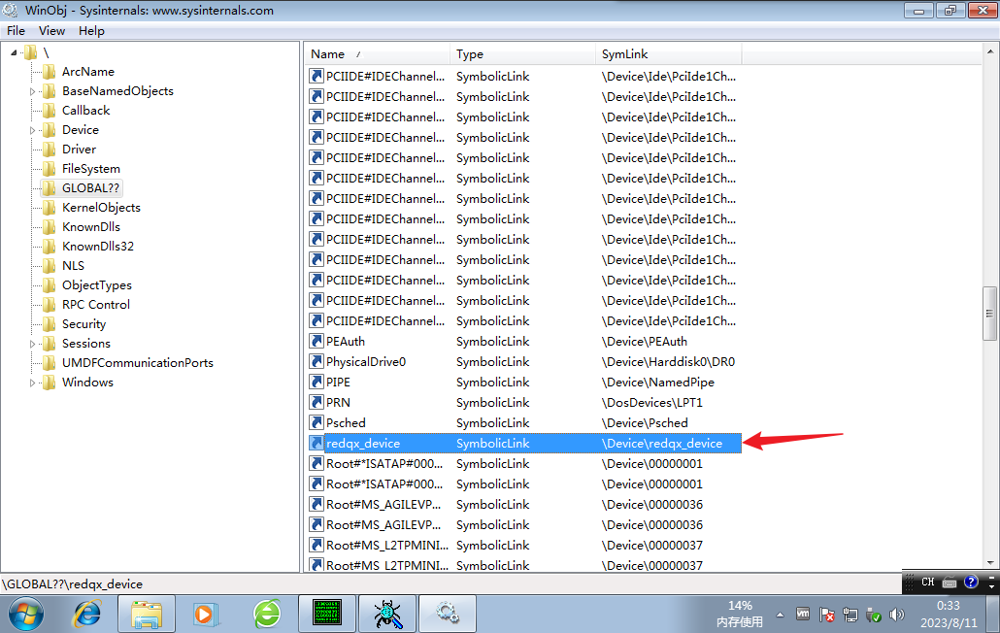

```c
#include<ntddk.h>

#define DNAME L"\\Device\\redqx_device"
#define SNAME L"\\??\\redqx_device"

void my_unload(PDRIVER_OBJECT xx)
{
	DbgPrint("Good Bye rdqx\n");
	if (xx->DeviceObject)
	{
		IoDeleteDevice(xx->DeviceObject);
		UNICODE_STRING symName = { 0 };
		RtlInitUnicodeString(&symName, SNAME);
		IoDeleteSymbolicLink(&symName);
	}
}
NTSTATUS myCreate(PDEVICE_OBJECT pdevice,PIRP pirp)//这里是PDEVICE_OBJECT不是PDRIVER_OBJECT
{
	NTSTATUS status = STATUS_SUCCESS;
	DbgPrint("my Device has been Created\n");
	pirp->IoStatus.Status = status;
	pirp->IoStatus.Information = 0;
	IoCompleteRequest(pirp, IO_NO_INCREMENT);
	return STATUS_SUCCESS;
}
NTSTATUS myCleanup(PDEVICE_OBJECT pdevice, PIRP pirp)//这里是PDEVICE_OBJECT不是PDRIVER_OBJECT
{
	NTSTATUS status = STATUS_SUCCESS;
	DbgPrint("my Device has been Cleanup\n");
	pirp->IoStatus.Status = status;
	pirp->IoStatus.Information = 0;
	IoCompleteRequest(pirp, IO_NO_INCREMENT);
	return STATUS_SUCCESS;
}
NTSTATUS myClose(PDEVICE_OBJECT pdevice, PIRP pirp)//这里是PDEVICE_OBJECT不是PDRIVER_OBJECT
{
	NTSTATUS status = STATUS_SUCCESS;
	DbgPrint("my Device has been opened\n");
	pirp->IoStatus.Status = status;
	pirp->IoStatus.Information = 0;
	IoCompleteRequest(pirp, IO_NO_INCREMENT);
	return STATUS_SUCCESS;
}
NTSTATUS  DriverEntry(
	PDRIVER_OBJECT driver,
	PUNICODE_STRING reg_path
)
{
	DbgPrint("redqx: %wZ\n", reg_path);
	NTSTATUS status = STATUS_SUCCESS;
	UNICODE_STRING deviceName = { 0 };
	PDEVICE_OBJECT pDevice = NULL;
	driver->DriverUnload = my_unload;//安全卸载函数
	RtlInitUnicodeString(&deviceName, DNAME);
	status = IoCreateDevice(driver, 0, &deviceName, FILE_DEVICE_UNKNOWN, 0, TRUE, &pDevice);
	if (!NT_SUCCESS(status))
	{
		DbgPrint("create my Device Failed %X\n", status);
		return status;
	}
	//创建设备的符号链接
	UNICODE_STRING symName = { 0 };
	RtlInitUnicodeString(&symName, SNAME);
	status = IoCreateSymbolicLink(&symName, &deviceName);
	if (!NT_SUCCESS(status))
	{
		DbgPrint("create symbleLink Failed %X\n", status);
		IoDeleteDevice(pDevice);
		return status;
	}
	driver->MajorFunction[IRP_MJ_CREATE] = myCreate;
	driver->MajorFunction[IRP_MJ_CLOSE] = myClose;
	driver->MajorFunction[IRP_MJ_CLEANUP]= myCleanup;
	return 0;

}
```


