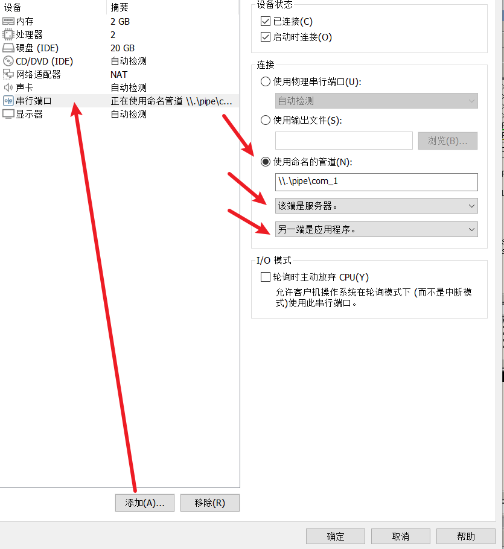
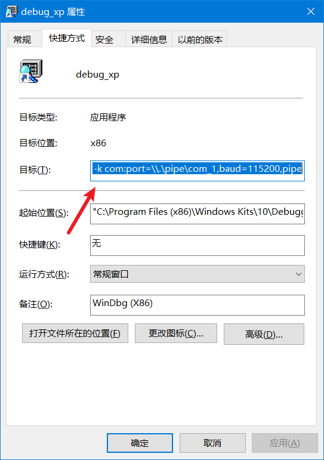

他是R0的调试器,优先级别更高的


简单的使用手册

https://blog.csdn.net/hgy413/article/details/7565003


# 常用的指令

| 指令 | 功能                         |
| ---- | ---------------------------- |
| r    | 查看寄存器                   |
| dd   | 以四字节为一组读取并显示数据 |
| dq   | 以八字节为一组读取并显示数据 |
| f11  | 逐语句                       |
| f10  | 逐过程                       |


该指令在windbg双机调试环境下有效 win10 -> xp

```
kd> r gdtr //产看gdtr数组在哪里
gdtr=8003f000
kd> r gdtl //查看gdtr表数组的大小
gdtl=000003ff
```


```
0: kd> dq gdtr L4
8003f000  00000000`00000000 00cf9b00`0000ffff
8003f010  00cf9300`0000ffff 00cffb00`0000ffff

```

 

# 虚拟机-双机调试xp-管道传输


参考链接

https://blog.csdn.net/counsellor/article/details/82194920

https://blog.csdn.net/team39/article/details/103386562

调试win10 : https://blog.csdn.net/qq_37596943/article/details/131766474


## xp配置


C盘根目录隐藏文件:boot.ini

```
[boot loader]
timeout=30
default=multi(0)disk(0)rdisk(0)partition(1)\WINDOWS
[operating systems]
multi(0)disk(0)rdisk(0)partition(1)\WINDOWS="Microsoft Windows XP Professional" /noexecute=optin /fastdetect
multi(0)disk(0)rdisk(0)partition(1)\WINDOWS="Microsoft Windows XP Professional" /noexecute=optin /fastdetect /debug /debugport=com1 /baudrate=115200
```


## 虚拟机配置:


`\\.\pipe\com_1`





## windbg x86配置


注意,我们最好且最好用WDK7.1的windbg来调试

我用过WDK10.windbg.,WDK8.windbg,最新版的windbg对xp的调试效果都是比较

不理想,,,也就是windbg老是卡死,,,导致虚拟机自然也是卡死

所以后来通过使用最新版windbug在kd输入eq产生的一个报错

然后获悉到xp的调试要用WDK7.1的调试工具


复杂一个快捷方式,用于xp的调试


右键快捷方式

设置目标




```
"D:\Windows Kits\10\Debuggers\x86\windbg.exe" 
-y srv*c:\symbols*http://msdl.microsoft.com/download/symbols -b -k com:port=\\.\pipe\com_1,baud=115200,pipe
```


符号文件载入

```c++
0:040> .sympath SRV*c:\localsymbols*http://msdl.microsoft.com/download/symbols
0:040> .reload
```

有时候,函数的名字没有找到

就是因为没有正确额引用符号文件的	
