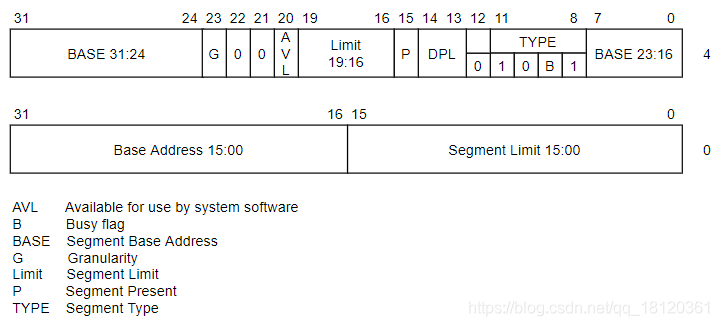

# TSS

因为性能的一些原因

TSS在x64下已经不再使用的


## 任务段

在调用门、中断门与陷阱门中，一旦出现权限切换，那么就会有堆栈的切换；

而且，由于CS的CPL发生改变，也导致了SS也必须要切换

思考：切换时，会有新的ESP和SS(CS是由中断门或者调用门指定)这2个值从哪里来的呢？

答案：TSS (Task-state segment )：任务状态段 

>   引入

TSS在哪里?

TR寄存器会告诉你

TSS是一块内存

大小：104字节

TSS存储了一堆寄存器的值

这很重要


把图片抽象出来就睡

```c
typedef struct TSS {
    DWORD link; // 保存前一个 TSS 段选择子，使用 call 指令切换寄存器的时候由CPU填写。
    // 这 6 个值是固定不变的，用于提权，CPU 切换栈的时候用
    DWORD esp0; // 保存 0 环栈指针
    DWORD ss0;  // 保存 0 环栈段选择子
    DWORD esp1; // 保存 1 环栈指针
    DWORD ss1;  // 保存 1 环栈段选择子
    DWORD esp2; // 保存 2 环栈指针
    DWORD ss2;  // 保存 2 环栈段选择子
    // 下面这些都是用来做切换寄存器值用的，切换寄存器的时候由CPU自动填写。
    DWORD cr3; 
    DWORD eip;  
    DWORD eflags;
    DWORD eax;
    DWORD ecx;
    DWORD edx;
    DWORD ebx;
    DWORD esp;
    DWORD ebp;
    DWORD esi;
    DWORD edi;
    DWORD es;
    DWORD cs;
    DWORD ss;
    DWORD ds;
    DWORD fs;
    DWORD gs;
    DWORD ldt;
    // 这个暂时忽略
    DWORD io_map;
} TSS;

```

Intel的设计思想：在操作系统运行的时候，进行任务的切换。

Intel提到的任务对应的是操作系统的线程。

它在CPU层面叫任务，

操作系统层面叫线程。

当程序执行的时候，如果想做新的事情，或者新的任务，

那么上下文环境需要发生变化，不能使用原来的寄存器。

原来的寄存器存储的是上一个程序要用到的值。

如果要做新的事情，那肯定要新的寄存器，

那么新的寄存器从哪来呢？TSS。

当想要恢复原来的事情，只需要把原来的寄存器的值存到TSS中，

通过TSS再写入寄存器中就恢复原来的样子了。

所谓的任务切换，其实就是线程切换。


不要把TSS与 "任务切换" 联系到一起。

TSS的意义就在于可以同时替换掉 "一堆" 寄存器，仅此而已。


<p id="Attribute.DPL" style="color:#00FA9A;font-size:32px">
    TR寄存器
</p>


TR寄存器的值是当操作系统启动时，从**TSS段描述符**中加载出来的，TSS段描述符在GDT表中

TR.Base = TSS起始地址

TR.Limit = TSS大小


<p id="Attribute.DPL" style="color:#00FA9A;font-size:32px">
    TSS段描述符
</p>





Type = 二进制1001：说明该TSS段描述符**未**被加载到TR段寄存器中

Type = 二进制1011：说明该TSS段描述符**已**被加载到TR段寄存器中

<div style="color:#00CED1;font-size:16px">
   	注意：<br>
   	高4字节的第23位，也就是G位。<br>
   	G位=0：代表limit界限单位是字节<br>
   	G位=1：代表limit界限单位是4KB。<br>
	前文中的实验通常都是1，本文中为0。<br>
	为什么是0？因为LIMIT指向的TSS是以字节为单位的。<br>
</div>


<p id="Attribute.DPL" style="color:#00FA9A;font-size:32px">
    TR寄存器读写
</p>


<p style="color:#FFA500;font-size:24px">
    写TR寄存器
</p>


指令：`LTR`

在R0可以通过LTR指令修改TR段寄存器。

说明：

1.  用LTR指令去装载的话 仅仅是改变TR寄存器的值(96位)
2.  并没有真正改变TSS
3.  LTR指令只能在系统层使用
4.  加载后TSS段描述符的状态位会发生改变

在R3可以通过 CALL FAR 或者 JMP FAR 指令修改。


用JMP去访问一个代码段的时候，改变的是CS和EIP：

JMP 0x48:0x123456，如果0x48是代码段，执行后：CS->0x48、EIP->0x123456。

用JMP去访问一个任务段的时候：

如果0x48是TSS段描述符，先修改TR段寄存器，再用TR.BASE指向的TSS中的值修改当前的寄存器。


<p style="color:#FFA500;font-size:24px">
    读TR寄存器
</p>


指令：`STR`

说明：如果用STR去读的话，只读了TR的16位，也就是段选择子


相关实验没做,没有环境


## 任务门


保留部分,随意写


INT N（N为IDT表索引号）

系统通过用户指定的索引查找IDT表，找到对应的门描述符

门描述符若为任务门描述符，则根据任务门描述符中TSS段选择子查找GDT表，找到TSS段描述符

将TSS段描述符中的内容加载到TR段寄存器

TR段寄存器通过Base和Limit找到TSS

使用TSS中的值修改寄存器

IRETD返回

相关实验没做,没环境


