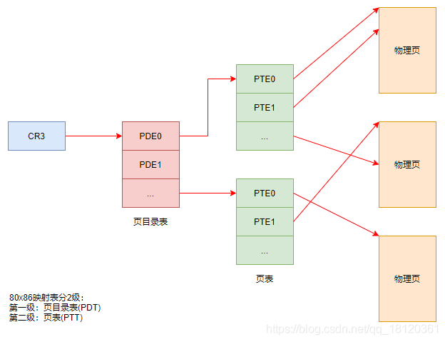

# 页的机制


## 引入

4GB内存空间

大家可能都听说过，每个程序在运行时，操作系统都会为其分配一段4GB的内存空间。

但是我们的内存容量很可能最多只够为一个进程分配4GB的内存空间，如何做到为每个进程都分配呢？

实际上，进程被分配到的`4GB内存空间`只是虚拟的的内存空间，

并不是指真正意义上的物理内存，虚拟内存与物理内存之间有一层转换关系

ps: 那`4GB内存空间`是假的


## 地址


<p id="Attribute.DPL" style="color:#00FA9A;font-size:32px">
    有效地址-线性地址
</p>


物理地址

以如下为例

```
MOV eax,dword ptr ds:[0x12345678]
```

其中，

0x12345678 是**有效地址**

ds.Base + 0x12345678 是**线性地址**

注意：当段[寄存器](https://so.csdn.net/so/search?q=寄存器&spm=1001.2101.3001.7020)的Base为0时，**有效地址**=**线性地址**，

大多数时候都是如此；但也有特殊情况，比如**fs段寄存器**的Base不为0

<p id="Attribute.DPL" style="color:#00FA9A;font-size:32px">
    物理地址
</p>


描述：

我们平时所用到的**系统DLL**（动态链接库）存在于物理地址中，

当程序想要调用某个DLL时，DLL便会映射一份线性地址给程序，

这样程序就能够通过线性地址找到DLL的物理地址


关于实验,我没去做,就说一下自己的理解吧

首先打开一个notpad.exe,往里面写入内容

然后用CE附加这个进程,然后用Unicode的方式扫描扫描字符串,寻找该内容

最后就可以获取一个线性地址

然后我们要做的就是把线性地址转化到物理地址

这里我们以`10-10-12`分页的方式为例

<div  style="color:#FFB5C5;font-size:16px">
    tips:<br>
    10-10-12的意思,就是把一个32位的数据分为10bit,10bit,12bit<br>
	然后10个bit位大小最大是1023,<br>
    也即是1024个数据<br>
</div>


如果通过CE获取的线性地址是0x06765140

然后我们划分数据,把3个数据提取出来,因为最后的12bit刚好3个16进制位,就不用划分了

```
0    6    7    6    5    140
=
0000 0110 0111 0110 0101 140
=
0000011001		// 0x19
1101100101		// 0x365
140				// 12个比特位刚好三个字节
```

所以我们提取出来就是0x19,0x365,0x140,

这3个数据是什么? 其实也就是一些表的索引值


```
!process 0 0 寻找进程,然后获取DirBase 是一个进程的物理地址
```

加入我们获取的DirBase是`0bd1000`

然后我们

tips:`!dd`是查看物理地址

```
!dd 0bd1000 + 0x19*4 //成员是DWORd Arr1[xx]
```

然后可以获取一个4字节数据,把后3位16进制置为0(后面讲诉)

```
!dd 08F17000 + 0x365*4	//成员是DWORd Arr2[xx]
```

然后可以获取一个4字节数据,把后3位16进制置为0(后面讲诉)

```
!dd 1D075000 + 0x140  //成员是BYTE Arr3[xx]
```


## PDE&PTE





### 简单介绍

CR3：唯一一个存储物理地址的寄存器。

在Windows中，页大小是4KB。在后期会接触到另一种页，有4MB大小，称为大页。

CR3里面存储的地址，指向的PDT，表中每个成员称为PDE,PTE指向的才是真正的`物理页`。

无论是PDE或者PTE，都是4字节。它的十六进制形式的后三位存储的是属性


然后说一下为什么0地址不能读写

因为0地址一般不会给他分配物理页

那么,如果我们手动给他分配物理页的话,是完全可以实现0地址的读写

关于0地址读写问题,我希望后面你自己写个小实验


寻找我们已经分配的物理页


```c
#include "stdafx.h"
 
int main(int argc, char* argv[])
{
    int x = 1;
 
    printf("x的地址:%x\n", &x);
 
    getchar();
 
    //向0地址写入数据
    *(int*)0 = 123;
 
    //读取0地址上的数据
    printf("0地址数据:%x\n", *(int*)0);
 
    return 0;
}
```


1.  PTE可以指向物理页，也可以没有指向物理页。
2.  多个PTE可以指向一同一个物理页。
3.  一个PTE只能指向一个物理页


### 属性


## 小实验


打印


```c
#include<stdio.h>
#include<stdlib.h>
#include<string.h>
#include<windows.h>

int main()
{
	long long arrGDT[] = 
	{
		0x000000000000000, 0x0cf9b000000ffff, 0x0cf93000000ffff, 0x0cffb000000ffff,
		0x0cff3000000ffff ,0x80008b04200020ab, 0xffc093dff0000001, 0x040f30000000fff
	};
	
	//long long arrGDT[] = 
	//{
	//	0x00000000 00000000, 0x00cf9b00 0000ffff, 0x00cf9300  0000ffff, 0x00cffb00 0000ffff,
	//	0x00cff300 0000ffff ,0x80008b04 200020ab, 0xffc093df  f0000001, 0x0040f300 00000fff
	//};
	
	char* Seginfo[] = { "  系统段","非系统段" };
	char* priRing[] = { "R0","R1","R2","R3" };
	int SegLimit=0;
	int SegBase=0;
	int len = 0;
	int tmp = 0;
	len = sizeof(arrGDT)/sizeof(arrGDT[0]);
	int i = 0;
	for (i = 0; i < len; i++)
	{
		SegBase = (arrGDT[i] & 0x000000FFFFFF0000) >> 16 | (arrGDT[i] & 0xFF00000000000000)>>32;
		SegLimit = (arrGDT[i] & 0x00F0000000000000) >> (52+3) == 1 ? 0xFFFFFFFF : 0x000FFFFF;
		tmp = (arrGDT[i] & 0x0000F00000000000) >> (11*4);
		printf("[%d]段范围:%08X[%08X] ,段类型:%s 段权限:%s \n", i,SegBase, SegLimit,Seginfo[tmp >> 3], priRing[(tmp & 0b0110) >> 1]);
	}

	
	return 0;
}
/*
GS 去往:GDT 索引:0 然后请求:R0 段范围:00000000[000FFFFF] ,段类型:  系统段 段权限:R0
FS 去往:GDT 索引:7 然后请求:R3 段范围:00000000[000FFFFF] ,段类型:非系统段 段权限:R3
ES 去往:GDT 索引:4 然后请求:R3 段范围:00000000[FFFFFFFF] ,段类型:非系统段 段权限:R3
DS 去往:GDT 索引:4 然后请求:R3 段范围:00000000[FFFFFFFF] ,段类型:非系统段 段权限:R3
CS 去往:GDT 索引:3 然后请求:R3 段范围:00000000[FFFFFFFF] ,段类型:非系统段 段权限:R3
SS 去往:GDT 索引:4 然后请求:R3 段范围:00000000[FFFFFFFF] ,段类型:非系统段 段权限:R3

8003f000 0000000000000000 00cf9b000000ffff 00cf93000000ffff 00cffb000000ffff
8003f020 00cff3000000ffff 80008b04200020ab ffc093dff0000001 0040f30000000fff

段范围:00000000[000FFFFF] ,段类型:  系统段 段权限:R0
段范围:00000000[000FFFFF] ,段类型:非系统段 段权限:R0
段范围:00000000[000FFFFF] ,段类型:非系统段 段权限:R0
段范围:00000000[000FFFFF] ,段类型:非系统段 段权限:R3
段范围:00000000[000FFFFF] ,段类型:非系统段 段权限:R3
段范围:80042000[000FFFFF] ,段类型:非系统段 段权限:R0
段范围:FFDFF000[000FFFFF] ,段类型:非系统段 段权限:R0
段范围:00000000[000FFFFF] ,段类型:非系统段 段权限:R3
*/
```

