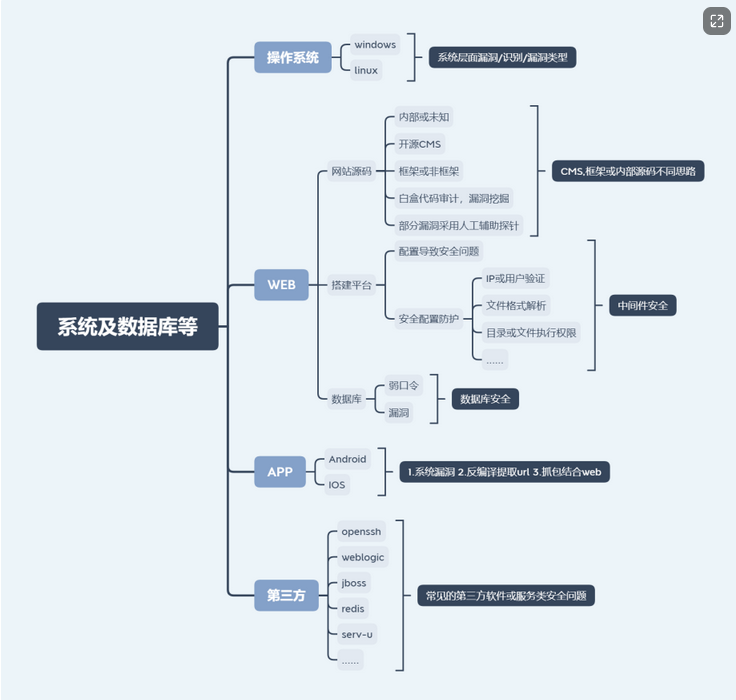

对于windows的网站,不区分URL的大小写

比如Linux的

访问 https://www.apple.com.cn/iphone/ 成功

访问 https://www.apple.com.cn/iphonE/ 失败

比如windows

访问 https://message.bilibili.com/?spm_id_from=333.1007.0.0#/reply 成功

访问 https://message.bilibili.com/?spm_id_from=333.1007.0.0#/rePLY 也成功


通过nmap去探测目标网站的系统类型

```
┌──(root㉿kali)-[/home/kali/Desktop]
└─# nmap -O 47.75.212.155 
```

通过nmap去探测目标网站的开放的第三方服务（端口特征）

```
┌──(root㉿kali)-[/home/kali/Desktop]
└─# nmap -O -sV 47.75.212.155 
```


**识别数据库类型常见方法**

默认的语言搭配的数据库,一些东西是常见的搭配使用

```
ASP+Access
php+mysql
aspx+mssql
jsp+mssql,oracle
python+mongodb
```

常见的端口号,简单看看

关系型数据库： 

1.Oracle数据库默认端口号为，1521； 

2.MySQL数据库默认端口号为，3306； 

3.SQLServer数据库默认端口号为，1433;

 

NOSQL数据库： 

1.MongoDB默认端口号为：27017； 

2.Redis默认端口号为：6379； 

3.memcached默认端口号为：11211；

 

其他：

1527　　Derby

5432　　pgsql

5000　　db2

9092　　pointbase

无默认　Informix


有很多第三发软件都有漏洞

但是我们只需要去挖一些特定类型的第三方软件，比如原创控制软件，比如文件传输软件等等

一些其他的就没必要去关心的


弱口令爆破：

超级弱口令


namp扫描不到端口？

1), 别人有防护措施，目前nmap可以加参数然后绕过

2), 别人的服务放在了内外，然后通过端口映射到了外网，所以nmap扫描不到


