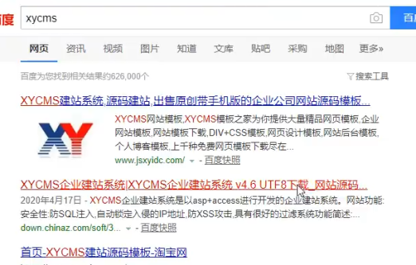

# 源代码收集

## demo0

右键-检查源代码，通过对网站数据包的请求，看一下在请求网站的时候有哪些文件名和特殊的文件

在google搜索

## demo1

访问网站，随意点开，查看后缀，判定程序

网站底部关键词XYCMS

搜索XYCMS，下载

下载打开之后找寻关键数据库路径文件xydata，找到文件xycms.mdb(asp特有文件)

文件里存有管理员的账号密码

根据下载的源码路径，尝试去访问网站目录 http://xxx.xxx.xxx.xxx:8003/xydata/xycms.mdb,下载到文件

尝试访问到后台  system或admin,根据刚才得到的管理员账号密码就可以登录

## demo2

根据底部信息去网站搜索漏洞

根据搜索到的漏洞提示来进行安全测试攻击，如果网上没有漏洞信息，也可以下载程序再做漏洞分析

## demo3

niushop电商类关注漏洞点-业务逻辑

把购买产品数量改成-1

结果付款是0

## demo5

对一个网站乱输入,也可以查看报错

## demo6

f12 查看路径

# 中间件识别

