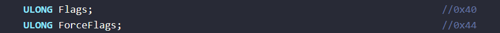

下面都是x86模式下进行的,x64以后再说吧


# 通过API调用获取PEB


way1: x86版本

```c
#include <stdio.h>
#include <windows.h>

 

int main()
{
	DWORD tmp,tmp2;
	tmp = GetModuleHandle("ntdll.dll");
	tmp2 = GetProcAddress(tmp, "NtCurrentTeb");
	__asm {
		mov eax, tmp2;
		call eax;
	}
	return 0;
}
```


way2: x86版本 获取PEB,我不是很理解

```c
#include <stdio.h>
#include < Windows.h>

int main()
{
	PVOID pPeb = 0;
	pPeb = (PVOID)__readfsdword(0x0C * sizeof(PVOID));
	pPeb = (PVOID)((PBYTE)pPeb + 0x1000);
	printf("%p\n", pPeb);
	return 0;
}
```

 

way3: x86版本

```c
#include <windows.h>
#include <stdio.h>

typedef struct _PROCESS_BASIC_INFORMATION
{
	DWORD ExitStatus;                     // 接收进程终止状态
	DWORD PebBaseAddress;                 // 接收进程环境块地址(PEB)
	DWORD AffinityMask;                     // 接收进程关联掩码
	DWORD BasePriority;                     // 接收进程的优先级类
	ULONG UniqueProcessId;                 // 接收进程ID
	ULONG InheritedFromUniqueProcessId;     // 接收父进程ID
} PROCESS_BASIC_INFORMATION;

int main()
{
	HMODULE hModule = LoadLibraryA("ntdll.dll");
	if (hModule == NULL)
	{
		printf("Failed to load ntdll.dll\n");
		return 1;
	}

	typedef NTSTATUS(NTAPI* PFN_ZwQueryInformationProcess)(
		HANDLE ProcessHandle,
		DWORD ProcessInformationClass,
		PVOID ProcessInformation,
		ULONG ProcessInformationLength,
		PULONG ReturnLength);

	PFN_ZwQueryInformationProcess pZwQueryInformationProcess =
		(PFN_ZwQueryInformationProcess)GetProcAddress(hModule, "ZwQueryInformationProcess");

	if (pZwQueryInformationProcess == NULL)
	{
		printf("Failed to get address of ZwQueryInformationProcess\n");
		FreeLibrary(hModule);
		return 1;
	}

	PROCESS_BASIC_INFORMATION Pbi = { 0 };
	HANDLE hProcess = GetCurrentProcess();
	NTSTATUS Status = pZwQueryInformationProcess(
		hProcess,
		0,
		&Pbi,
		sizeof(PROCESS_BASIC_INFORMATION),
		NULL);

	if (Status != 0)
	{
		printf("ZwQueryInformationProcess failed with status: %d\n", Status);
		FreeLibrary(hModule);
		return 1;
	}

	// 打印获取到的进程ID和父进程ID
	printf("PEB: %p\n", Pbi.PebBaseAddress);
	 
	FreeLibrary(hModule);

	return 0;
}

```


# BeingDebugged

用的到的字段位于TEB->PEB->BeingDebugged; 

可以调用windows的API直接获取

```c
#include< Windows.h >
BOOL IsDebuggerPresent();
```


x86版本

```c
#include <stdio.h>
#include <Windows.h>

int IsDebugA()
{
	BYTE Debug = 0;
	__asm
	{
		mov eax, dword ptr fs : [0x30]
		mov bl, byte ptr[eax + 0x2]
		mov Debug, bl
	}
	return Debug;
}

int IsDebugB()
{
	BYTE Debug = 0;
	__asm
	{
		push dword ptr fs : [0x30]
		pop edx
		mov al, [edx + 2]
		mov Debug, al
	}
	return Debug;
}

int IsDebugC()
{
	DWORD Debug = 0;

	__asm
	{
		mov eax, fs: [0x18]       // TEB Self指针
		mov eax, [eax + 0x30]      // PEB
		movzx eax, [eax + 2]       // PEB->BeingDebugged
		mov Debug, eax
	}
	return Debug;
}

int main(int argc, char* argv[])
{
	if (IsDebugA() && IsDebugB() && IsDebugC())
		printf("check YOu\n");
	else
		printf("where are YOu\n");

	system("pause");
	return 0;
}
```


冷饭热炒,其实就是混淆了一下,类似于vmp的那种恶心混淆

a=1

a=a+1

```c
#include<stdio.h>
int PebIsDebuggedApproach()
{
    char result = 0;
    int i = 0;
    char flag[] = "flag{ABCDEFGHIJKLMNOPQRSTUVWX}";
    int flag_CF = 0;
    int sum = 0;
    int a = 0, b = 0;
    for (i = 0; flag[i]; i++)
    {
        result = result + flag[i] ^ 0x10;
    }
    __asm
    {
        // 进程的PEB地址放在fs这个寄存器位置
        lea esi,result
        movzx eax,byte ptr [esi]
        mov ebx,0xCE
        xor eax,ebx
        mov edi,fs:[eax]
        lea eax, a
        mov[eax], edi
        lea eax, b
        mov[eax], 2
    }
    do
    {
        sum = a ^ b;
        flag_CF = (a & b) << 1;
        a = sum;
        b = flag_CF;
    } while (flag_CF);
    _asm
    {
        lea eax,sum
        mov ebx,[eax]
        mov eax,[ebx]
        lea ebx,flag_CF
        mov [ebx],eax
    }
    if ((flag_CF & 0xFF) == 1)
    {
        printf("Get You!\n");
    }
    else
    {
        printf("Where are you?\n");
    }
}
int main()
{
    PebIsDebuggedApproach();
    return 0;
}
```


# ProcessHeap

用的到的字段位于 TEB->PEB->ProcessHeap->Flags和ForceFlags


x86版本, IDA会被检测, vs2019可绕过


其中

```c
struct _HEAP {} ProcessHeap
```





```c
#include <stdio.h>
#include <windows.h>

int IsDebugA()
{
	DWORD Debug = 0;
	__asm
	{
		mov eax, fs: [0x18]       // TED基地址
		mov eax, [eax + 0x30]    // PEB基地址
		mov eax, [eax + 0x18]    // 定位 ProcessHeap
		mov eax, [eax + 0x44]    // 定位到 ForceFlags
		mov Debug, eax
	}
	return Debug!=0;
}

int IsDebugB()
{
	DWORD Debug = 0;
	__asm
	{
		mov eax, fs: [0x18]       // TED基地址
		mov eax, [eax + 0x30]    // PEB基地址
		mov eax, [eax + 0x18]    // 定位 ProcessHeap
		mov eax, [eax + 0x40]    // 定位到 Flags
		mov Debug, eax
	}
	return Debug!=2;
}

int main(int argc, char* argv[])
{

	if (IsDebugA() && IsDebugB())
		printf("Find You\n");
	else
		printf("where are you\n");

	system("pause");
	return 0;
}
```


# NtGlobalFlag

用的到的字段位于 TEB->PEB->NtGlobalFlag

hex(0x10 | 0x20 | 0x40 )=0x70

在调试期间，这些标识在NtGlobalFlag字段中的设置如下：

```
FLG_HEAP_ENABLE_TAIL_CHECK (0x10)
FLG_HEAP_ENABLE_FREE_CHECK (0x20)
FLG_HEAP_VALIDATE_PARAMETERS (0x40)
```


x86版本,可检测IDA,vs2019可绕过

```c
#include <stdio.h>
#include <windows.h>

DWORD IsDebug()
{
	DWORD Debug = 0;
	__asm
	{
		mov eax, fs: [0x18]       // TEB基地址
		mov eax, [eax + 0x30]    // 找到PEB
		mov eax, [eax + 0x68]    // 找打 NtGlobalFlag
		mov Debug, eax            // 取出值
	}

	if (Debug == 0x70)
		printf("程序正在被调戏 \n");
	else
		printf("程序正常 \n");

	return Debug;
}

int main(int argc, char* argv[])
{
	printf("返回状态: %d \n", IsDebug());

	system("pause");
	return 0;
}
```


# 堆Magic标志

当进程被调试器调试时该进程堆会被一些特殊的标志填充，

这些特殊标记分别是0xABABABAB , 0xFEEEFEEE。

在调试模式下， NtGlobalFlag的HEAP_TAIL_CHECKING_ENABLED 标志将被默认设置，

堆内存分配会在末尾追加 0xABABABAB标志进行安全检查，

如果NtGlobalFlag设置了HEAP_FREE_CHECKING_ENABLED标志，

那么当需要额外的字节来填充堆块尾部时, 就会使用0xFEEEFEEE(或一部分) 来填充


[PROCESS_HEAP_ENTRY结构详细介绍](https://docs.microsoft.com/en-us/windows/win32/api/minwinbase/ns-minwinbase-process_heap_entry)

x86版本,可检测IDA, vs2019课绕过

```c
#include <windows.h>
#include <stdio.h>

BOOL CheckHeapMagic()
{
    PROCESS_HEAP_ENTRY HeapEntry = { 0 };
    do
    {
        if (!HeapWalk(GetProcessHeap(), &HeapEntry))
            return 0;
    } while (HeapEntry.wFlags != PROCESS_HEAP_ENTRY_BUSY);

    PVOID pOverlapped = (PBYTE)HeapEntry.lpData + HeapEntry.cbData;
    return ((DWORD)(*(PDWORD)pOverlapped) == 0xABABABAB);
}
int main()
{
    if (CheckHeapMagic())
    {
        printf("Get You\n");
    }
    else
    {
        printf("where are you\n");
    }
    return 0;
}
```


# Ldr 失败

调试进程时，其堆内存区域中会出现一些特殊标识，表明它正处于被调试状态。

最醒目的是：未使用的堆内存区域全部填充着0xEEFEEEFE，利用这一特征可判断是否处于被调试状态。

PEB.Ldr 是指向 _PEB_LDR_DATA 结构体指针， _PEB_LDR_DATA 恰好是在堆内存中创建的。

检测 _PEB_LDR_DATA 是否是0xEEFEEEFE 即可判断是否处于被调试，汇编的调用形式和上面的相差不多。
 

ps: 至少我用CE没有扫描出EEFEEEFE的数值

```c
#include <windows.h>
#include <stdio.h>
int main()
{
	LPBYTE pLdr;
	DWORD pLdrSig[4] = { 0xEEFEEEFE,0xEEFEEEFE,0xEEFEEEFE,0xEEFEEEFE };
	__asm
	{
		mov eax, fs: [0x30] ; //PEB地址
		mov eax, [eax + 0xC];//Ldr
		mov pLdr, eax;
	}
	__try
	{
		while (1)
		{
			if (!memcmp(pLdr, pLdrSig, sizeof(pLdrSig)))
			{
				printf("is debuggig\n");
					break;
			}
			else
			{
				pLdr++;
			}
		}
	}
	__except (EXCEPTION_EXECUTE_HANDLER)
	{
		printf("notdebugging\n");
	}
	system("pause");
	return 0;
}
```


# 多种混合在一起


```c
#include <stdio.h>
#include <Windows.h>

DWORD TEB;
DWORD PEB;
DWORD Check_BeingDebugged()
{
	DWORD Debug = 0;

	__asm
	{
		mov	eax,PEB
		movzx eax, [eax + 2]       // PEB->Check_BeingDebugged
		mov Debug, eax
	}
	return Debug;
}
DWORD Check_ProcessHeap()
{

	DWORD dwFlags = 0;
	DWORD dwForceFlags = 0;
	__asm
	{
		mov	eax, PEB
		mov eax, [eax + 0x18]    // 定位 ProcessHeap
		mov ecx, [eax + 0x40]
		mov dwFlags,ecx
		mov ecx, [eax + 0x44]    // 定位到 ForceFlags
		mov dwForceFlags, ecx
	}
	return dwFlags!=2 && dwForceFlags != 0;
}
DWORD CheckNtGlobalFlag()
{
	DWORD Debug = 0;
	__asm
	{
		mov	eax, PEB
		mov eax, [eax + 0x68]    // 找打 NtGlobalFlag
		mov Debug, eax            // 取出值
	}
	return Debug == 0x70;
}
DWORD CheckHeapMagic()
{
	PVOID pOverlapped = 0;
	PROCESS_HEAP_ENTRY HeapEntry = { 0 };
	do
	{
		if (!HeapWalk(GetProcessHeap(), &HeapEntry))
			return 0;

	} while (HeapEntry.wFlags != PROCESS_HEAP_ENTRY_BUSY); //堆元素是已分配的块

	pOverlapped = (PBYTE)HeapEntry.lpData + HeapEntry.cbData;//堆元素的数据部分的大小（以字节为单位）

	return ((DWORD)(*(PDWORD)pOverlapped) == 0xABABABAB);
}
int main()
{
	__asm
	{
		lea eax,TEB
		mov ecx,fs:[0x18]
		mov [eax] ,ecx
		add ecx,0x30
		lea eax,PEB
		mov ecx, [ecx]
		mov [eax],ecx
	}
	if (Check_BeingDebugged()&&
		Check_ProcessHeap()&&
		CheckNtGlobalFlag()&&
		CheckHeapMagic()
		)
	{
		MessageBox(0, "Find YOu\n", "Xsir", 0);
	}
	else
	{
		MessageBox(0, "Where are You\n", "Xsir", 0);
	}
	return 0;
}
```


# 关于x64

```
.CODE
  GetPeb PROC
    mov rcx,gs:[30h]
    mov rax,[rcx+60h]
    ret
  GetPeb ENDP
 END
```

未完成asm

```c
#include <stdio.h>
#include <stdlib.h>
#include <string.h>
#include <windows.h>

extern  DWORD64 GetPeb();
int Check_BeingDebugged(DWORD64 PEb)
{
    char* tmp = PEb + 2;
    return (*tmp) != 0;//直接就是返回 0和1
}
int Check_ProcessHeap(DWORD64 PEB)
{
    int* tmp = PEB + 0x18;
    int Flags = *((DWORD*)(*tmp + 0x70));
    int ForceFlags = *((DWORD*)(*tmp + 0x74));
    return Flags != 2 && ForceFlags != 0;//直接返回0和1
}
int Check_NtGlobalFlag(DWORD64 PEB)
{
    int* tmp = PEB + 0x68;
    return (*tmp) == 0x70;//直接返回0或者1
}
int CheckDbg()
{
    DWORD64 PEB = 0;
    int BeingDebugged = 0;
    int ProcessHeap = 0;
    int NtGlobalFlag = 0;

    PEB= GetPeb();
    BeingDebugged = Check_BeingDebugged(PEB);
    ProcessHeap = Check_ProcessHeap(PEB);
    NtGlobalFlag = Check_NtGlobalFlag(PEB);
    printf("%d %d %d\n", BeingDebugged, ProcessHeap, NtGlobalFlag);
    return BeingDebugged | ProcessHeap | NtGlobalFlag;
}
int main()
{
    long long tmp = 0;
    tmp = GetPeb();
    /*if (CheckDbg())
    {
        printf("Check You\n");
    }
    else
    {
        printf("Where Are YOu\n");
    }*/
}
```