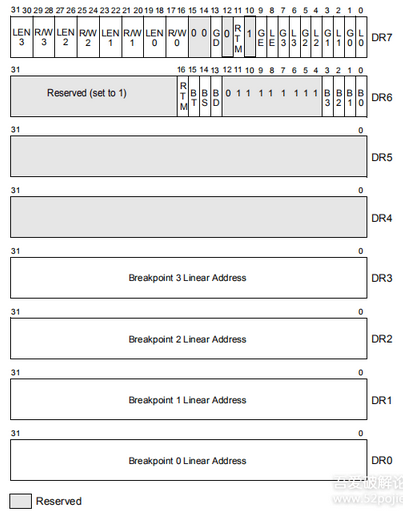
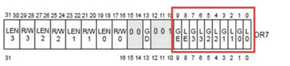
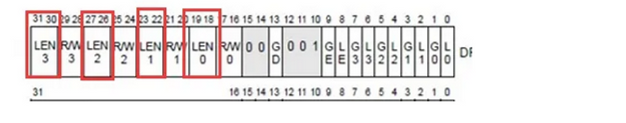

[恶意样本分析手册——反调试篇（上）](http://blog.nsfocus.net/anti-test-articles1/)

[恶意样本分析手册——理论篇](http://blog.nsfocus.net/sample-analysis-manual-theory/)


# 启动被调试程序

当我们要对一个程序进行调试时，首先要做的当然是启动这个程序，这要使用CreateProcess这个Windows API来完成。

```c
CreateProcess(
	TEXT("Path"),
	NULL,
	NULL,
	NULL,
	FALSE,
	DEBUG_ONLY_THIS_PROCESS | CREATE_NEW_CONSOLE,
	NULL,
	NULL,
	&si,
	&pi
)
```

CreateProcess的第六个参数使用了DEBUG_ONLY_THIS_PROCESS，这意味着调用CreateProcess的进程成为了调试器，

而它启动的子进程成了被调试的进程。

除了DEBUG_ONLY_THIS_PROCESS之外，还可以使用DEBUG_PROCESS

两者的不同在于：DEBUG_PROCESS会调试被调试进程以及它的所有子进程，

而DEBUG_ONLY_THIS_PROCESS只调试被调试进程，不调试它的子进程。

一般情况下我们只想调试一个进程，所以应使用后者。

建议在第六个参数中加上CREATE_NEW_CONSOLE标记。

因为如果被调试程序是一个控制台程序的话，调试器和被调试程序的输出都在同一个控制台窗口内，显得很混乱，

加上这个标记之后，被调试程序就会在一个新的控制台窗口中输出信息。如果被调试程序是一个窗口程序，这个标记没有影响


# 调试循环

一个进程成为被调试进程之后，在完成了某些操作或者发生异常时，

它会发送通知给调试器，然后将自身挂起，

直到调试器命令它继续执行。这有点像Windows窗口的消息机制

被调试进程发送的通知称为调试事件，DEBUG_EVENT结构体描述了调试事件的内容：

```c
typedef struct _DEBUG_EVENT {
  DWORD dwDebugEventCode;
  DWORD dwProcessId;
  DWORD dwThreadId;
  union {
    EXCEPTION_DEBUG_INFO Exception;
    CREATE_THREAD_DEBUG_INFO CreateThread;
    CREATE_PROCESS_DEBUG_INFO CreateProcessInfo;
    EXIT_THREAD_DEBUG_INFO ExitThread;
    EXIT_PROCESS_DEBUG_INFO ExitProcess;
    LOAD_DLL_DEBUG_INFO LoadDll;
    UNLOAD_DLL_DEBUG_INFO UnloadDll;
    OUTPUT_DEBUG_STRING_INFO DebugString;
    RIP_INFO RipInfo;
  } u;
} DEBUG_EVENT, *LPDEBUG_EVENT;
```

其中有一个dwDebugEventCode

dwDebugEventCode描述了调试事件的类型，总共有9类调试事件


|       调试事件的类型       |                           解释说明                           |
| :-: | :-: |
| CREATE_PROCESS_DEBUG_EVENT | 创建进程之后发送此类调试事件，这是调试器收到的第一个调试事件。 |
| CREATE_THREAD_DEBUG_EVENT | 创建一个线程之后发送此类调试事件。 |
| EXCEPTION_DEBUG_EVENT | 发生异常时发送此类调试事件。 |
| EXIT_PROCESS_DEBUG_EVENT | 进程结束后发送此类调试事件。 |
| EXIT_THREAD_DEBUG_EVENT | 一个线程结束后发送此类调试事件。 |
| LOAD_DLL_DEBUG_EVENT | 装载一个DLL模块之后发送此类调试事件。 |
| OUTPUT_DEBUG_STRING_EVENT | 被调试进程调用OutputDebugString之类的函数时发送此类调试事件。 |
| RIP_EVENT | 发生系统调试错误时发送此类调试事件。 |
| UNLOAD_DLL_DEBUG_EVENT | 卸载一个DLL模块之后发送此类调试事件。 |

每种调试事件的详细信息通过联合体u来记录，通过u的字段的名称可以很快地判断哪个字段与哪种事件关联。

例如CREATE_PROCESS_DEBUG_EVENT调试事件的详细信息由CreateProcessInfo字段来记录。

dwProcessId和dwThreadId分别是触发调试事件的进程ID和线程ID。

一个调试器可能同时调试多个进程，而每个进程内又可能有多个线程，通过这两个字段就可以知道调试事件是从哪个进程的哪个线程触发的了。

调试器通过WaitForDebugEvent函数获取调试事件，

通过ContinueDebugEvent继续被调试进程的执行。

ContinueDebugEvent有三个参数，

第一和第二个参数分别是进程ID和线程ID，表示让指定进程内的指定线程继续执行。通常这是在一个循环中完成的

# 读取寄存器和内存

每个线程都有一个上下文环境，它包含了有关线程的大部分信息，例如线程栈的地址，线程当前正在执行的指令地址等。

上下文环境保存在寄存器中，系统进行线程调度的时候会发生上下文切换，实际上就是将一个线程的上下文环境保存到内存中，然后将另一个线程的上下文环境装入寄存器

获取某个线程的上下文环境需要使用GetThreadContext函数，该函数声明如下：

```c
BOOL WINAPI GetThreadContext(
	HANDLE hThread,
	LPCONTEXT lpContext
);
```

第一个参数是线程的句柄，第二个参数是指向CONTEXT结构的指针。

要注意，调用该函数之前需要设置CONTEXT结构的ContextFlags字段，

指明你想要获取哪部分寄存器的值。该字段的取值如下

ContextFlags.ContextFlags

[CONTEXT (winnt.h) - Win32 apps](https://learn.microsoft.com/en-us/windows/win32/api/winnt/ns-winnt-context)

该字段的取值如下

| CONTEXT_CONTROL | 获取EBP，EIP，CS，EFLAGS，ESP和SS寄存器的值。 |
| --- | --- |
| CONTEXT_INTEGER | 获取EAX，EBX，ECX，EDX，ESI和EDI寄存器的值。 |
| CONTEXT_SEGMENTS | 获取DS，ES，FS和GS寄存器的值。 |
| CONTEXT_FLOATING_POINT | 获取有关浮点数寄存器的值。 |
| CONTEXT_DEBUG_REGISTERS | 获取DR0，DR1，DR2，DR3，DR6，DR7寄存器的值。 |
| CONTEXT_FULL | 等于CONTEXT_CONTROL | CONTEXT_INTEGER | CONTEXT_SEGMENTS |

调用GetThreadContext函数之后，CONTEXT结构相应的字段就会被赋值，此时就可以输出各个寄存器的值了

读取进程的内存使用ReadProcessMemory函数，该函数声明如下：

```c
BOOL WINAPI ReadProcessMemory(
    HANDLE hProcess,                  //进程句柄
    LPCVOID lpBaseAddress,            //要读取的地址
    LPVOID lpBuffer,                  //一个缓冲区的指针，保存读取到的内容
    SIZE_T nSize,                     //要读取的字节数
    SIZE_T* lpNumberOfBytesRead       //一个变量的指针，保存实际读取到的字节数
);
```

要想成功读取到进程的内存，需要两个条件：

一是hProcess句柄具有PROCESS_VM_READ的权限；

二是由lpBaseAddress和nSize指定的内存范围必须位于用户模式地址空间内，而且是已分配的

对于调试器来说，第一个条件很容易满足，因为调试器对被调试进程具有完整的权限，可以对其进行任意操作。

第二个条件意味着我们不能读取进程任意地址的内存，而是有一个限制。Windows将进程的虚拟地址空间分成了四个分区，如下表所示：

| 分区 | 地址范围 |
| --- | --- |
| 空指针赋值分区 | 0x00000000~0x0000FFFF |
| 用户模式分区 | 0x00010000~0x7FFEFFFF |
| 64KB禁入分区 | 0x7FFF0000~0x7FFFFFFF |
| 内核模式分区 | 0x80000000~0xFFFFFFFF |

空指针赋值分区主要为了帮助程序员检测对空指针的访问，任何对这一分区的读取或写入操作都会引发异常。

64KB禁入分区正如其名字所言，是禁止访问的，由Windows保留。

内核模式分区由Windows的内核部分使用，运行于用户态的进程不能访问这一区域。

进程只能访问用户模式分区的内存，对于其它分区的访问将会引发ACCESS_VIOLATION异常。

另外，并不是用户模式分区的任意部分都可以访问。

我们知道，在32位保护模式下，进程的4GB地址空间是虚拟的，在物理内存中不存在。

如果要使用某一部分地址空间的话，必须先向操作系统提交申请，让操作系统为这部分地址空间分配物理内存。

只有经过分配之后的地址空间才是可访问的，试图访问未分配的地址空间仍然会引发ACCESS_VIOLATION异常


# 断点介绍


## 软件断点0xCC

当我们在调试器中对代码的某一行设置断点时，调试器会把这里的本来指令的第一个字节保存起来，然后写入一条INT3指令。

因为INT3指令的机器码是0xCC，仅有一个字节，所以设置和取消断点时也只需要保存和恢复一个字节。

当CPU执行到INT3指令时，由于INT3指令的设计目的就是中断到调试器，

因此，CPU执行执行这条指令的过程也就是产生断点异常并转去执行异常处理的过程。

在跳转到处理历程之前，CPU会保存当前的执行上下文，包括段寄存器，程序指针寄存器等内容

在保护模式下，在保存当前执行上下文之后，cpu会从IDTR寄存器中获得IDT的地址，

在IDT表中查询异常处理函数

在Windows系统中，INT 3异常处理函数是操作系统内核函数KiTrap03。

在调试器收到调试事件后，会根据调试事件数据结构中的程序指针，得到断点发生的位置，然后在自己的断点列表中寻找与其匹配的项。

如果能找到说明是自己设置的断点。如果找不到，则说明导致这个异常的INT 3指令不是自己放进去的。

会告诉用户：一个用户插入的断点被触发了。

在调试器下，我们很少看到动态替换到程序的INT 3指令。

大多数调试器的做法是调试前下断点

软件断点虽然使用方便，但是也有局限性：

- 属于代码类断点，即可以让CPU执行到代码段内的某个地址是停下来，不使用于数据段和I/O控件
- 对于ROM中执行的程序，无法动态增加软件断点。因为目标内存是只读的，无法动态写入断点指令。这时就需要使用硬件断点。
- 在中断向量表或中断描述表（IDT）没有准备好或遭破坏的情况下，这类断点是无法或不能正常工作的，比如系统刚刚启动时或IDT被病毒篡改后，这时只能用硬件级的调试工具
- 上面几点我反正看不懂,😋😋😋😋


## 硬件断点

IA-32处理器定义了8个调试寄存器，分别称为DR0-DR7。

在32位模式下，他们都是32位的；在64位模式下，都是64位的。下面以32位的情况来介绍。

32位硬件断点



- 4个32位的调试地址寄存器（DR0-DR3），64位下是64位的 , 用于设置断点的地址，
- 1个32位调试控制寄存器（DR7），64位时，高32位保留未用, DR7保存了断点是否启用、断点类型和长度等信息。
- 1个32位调试状态寄存器（DR6），64位时，高32位保留未用,  DR6为调试异常产生后显示的一些信息
- DR4和DR5是保留的

通过以上寄存器可以最多设置4个断点，基本分工是DR0-DR3用来指定断点的内存（线性地址）或I/O地址。

DR7用来进一步定义断点的中断条件。

DR6的作用是当调试事件发生时，向调试器报告事件的详细信息，以供调试器判断发生的是何种事件

这7个寄存器里面，Dr7是最重要的寄存器, 

24位被划分成四组分别与四个调试地址寄存器相对应   

1), 

0 - 7 标志位 控制了 DR0 - DR3 寄存器指定的断点是否处于激活状态

L0/G0 ~ L3/G3：控制Dr0~Dr3局部有效还是全局有效；换句话说,G 和 L 域分别代表 global 和 local 范围

每次异常后，L局部位都被清零，G全局位不清零

 


2), 

断点长度(LENx)：00(1字节)、01(2字节)、11(4字节) 是通过DR7的LEN控制

16 - 31 标志位指定断点的类型和长度

 

3), 

断点类型(R/Wx)：00(执行断点)、01(写入断点)、11(访问断点)

 

设置硬件断点需要的DR0-DR3很简单，就是下断点的地址，DR7寄存器很复杂，位段信息结构体如下：

 

上图所示，保存DR0-DR3地址所指向位置的断点类型(RW0-RW3)与断点长度(LEN0-LEN3)，


4), 

状态描述如下:

```
00：执行
01：写入
10：当向相应地址进行输入输出（即I/O读写）时中断
11：读写
```

长度

```
00：1字节
01：2字节
10：8字节长或未定义（其他处理器）
11：4字节
```


设置硬件执行断点时，长度只能为1(LEN0-LEN3设置为0时表示长度为1)

设置读写断点时，如果长度为1，地址不需要对齐，

如果长度为2，则地址必须是2的整数倍，

如果长度为4，则地址必须是4的整数倍。

我们在使用硬件断点的时候，就是要设置调试寄存器，

将断点的地址设置到DR0-DR3中，

断点的长度设置到DR7的LEN0-LEN3中，

将断点的类型设置到DR7的RW0-RW3中，

将是否启用断点设置到DR7的L0-L3中。

实现硬件断点，首先要获取当前线程环境

```
//获取线程环境
CONTEXT g_Context = { 0 };
g_Context.ContextFlags = CONTEXT_CONTROL;
GetThreadContext(hThread, &g_Context);
```

获取信息后,如果要修改

```
//设置当前环境
SetThreadContext(hThread, &g_Context);
```

```c
typedef struct _CONTEXT {
    DWORD ContextFlags;
    DWORD   Dr0;
    DWORD   Dr1;
    DWORD   Dr2;
    DWORD   Dr3;
    DWORD   Dr6;
    DWORD   Dr7;
    FLOATING_SAVE_AREA FloatSave;
    DWORD   SegGs;
    DWORD   SegFs;
    DWORD   SegEs;
    DWORD   SegDs;
    DWORD   Edi;
    DWORD   Esi;
    DWORD   Ebx;
    DWORD   Edx;
    DWORD   Ecx;
    DWORD   Eax;
    DWORD   Ebp;
    DWORD   Eip;
    DWORD   SegCs;              // MUST BE SANITIZED
    DWORD   EFlags;             // MUST BE SANITIZED
    DWORD   Esp;
    DWORD   SegSs;
    BYTE    ExtendedRegisters[MAXIMUM_SUPPORTED_EXTENSION];

} CONTEXT;
```


## 其它断点


### **条件断点**

是一个带有条件表达式的普通INT3断点，是软件断点的一种，只有某些条件得到满足时这个断点才能中断执行程序。

对于频繁调用的API函数，仅当特定参数传给他时才中断程序执行，这种情况下，条件断点特别有用，它可以节省调试的时间

### **内存断点**

改变内存分页的属性，如内存访问断点设为不可访问属性。由于分页粒度的限制，无法保证精度，

最小改变一页的属性，不过内存断点不改变指令，不会被自校验检测到，并且没有个数限制，同时可以对一整段内存下断。归属于硬件断点