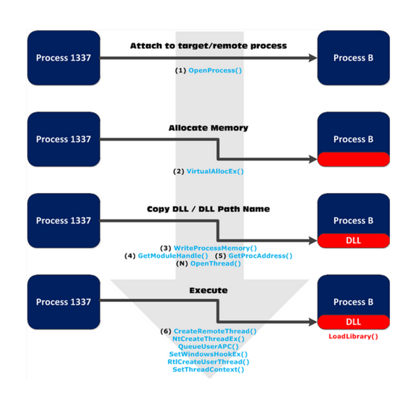
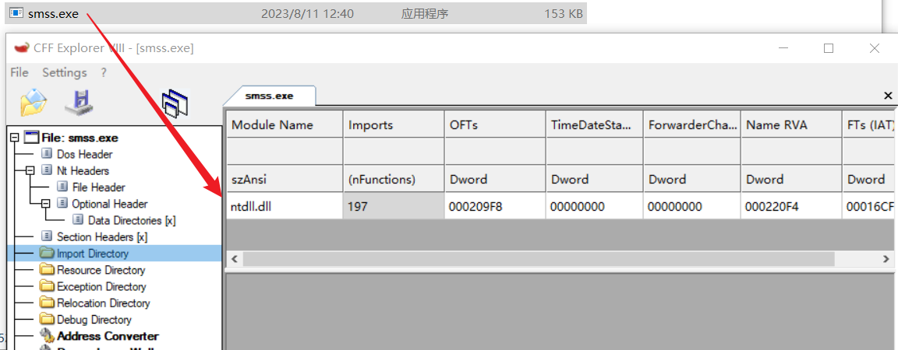

一般用于免杀,外挂之类的

hook一个好的宿主进程,可以达到隐藏自己的目的

hook的同时也要注意,别被反hook

# API_Hook(含部分dll注入)

基础的:

下图就很好的说明了一些常规的注入过程

所有进程都会默认加载 kernel32.dll库，kernel32.dll又会加载 ntdll.dll库。

**注**: 但是某些特定的系统进程（如：smss.exe）,不会加载 kernel32.dll库

此外， GUI 应用程序中，user32.dll 与 gdi32.dll 是必须库。

通过 API 钩取技术可以实现对某些 Win32 API 调用过程的拦截，并获得相应的控制权限。

使用 API 钩取技术的优势如下：

- 在 API 调用前/后运行用户的“钩子”代码。
- 查看或操作传递给 API 的参数或 API 函数的返回时。
- 取消对 API 的调用，或者更改执行流程，运行用户代码。

下图是一张技术图标 （Tech Map），涵盖了 API 钩取得所有技术内容

%20b81a8d48fb314c46a57ebb6f5509a02f/Untitled%201.png)

现在可能看不懂,不过无所谓,然后我们谈一下那张技术表

# 勾取的 方法 和 对象

首先时关于 API 钩取方法（Method）的分类，根据针对的对象（Object）不同，API 钩取方法大致可以分为静态方法与动态方法。

静态方法针对的时 文件，

而动态方法针对的是进程内存，

一般 API 钩取技术指动态方法，当然在某些非常特殊的情况下也可以使用静态方法。

%20b81a8d48fb314c46a57ebb6f5509a02f/Untitled%202.png)

**注**：静态方法在 API 勾取中并不常用。

# 勾取的位置

## exe导入表 IAT**表**

IAT 将其内部的 API 地址更改为钩取函数的地址。

该方法的优点是实现起来非常简单，缺点是无法勾取不在 IAT 而在程序用使用的 API

如：动态加载并使用 DLL 时 

## dll导出表 **EAT表**

将记录在 DLL 的 EAT 中的 API 的起始地址更改为钩取函数地址，也可以实现 API 钩取。

这种方法从概念上看非常简单，但在具体实现上不如前面的 Code 方法简单、强大，所以修改 EAT 的这种方法并不常用。

## 代码(字节码)

系统库（.dll）映射到进程内存时，

从中查找 API 的实际地址，并直接修改代码。该方法应用非常广泛，具体实现中有如下几种选择：

- 使用 JMP 指令修改起始代码；也就跳过
- 覆写函数内部；重写函数整体
- 仅修改必需部分的局部 重写函数局部

# 实际技术

%20b81a8d48fb314c46a57ebb6f5509a02f/Untitled%203.png)

技术图表中的这一栏是向目标进程内存设置钩取函数的具体技术，

大致分为调试法与注入法两类：

注入法又细分为

- 代码注入
- DLL注入

## 调试法

调试法通过调试目标进程钩取 API 。调试器拥有被挑事者（被调试进程）的所有权限（执行控制、内存访问等），

所以可以向被调试进程的内存任意设置钩取函数。

也就是说，在用户编写的程序中使用调试 API 附加到目标进程，然后（执行处于暂停状态）设置钩取函数。

这样，重启运行是就能完全实现 API 钩取了

## 注入法

注入技术是一种向目标进程内存区域进行渗透的技术，

根据注入对象的不同，可以细分为 DLL 注入与代码注入两种，

其中 DLL 注入技术应用最为广泛

- DLL 注入

使用 DLL 注入技术可以驱使目标进程强制加载用户指定的 DLL 文件。

使用该技术时，先在要注入的 DLL 中创建钩取代码与设置代码，

然后在 DllMain()中调用设置代码，注入的同时即可完成 API 钩取。

敲黑板: 注入的同时即可完成 API 钩取。

- 代码注入

代码注入技术比 DLL 注入技术更发达（更复杂），

广泛应用于恶意代码（病毒、Shellcode等）

代码注入比dll注入更加优秀

# 可以去分析的项目

通过搜索关键字 _SYSTEM_PROCESS_INFORMATION 看到的

[https://github.com/kevoreilly/capemon](https://github.com/kevoreilly/capemon)