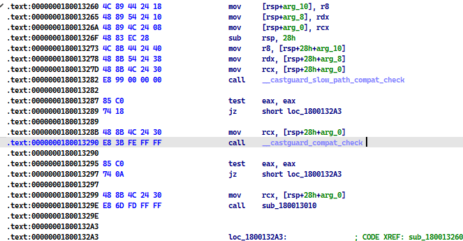
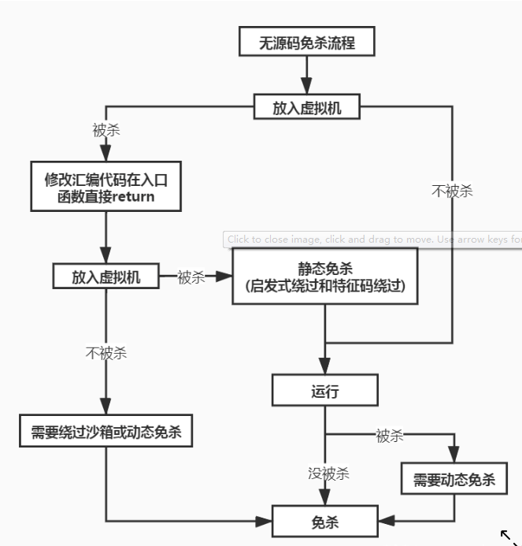

# 导入

ps: 绕过md5校验的话,就修改字节码或者增加文件大小之类的,会比较简单

绕过特征码, 其实就是需要我们不断的去猜测,特征码在哪里





然后我们去修改特征码的某一个字节,然后再让杀软去扫描,是否报毒

如果还在报毒,那么我们就再寻找关键位置,再次修改字节码,再次让杀软扫描


如何修改特征码:

1), 修改字节码,不能影响样本的正常运行

2), 可以采用等效的方法修改, 类似于 xor eax,eax == mov eax,0

比如nop大法,修改程序跳转,等效指令,花指令...

总之这种效果不是很好,比较费时间,源码免杀会更加不错

其实这种方法算得上是效率比较低下的笨方法,因为是大海捞针

ps: 从反病毒工程师的角度去思考如何定位特征码,我们才可以更加有效的去猜测特征码位置


进一步

这又侧面的说明了什么: 如何寻找特征码便得很重要

于是出现了工具  常用的定位木马病毒特征码: CCL，MultiCCL，MYCC, VirTest

其实可以去百度一下MyCLL的用法,知道MyCll是干嘛的

可以发现,MyCll也是一个效率很低的一个方法

关于VirTest貌似是一个更加科学的方法,不过效率还是比较低的


反正特征码定位到数据位置不容易修改（可以再试试后面的盲免杀）

因为我们很难精准定位到特征码的位置


# 数据角度


1 字符串，如果不影响程序逻辑，可以替换大小写；如果无关紧要的数据，随意替换；等等，看情况而定。

2 整数，如果不影响结果，替换值，清零等等操作。

3 地址，基本应该不能修改，具体看情况。

4 PE头数据，根据PE结构具体来看，无用数据清零或修改，有用数据看情况修改。


如果说敏感数据在exe身上,比如一些shellcode

我们可以把shellcode提取出来,放在一个新的文件里面

然后利用读取文件读取到内存


# 代码角度

1 如果特征码定位到代码（也通过IDA/OD等确认），在不改变程序功能基础上，应用各种方法修改。

2 等价替换汇编代码，如mov eax，0 可以换成xor eax，eax，直接结果相同，二进制代码不同。

3 交换代码顺序，在不影响逻辑的情况下。

4 代码块移位，将代码块移动不用的内存位置，通过加入jmp addr 跳过去执行，addr是新的代码块地址。

5 最后，终极修改方法，找到访问数据的代码，直接修改代码访问数据的地址，数据也可以放到其他地址了，

其实就如同修改源码一样修改，肯定没有修改源码那么容易（见后）。


# 常见的手法


比如说 call一个API函数

```assembly
FF95  3CFFFFFF | call dword ptr ss:[ebp-0xC4]
```

实际call的地址是0x7C3FF93C

于是我们就可以这样写

```assembly
E8 3CF93F7C     | call 0x7C3FF93C
90			    | nop ;长度填充
```

这样的话,就绕过了对某一个API的特征检查

但是这样已经被杀软盯上了,加高了危险指数,正常软件谁会这样写呢?


# 流程图

二进制文件->无特征文件:




