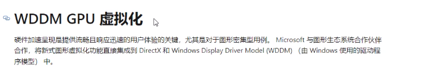

# 什么是免杀

免杀就是反病毒技术

它指的是一种能使病毒木马免于被[杀毒软件] 查杀的技术

其内容基本上都是修改病毒),木马的内容改变特征码，从而躲避了杀毒软件的查杀


病毒不断的发生进化...

进化到红蓝对抗的免杀?


为什么学先x86免杀?而不是x64?

这个问题 应该和 "为什么先学x86逆向,而不是x64逆向" 一样的


# 查杀方式的基本框架 


**静态查杀**  : 一般根据特征码(涉及多处多组)，然后对文件进 **多维的** 交叉匹配 

**行为查杀**  : 关注软件执行时的行为模式。行为查杀会监控程序的运行，并分析其行为，如文件操作、系统修改、网络通信等。

如果一个程序表现出类似恶意软件的行为模式，即使其没有明确的病毒特征，行为查杀系统也可以标记它为潜在威胁或恶意软件

**云查杀**    :  它将样本上传到云端进行分析和检测。云端服务器使用先进的算法和机器学习技术来识别恶意代码。

一旦新的威胁被确认，其特征会被添加到云数据库中，以便全球用户受益于对新威胁的防护


# 什么特征码

计算机病毒的特征码需要能够把病毒程序与一般的程序区分开来，即能够唯一标识一个或者一类多态病毒

要能够成为计算机病毒程序的指纹

一般来说，病毒特征码需要满足以下几个要求：

1),不能从数据区提取，因为数据区的内容很容易改变，一旦病毒程序变更版本，改变了数据内容，特征码就会失效。而其它的区块则相对来说保险一些。

2),在保持特征码的唯一性的前提下，应当尽量使得特征码短小精悍，从而减少检测过程中的时间与空间的复杂度，提高检测效率。

3),经过详细的逆向分析之后选取出来的特征码，才足以将该病毒与其它病毒或正常程序相区别。

4),病毒程序的特征码一定不能匹配到普通程序，比如选取病毒入口点的二进制代码，就必然出现误报的情况。

5),特征码的长度应当控制在64个字节以内。


特征码选取的基本方法:

计算校验和(参考之一)

提取特征字符串: 比如IDA的shift F12 ,或者OD的搜索字符串

除了特征码,也还有特征函数可以辅助特征码的提取


# 监测技术

1、内存读取监测

监控所有进程，扫描内存。


2、写入文件监测

对于写入磁盘的文件进行扫描。

比如,我们创建一个文件,会被杀软检测到,确定安全才会被创建


3、网页安全监测

检测是否存在网络攻击和不安全下载。


4、邮件附件监测

对于电子邮件的附件进行病毒扫描。

比如自动解压一些文件,zip或者7z什么的,如果你加了密码,就不会被杀软解压缩


5、进程行为监测

沙盒模式即为进程行为检测，监测进程各种行为，对于敏感操作进行警报。


通过深度学习技术来识别病毒特征，不仅可以做静态样本的二进制分析，也可以运用到沙盒动态行为分析中。

涉及4处特征码


我们要过的免杀,是可以让样本运行起来


# 关于沙箱


沙盒免杀



研究这个的话,可以写出这个虚拟化,然后借助一些签名,就可以长期驻留在显卡驱动层面


# 其它


## **关于pe文件杀软会关注哪些地方**

1), pe头

2), p代码段: 一般放全局变量

3), p数据段: 

4), 资源段(杀软重点研究): ico,shellcode


同时杀软会参照样本PE文件和标准PE文件,从多个维度考查样本PE的合法性

比如

首先确定是不是pe文件

查看section是否异常

...


## **关于文件的静态匹配,可能匹配什么**

MD5 匹配:文件哈希

FileName 匹配:文件名字

File Size匹配: 文件大小

File Path 匹配:

scode 匹配: 关键特征码,也就是程序如果没有那段字节码,就跑不起来


## 加花指令免杀

等效汇编指令 add eax,-1  == sub eax1,1

...


## 关于对pe的入口修改

不一定要一开始就修改ep

而是在执行ep的时候,再去新的节区


## 关于pe的IAT

一般不去导入表加载API,容易被检测敏感函数,所以一般动态加载API

比如说你有一段提取的代码 ,他会通过你有危险APi的导入和危险APi的调用来判断你是一个恶意程序


敏感的API:

```
KERNEL32.LoadLibraryA
KERNEL32.GetProcAddress
KERNEL32.VirtualProtect
KERNEL32.VirtualAlloc
KERNEL32.VirtualFree
ADVAPI32.OpenProcessToken
PSAPI.EnumProcesses
kernel32.GetCurrentProcess
SeDebugPrivilege
```


## 如何修改特征


比如下面这个东西,假如他是特征码,

```assembly
.text:0000000180013273 4C 8B 44 24 40                mov     r8, [rsp+28h+arg_10]
.text:0000000180013278 48 8B 54 24 38                mov     rdx, [rsp+28h+arg_8]
```

其实我们可以调用2条汇编指令的顺序

```assembly
48 8B 54 24 38              mov     rdx, [rsp+28h+arg_8]
8B 44 24 40                 mov     r8, [rsp+28h+arg_10]
```

这样就修改了特征,并且不影响效果

但是我们得判断谁是特征码,QWQ


比如把一小段for循环修改为while循环


# 闲谈

把自己封装为一个好人,最终的目的是干坏事


反病毒工程师 在动态分析的时候,不会去跟踪每一个call

最关心的是你什么时候调用的魔改API

exe是怎么启动的

exe调用了哪些API

exe如何加载dll

exe如何进行他的骚操作

