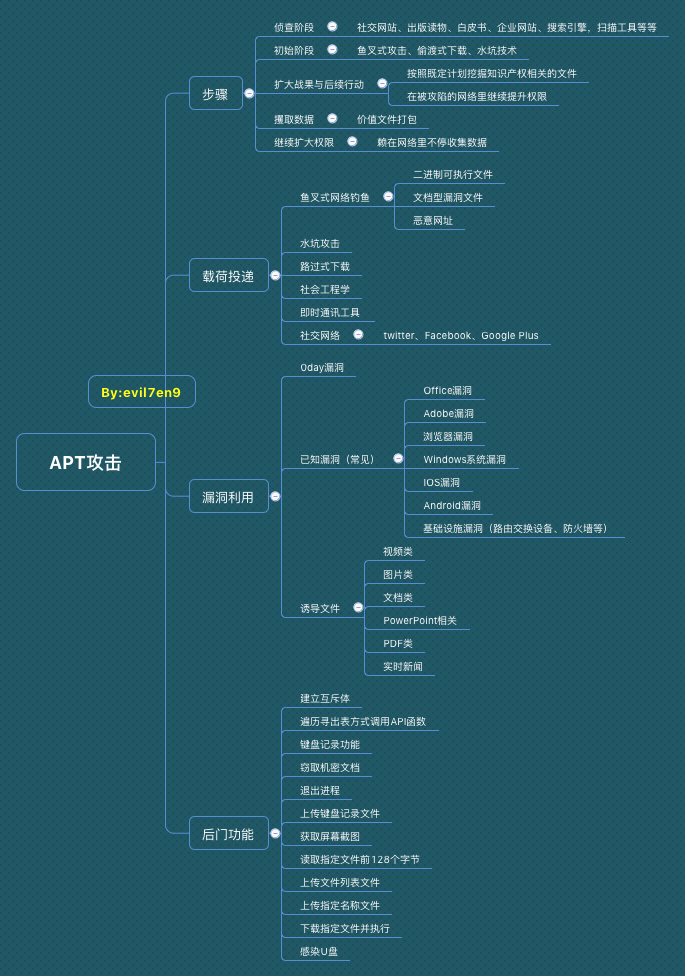

# APT组织常用的攻击手法

# 概览

# 载荷投递的方式

如何把我们的病毒 投递给 攻击目标

APT组织常用的攻击手法有：鱼叉式网络钓鱼、水坑攻击、路过式下载攻击、社会工程学、即时通讯工具、社交网络等，

在各大分析报告中出现最多的还是鱼叉式网络钓鱼、水坑攻击、路过式下载攻击手法、社会工程学，维基百科对攻击手法的描述如下：

**鱼叉式网络钓鱼（Spear phishing）**

指一种源于亚洲与东欧，只针对特定目标进行攻击的网络钓鱼攻击。当进行攻击的骇客锁定目标后，会以电子邮件的方式，

假冒该公司或组织的名义寄发难以辨真伪之档案，诱使员工进一步登录其账号密码，

使攻击者可以以此借机安装特洛伊木马或其他间谍软件，

窃取机密；或于员工时常浏览之网页中置入病毒自动下载器，并持续更新受感染系统内之变种病毒，使使用者穷于应付。

**水坑攻击（Watering hole）**是一种计算机入侵手法，其针对的目标多为特定的团体（组织、行业、地区等）。

攻击者首先通过猜测（或观察）确定这组目标经常访问的网站，并入侵其中一个或多个，植入恶意软件，

最后，达到感染该组目标中部分成员的目的。

**路过式下载（Drive-by download）**在用户不知道的情况下下载间谍软件、计算机病毒或者任何恶意软件。

路过式下载可能发生在用户访问一个网站、阅读一封电子邮件、或者点击一个欺骗性弹出式窗口的时候。

例如，用户误以为这个弹出式窗口是自己的计算机提示错误的窗口或者以为这是一个正常的弹出式广告，因此点击了这个窗口。

**社会工程学：**在计算机科学中，社会工程学指的是通过与他人的合法地交流，来使其心理受到影响，做出某些动作或者是透露一些机密信息的方式。这通常被认为是一种欺诈他人以收集信息、行骗和入侵计算机系统的行为。在英美普通法系中，这一行为一般是被认作侵犯隐私权的。

360发布的《摩诃草APT组织大揭秘》报告中，

发现了摩诃草近年来大量使用即时通讯工具（主要是腾讯的QQ聊天工具）和社交网络（Facebook）进行载荷投递的攻击方式；

即时通讯工具以发送二进制可执行程序为主，这类程序主要伪造成MP4格式的视频文件；社交网络（Facebook）的载荷投递一般是分为：

SNS蠕虫、放置二进制格式可执行恶意程序或文档型漏洞文件。

# 常用漏洞

## Office漏洞

Office漏洞依然是大部分APT组织最喜爱的漏洞，

Office在个人办公电脑使用量大，对针对性目标是最佳的外网入口，效果也是最直接的

Office漏洞依然是大部分APT组织最喜爱的漏洞，Office在个人办公电脑使用量大，对针对性目标是最佳的外网入口，效果也是最直接的。

| CVE编号 | 漏洞类型 | 使用组织 |
| --- | --- | --- |
| CVE-2009-2496 | 堆损耗远程代码执行漏洞，又称作 "Office Web 组件堆损耗漏洞 " | 丰收行动 |
| CVE-2010-3333 | RTF分析器堆栈溢出漏洞，又称"RTF栈缓冲区溢出漏洞" |  |
| CVE-2012-0158 | Microsoft Windows Common Controls ActiveX控件远程代码执行漏洞，栈内存拷贝溢出漏洞，又称“MSCOMCTL.OCX RCE漏洞” | 摩诃草蔓灵花白象Rotten Tomato |
| CVE-2013-3906 | Microsoft Graphics组件处理特制的TIFF图形时存在远程代码执行漏洞 | 摩诃草白象 |
| CVE-2014-1761 | Microsoft Word RTF文件解析错误代码执行漏洞 | 摩诃草Pitty Tiger白象Rotten Tomato |
| CVE-2014-4114 | OLE包管理INF 任意代码执行漏洞 | 摩诃草白象 |
| CVE-2015-1641 | RTF解析中的类型混淆漏洞 | MONSOON摩诃草白象奇幻熊Rotten Tomato丰收行动 |
| CVE-2015-2545 | EPS图形文件任意执行代码 | Rotten Tomato |
| CVE-2015-2546 | UAF（释放后重用）漏洞 |  |
| CVE-2016-7193 | RTF文件解析漏洞，可远程执行任意代码 |  |
| CVE-2017-0199 | 首个Microsoft Office RTF漏洞 | 暗黑客栈 |
| CVE-2017-0261 | EPS中的UAF漏洞 | 摩诃草白象Turla |
| CVE-2017-0262 | EPS中的类型混淆漏洞 | 摩诃草白象 |
| CVE-2017-11826 | OOXML解析器类型混淆漏洞 | 东亚某组织 |
| CVE-2017-11882 | “噩梦公式”公式编辑器中的栈溢出漏洞，可远程代码执行 | 白象响尾蛇寄生兽摩诃草人面马黑凤梨 |
| CVE-2017-8464 | 解析快捷方式时存在远程执行任意代码的高危漏洞 |  |
| CVE-2017-8570 | OLE对象中的逻辑漏洞 (CVE-2017-0199的补丁绕过)，“沙虫”二代漏洞 | 白象寄生兽摩诃草 |
| CVE-2017-8759 | .NET Framework中的逻辑漏洞 |  |
| CVE-2018-0802 | “噩梦公式二代”利用office内嵌的公式编辑器EQNEDT32.EXE发起攻击 | 黑凤梨 |
| CVE-2018-0798 | Microsoft Office远程内存破坏漏洞 |  |
| CVE-2018-8174 | 利用浏览器0day漏洞的新型Office文档攻击 |  |

## **Adobe 系漏洞**

Adobe系列包括Adobe Reader、Acrobat、Flash Player，Flash Player因为其跨平台，使用广泛，一直也受到各大APT组织的关注。

| CVE编号 | 漏洞类型 | 影响版本 | 使用组织 |
| --- | --- | --- | --- |
| CVE-2007-5659 | Adobe Acrobat/Reader PDF文件 多个缓冲区溢出漏洞 | Adobe Acrobat 8Adobe Reader 8Adobe Reader 7 | 丰收行动 |
| CVE-2008-2992 | Adobe Reader util.printf() JavaScript函数栈溢出漏洞 | Adobe Acrobat < 8.1.3Adobe Reader < 8.1.3 | 丰收行动 |
| CVE-2009-0927 | Adobe Acrobat和Reader Collab getIcon() JavaScript方式栈溢出漏洞 | Adobe Acrobat 9Adobe Acrobat 8Adobe Acrobat 7.0Adobe Reader 9Adobe Reader 8Adobe Reader 7 | 丰收行动 |
| CVE-2009-4324 | Adobe Reader和Acrobat newplayer() JavaScript方式内存破坏漏洞 | Adobe Acrobat <= 9.2Adobe Reader <= 9.2 | 丰收行动 |
| CVE-2010-0188 | Adobe Reader和Acrobat TIFF图像处理缓冲区溢出漏洞 | Adobe Acrobat < 9.3.1Adobe Acrobat < 8.2.1Adobe Reader < 9.3.1Adobe Reader < 8.2.1 | 丰收行动 |
| CVE-2010-3653 | Adobe Shockwave Player Director文件rcsL块解析内存破坏漏洞 | Adobe Shockwave Player 11.5.8.612 | 丰收行动 |
| CVE-2012-0773 | Adobe Flash Player / AIR  NetStream类任意代码执行或拒绝服务漏洞 | Adobe Flash Player 11.xAdobe AIR 3.x | The mask |
| CVE-2013-0640 | Adobe Acrobat和Reader远程代码执行漏洞 | Adobe Acrobat 9.xAdobe Acrobat 11.xAdobe Acrobat 10.xAdobe Reader 9.xAdobe Reader 11.xAdobe Reader 10.x | 丰收行动 |
|  |  |  |  |
| CVE-2014-0497 | Adobe Flash Player远程代码执行漏洞 | Adobe Flash Player 12.xAdobe Flash Player 11.x | 暗黑客栈 |
| CVE-2015-5119 | Adobe Flash Player ActionScript 3 ByteArray释放后重用远程漏洞 | Adobe Flash Player <= 18.0.0.194Adobe Flash Player <= 18.0.0.194Adobe Flash Player Extended Support Release 13.xAdobe Flash Player Extended Support Release 13.0.0.296Adobe Flash Player for Linux 11.xAdobe Flash Player for Linux 11.2.202.468 | 蓝白蚁Hacking Team |
| CVE-2015-8651 | Adobe Flash Player整数溢出漏洞 | Adobe Flash Player < 18.0.0.324Adobe Flash Player < 11.2.202.559Adobe Flash Player 20.x-20.0.0.267Adobe Flash Player 19.xAdobe AIR < 20.0.0.233 | 暗黑客栈 |
| CVE-2016-0984 | Adobe Flash远程代码执行漏洞 | Adobe Flash Player before 18.0.0.329 and 19.x and 20.x before 20.0.0.306 | BlackOasis |
| CVE-2016-4117 | Adobe Flash Player 任意代码执行漏洞 | Adobe Flash Player <= 21.0.0.226 | 奇幻熊 |
| CVE-2016-7855 | Adobe Flash Player 释放后重利用远程代码执行漏洞 | Adobe Flash Player <= 23.0.0.185Adobe Flash Player <= 11.2.202.637 |  |
| CVE-2017-11292 | 类型混淆漏洞导致的远程代码执行 | Adobe Flash Player Desktop RuntimeAdobe Flash Player for Google ChromeAdobe Flash Player for Microsoft Edge and Internet Explorer 11Adobe Flash Player Desktop Runtime | 黑色绿洲Lazarus |
| CVE-2018-4878 | Adobe Flash Player释放后重利用远程代码执行漏洞 | Adobe Flash Player <= 28.0.0.137 | Lazarus |

## **IE漏洞**

浏览器是用户接入互联网的门户，IE浏览器是Windows系统的默认浏览器，IE浏览器漏洞的使用一直也受各大组织喜爱。

| CVE编号 | 漏洞类型 | 影响版本 | 使用组织 |
| --- | --- | --- | --- |
| CVE-2010-0806 | Microsoft IE畸形对象操作内存破坏漏洞 | Microsoft Internet Explorer 7.0Microsoft Internet Explorer 6.0 SP1Microsoft Internet Explorer 6.0 | 丰收行动 |
| CVE-2010-3962 | Microsoft IE CSS标签解析远程代码执行漏洞 | Microsoft Internet Explorer 8.0Microsoft Internet Explorer 7.0Microsoft Internet Explorer 6.0 | 丰收行动 |
| CVE-2012-4792 | Microsoft IE mshtml!CButton对象释放后重用代码执行漏洞 | Internet Explorer 6Internet Explorer 7Internet Explorer 8 | 摩诃草 |
| CVE-2014-0322 | Microsoft Internet Explorer释放后重用远程代码执行漏洞 | Microsoft Internet Explorer 10 | Pitty Tiger |
| CVE-2016-7279 | Microsoft Internet Explorer/Edge远程内存破坏漏洞 | Microsoft Edge |  |
| CVE-2017-8618 | Microsoft Internet Explorer远程代码执行漏洞 | Microsoft Internet Explorer 9Microsoft Internet Explorer 11Microsoft Internet Explorer 10 |  |
| CVE-2018-0978 | Microsoft Internet Explorer远程内存破坏漏洞 | Microsoft Internet Explorer 9-11 |  |
| CVE-2018-8113 | Microsoft Internet Explorer安全限制绕过漏洞 | Microsoft Internet Explorer 11 |  |
| CVE-2018-8178 | Microsoft Internet Explorer/Edge 远程内存破坏漏洞 | Microsoft Edge Microsoft ChakraCore |  |

# **总结**

工欲善其事，必先利其器！

0day宛如窈窕淑女，只可远观，不可随意撒网式的使用；

好用的Nday才是网络安全人员的手中利器，

普遍的APT组织都会把好用的Nday漏洞纳入他们的“武器库”。

当然，道高一尺，魔高一丈！也许还有好多故事还在发生着！