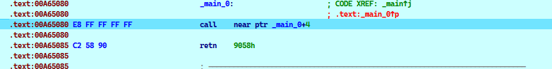
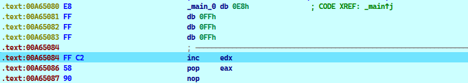

# CALL/POP .1


```assembly
DWORD* lp_apiAddr;

    __asm {
        push eax;
        push ebx;
        push ecx;

        call label_reloc;
    label_reloc:
        pop ebx;

        //重定位lpfuncAddr;
        lea eax, g_apiAddr;
        sub eax, label_reloc;
        add eax, ebx;

        lea ecx, lp_apiAddr;
        mov[ecx], eax;

        pop ecx;
        pop ebx;
        pop eax;

    }
```

他的原理是什么?

一个变量的真实地址 = 一个基址 + 一段偏移


比如y1地址的重定位,就是x1的地址+一个偏移量量

偏移量是一个相对距离,静态加载和动态加载都不会改变这个相对值

只是基址在发生变化,所以重定位就是新的基址+写死的偏移量

对方法1的小结

其实就是新的基址+一个固定的偏移

就我举得例子,它是通过现场获取当前基址,并现场计算写死的固定偏移

通过新的基址+固定偏移来获取

其实,大多数情况下,固定偏移是提前计算好了的,不需要我们那样现场计算

```c
        //重定位lpfuncAddr;
        lea eax, g_apiAddr;
        sub eax, label_reloc;
        add eax, ebx;

优化为
 
        mov eax,xxx ;xx是直接写死的,而不是通过计算
				add eax,ebx
```


# CALL/POP .2


```
E8FFFFFFFFC25890
```




执行后,代码会重构



这样的话,edx就可以获取地址 .text:00A65085


# 浮点运算型

浮点运算后位置保存在栈顶，通过POP操作可以获取其位置。


案例1

```assembly
 ; ---------------------------------------------------------------------------
.text:00A65084 D9 EE                         fldz
.text:00A65086 D9 74 24 F4                   fnstenv byte ptr [esp-0Ch]
.text:00A6508A 5B                            pop     ebx
```


案例2

```c
debug043:00E00000 DA C5                         fcmovb  st, st(5)
debug043:00E00002 B8 5B 43 B1 DA                mov     eax, 0DAB1435Bh
debug043:00E00007 D9 74 24 F4                   fnstenv byte ptr [esp-0Ch]
debug043:00E0000B 5D                            pop     ebp
```

其实具体东西就是00E00000进入了某个环境.然后后面取出来了


# 中断

说用int 2Eh 或者 int 2Ch 可以把下一条地址入ebx

没有实验成功


# 异常

通过异常,可以记录异常发生的位置eip

