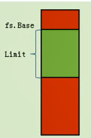
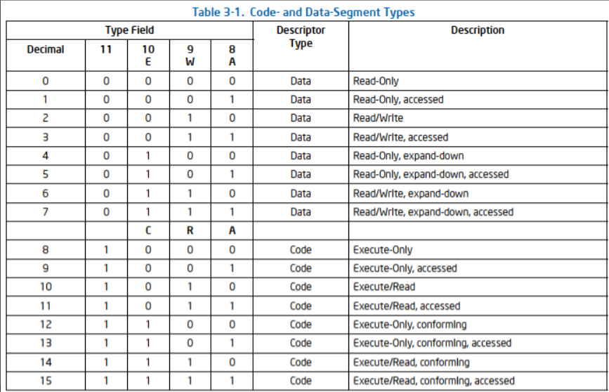
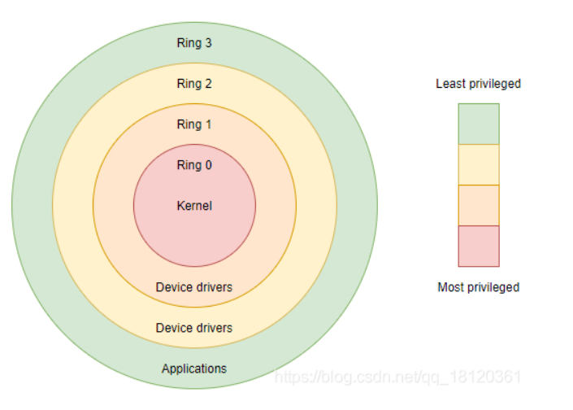
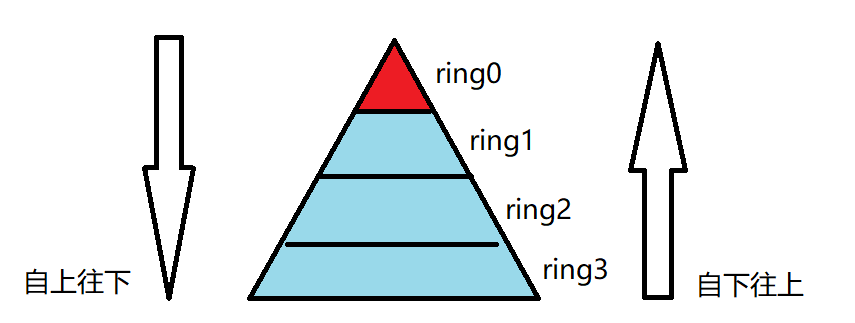
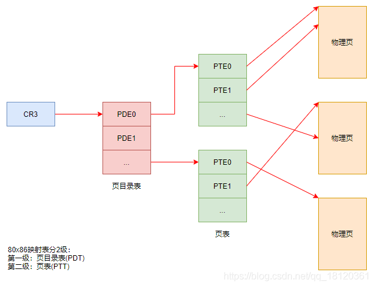

# 带学习的文章


[GDTR](https://blog.csdn.net/abc123lzf/article/details/109289567)


# 段寄存器 


## 简单介绍


下面是简单的说明了一下,各个寄存器是干嘛的,后面遇到会详细说

CS:代码段寄存器 （Code Segment） 存放当前正在运行的程序代码所在段的段基址

DS:数据段寄存器DS（Data Segment）指出当前程序使用的数据所存放段的最低地址，即存放数据段的段基址。

SS:堆栈段寄存器SS（Stack Segment）指出当前堆栈的底部地址，即存放堆栈段的段基址。

ES:附加段寄存器ES（Extra Segment）指出当前程序使用附加数据段的段基址，该段是串操作指令中目的串所在的段

FS:

GS:

TR:  指明了TSS位置和大小

GDTR: Global Description Tabel Register  全局描述符号表寄存器

LDTR: Local Description Tabel Register  局部描述符号表寄存器

IDTR: 指明了IDT表


就以前学习8086的时候,地址的寻址是 BASE*16+地址    

因为x86地址范围比较大,就变为了BASE+地址,省略了那个`*16`,可能那个BASE都是不存在的

然后是个人的理解

<div style="color:#00CED1;font-size:16px">
    段和段之间是可以交叉的<br>
	比如数据段和栈段会存在一个包含的关系<br>
</div>


关于x86寄存器的结构


```c
struct Segment
{
    WORD Selecter;  //段选择子 ,类似于一个index的索引值,索引了一张表
    WORD Attribute; //段属性,比如读写权限
    DWORD Base;     //基址,表示段的起点 
    DWORD limit;    //基址的长度 
}//12字节,96位
```

个人的理解:

` Selecter`决定了Base和limti的数值,还有Attribute

也可以说是`Selecter`决定了`BYTE Base[limit]`数组的起点,数组的大小

我们的段就是指的那个数组`BYTE Base[limit]`

然后`Attribute`指明了这个内存空间(简称段)的属性




那个绿色的,就形象的说明了一个段的内存空间

## 读写


### mov指令

mov可以实现一个寄存器的读写

ps:对LDTR和TR的读写,用的不是mov

读取段寄存器 :只能拿着16位寄存器去读取数据

```c
mov ax,ES  //只能读取段选择子,其它的不能读取
```

修改段寄存器 :会根据你的段选择子和一些附带的其它信息写入12字节

```c
mov DS,ax 
//也就是你主要提供2个字节的段选择子就可以了
//然后其它的参数就会自动依据你的段选择子生成所有的数据
```

ps:我尝试修改FS.然后程序就直接g了,因为涉及一些权限的检查


### 基于mov指令实现属性探测

在x86下.我们可以看如下寄存器表示图.


下面的表格是直接给出的参考数据

| 寄存器名称      | 段选择子(Select) | 段属性(Attributes) | 段基址(Base) | 段长(Limit) |
| :-------------- | :--------------- | :----------------- | :----------- | :---------- |
| ES(附加扩展段)  | 0x0023           | 可读,可写          | 0x0000000    | 0xFFFFFFFF  |
| CS(代码段)      | 0x001B           | 可读,可执行        | 0x00000000   | 0xFFFFFFFF  |
| SS(堆栈段)      | 0x0023           | 可读,可写          | 0x00000000   | 0xFFFFFFFF  |
| DS(数据段)      | 0x0023           | 可读,可写          | 0x00000000   | 0xFFFFFFFF  |
| FS(分段机制)    | 0x003B           | 可读,可写          | 0x7FFDF000   | 0xFFF       |
| GS(x64下才生效) | 未使用           | 未使用             | 未使用       | 未使用      |

 

简单的检测,是否可写

其实这里你也可以故意的去引发一些异常或者什么的

```c
int var = 0;
int main(int argc, char* argv[])
{
    __asm
    {
        mov ax,ss
        mov ds,ax
        mov dword ptr ds:[var],eax
    }
	return 0;
}
```


简单的检测Base属性 

```c
int var = 0;
 
int main(int argc, char* argv[])
{
    __asm
    {
        mov ax,fs
        mov gs,ax        //不要使用ds，否则编译不通过
        mov eax,gs:[0]   //fs.base+0
 		
        mov dwrod ptr ds:[var],eax
 		//如果BASE不存在的话,相当于mov dwrod ptr [0+0],eax,会触发一个异常
        //如果BASE存在的话,相当于mov dwrod ptr [BASE+0],eax,可能不会触发一个异常   
    }
	return 0;
}
```


检测Limit属性,其实就是Limit限制了你的寻址范围

```c
//报错，fs访问越界，证明Limit真实存在
int var = 0;
int main()
{
    __asm
    {
        mov ax,fs     
        mov gs,ax      //此处如果换成ds则会出现编译不过的问题
        mov eax,gs:[1000]  //fs的limit是FFF 但是读0x1000则越界了
        //访问的地址相当于下面的 但是DS的Limit是0xFFFFFFFF
        //mov eax,dword ptr ds:[0x7FFDF000+0x1000]
        mov dword ptr ds:[var],eax
    }
    
}
```

关于对地址的个人理解

比如说:

DS的范围是 [0,0xFFFFFFFF]

然后FS的范围是[0x00000000,0x7FFFFFFF]

于是FS的范围可能有点受限制

然后你就直接

```assembly
mov ax,fs
mov DS,ax
```

然后通过DS间接的去访问FS访问不到的地址


### L系列指令

L是Load的意思

```
LES,LSS,LDS,LFS,LGS
```

但是在使用的时候也有很多讲究

 

```c
#include<stdio.h>
#include<stdlib.h>
#include<string.h>
#include<windows.h>

int main()
{
	char buff[6];
	_asm {
		lea eax, buff;
		mov bx, ds;
		mov word ptr [eax+4], bx;
		les ecx, fword ptr [eax]
	}
	
	return 0;
}
```

fword的意思就是取出6个字节

les会把高2字节(段选择子)给es,也就是把数组最后2个字节给段选择子

低4字节给ecx

也就是说: 我们可以把一个tmp[6]的tmp[4,5]作为段选择子,然后赋值给寄存器


## 段选择子


>之前说过这么一句话:
>
>mov读写修改段寄存器 :会根据你的段选择子和一些附带的其它信息写入12字节

引入:

GDTR: 48位 Global Description Tabel Register  全局描述符号表寄存器 有2个值,GDTR表的开始位置和表的大小
LDTR: Local Description Tabel Register  局部描述符号表寄存器 有2个值,LDTR表的开始位置和表的大小


当我们执行类似`MOV DS,AX` 指令时，

CPU会在系统中查表，那个表叫做`GDTR或者LDTR` ,也就是一个数组, `QWORD GDTR[xx],QWORD LDTR[xx]`

然后传入的16位寄存器参数,寄存器的信息,决定了查哪一个数组,数组的索引值是多少


ps: 该指令在windbg双机调试环境下有效 win10 -> xp

```
kd> r gdtr //产看gdtr数组在哪里
gdtr=8003f000
kd> r gdtl //查看gdtr表数组的大小
gdtl=000003ff
```

GDRT表成员是就是段描述符,每个成员占用8字节,后面会提到 


段选择子(2字节,也就是可读可写的部分) 决定了段寄存器的大部分数据填充

段选择子有时也叫段描述符(奇怪.jpg)


下面是一个段选择子的分解情况


```c
#include<stdio.h>
#include<stdlib.h>
#include<string.h>
#include<windows.h>

int main()
{
	int arrReg[] = { "GS",0x0000,"FS",0x003B,"ES",0x0023,"DS",0x0023,"CS",0x001B,"SS",0x0023 };
	int index = 0;
	int pri = 0;
	int aDT = 0;
	int i = 0;
	char* priRing[] = { "R0","R1","R2","R3" };
	char* arrDT[] = { "GDT","LDT" };
	int len = sizeof(arrReg) / sizeof(arrReg[0]) / 2;

	for (i = 0; i < len; i++)
	{
		index = arrReg[i * 2 + 1] >> 3;
		pri = arrReg[i * 2 + 1] & 3;//3=0000000000000011
		aDT = (arrReg[i * 2 + 1] & 4) >> 2;//4=0000000000000100
		printf("%s 去往:%s 索引:%d 然后请求:%s\n", arrReg[i * 2 + 0], arrDT[aDT], index, priRing[pri]);

	}
	return 0;
}
/*
GS 去往:GDT 索引:0 然后请求:R0
FS 去往:GDT 索引:7 然后请求:R3
ES 去往:GDT 索引:4 然后请求:R3
DS 去往:GDT 索引:4 然后请求:R3
CS 去往:GDT 索引:3 然后请求:R3
SS 去往:GDT 索引:4 然后请求:R3
*/
```


<p style="color:#FFA500;font-size:24px">
    RPL[0,1]<br>
</p>

一些段权限检查,就是限制你的行为

后面会介绍的,[点击我跳转](#Attribute.DPL) 

<p style="color:#FFA500;font-size:24px">
    TI[2]<br>
</p>

```
TI=0,查GDT表
TI=1,查LDT表
```

GDT全局描述符表

LDT局部描述符表

<p style="color:#FFA500;font-size:24px">
    Index[3,15]<br>
</p>

一个索引值,去GDT或者LDT查表,

但是我们得把该实际的数值`index>>3`才是真正的索引值


比如数据是	


所以它大概的结构

```c
strct
{
	2个bit位 RequestPrivilegeLevel; //请求特权级别
	1个bit位 TableIndicator; //查哪一个数组
	15个bit位 Index;//数组索引值
}
```

ps: 数组是QWORD Arr[xx]


一句话总结: 

<div style="color:#00CED1;font-size:16px">
    段选择子根据自己的信息去GDTR的查表,<br>
    然后拿到数据,拆解数据,然后是一些段权限检查,不是索引谁,都可以直接塞到段寄存器<br>
	检查合格,就后往段寄存器里面赛<br>
	但是这里只涉及了8个字节,还差2字节,后面会介绍到<br>
</div>


## 段描述符号表成员

如果把8字节合并在一起的话,从低地址往高地址看


积累值:

```
SDPLP: 从左到右第4个
0xf 非系统段3环数据
0x9 非系统段0环数据
0x7 系统段3环数据
0x1 系统段0环数据
```


顺便回忆一下段寄存器结构,下面要介绍

```c
struct Segment
{
    WORD Selecter;  //段选择子 ,类似于一个index的索引值,索引了一张表
    WORD Attribute; //段属性, 表示了当前段寄存器的 R W X 属性读写执行
    DWORD Base;     //基址,表示段的起点 
    DWORD limit;    //基址的长度 
}//12字节,96位
```


引入:

段描述符分为 数据段描述符,代码段描述符,系统段描述符

后面会介绍如何判断是什么段


### Base

(Base:DWORD `[0,15]+[16,23]+[24,31] `


Base由3部分构成(1+1+2=4)


### Limit

Limit:DWORD但是,**数据是20个bit位** `[0,15]+[16,19]`


### Attribute


Attribute:WORD `[8,23]`


[8,23]这16位其实就对应了段寄存器结构体成员的Attribute

小目录:点击即跳转

[Attribute.P位](#Attribute.P)

[Attribute.G位](#Attribute.G)

[Attribute.S位](#Attribute.S)

[Attribute.Type](#Attribute.Type)

-   11位
-   数据段AWE
-   代码段AWX

[Attribute.DB位](#Attribute.DB)

[Attribute.DPL位](#Attribute.DPL)

-   CPL
-   DPL
-   RPL


<h4 id="Attribute.P" style="color:#00FA9A">
    Attribute.P位
</h4>


```
P=1,该段描述符有效
P=0,反之无效
```

通过指令将段描述符加载至段寄存器的时候，CPU第一件事就是检查该段描述符的P位。

如果P位等于0，那么其他的检查就不做了。只有当P位为1的时候才会做后续的其他检查


<h4 id="Attribute.G" style="color:#00FA9A">
    Attribute.G位
</h4>


Limit在取数据的时候,然后是20位,一般都是0xFFFFF,

但是我们知道段的最大长度,但是可以是0xFFFFFFFF

那是如何实现的?

依靠G位

```
G位=1,最大长度0xFFFFFFF
G位=0,最大长度是0xFFFFF
```


<h4 id="Attribute.S" style="color:#00FA9A">
    Attribute.S位
</h4>


段描述符分为了2大类

```
S=1,代码段或者数据段描述符
S=0,系统段描述符
```

系统段描述符可能是调用门、中断门、任务门、TSS段


<h4 id="Attribute.Type" style="color:#00FA9A">
    Attribute.Type域 [8,11] 
</h4>


占据4位 ,可以形成一个16进制

下面是基于S=1的情况,引入介绍

>   `Attribute.DPL` 它占据2个bit位,要么是0b11,要么是0b00
>
>   
>
>   代码段或者数据段一定有: S=1,P=1 ,然后DPL=0b00或者0b11
>
>   P+DPl+S=4个比特位,可以形成一个16进制
>
>   所以,对于代码段或者数据段而言,这4个bit位的值要么是0x9,要么是0xF


然乎继续Attribute.Type域

下面主要介绍的是代码段和数据段的Type域, 系统段的Type域后面介绍,[点击我就跳转]()





<p style="color:#FFA500;font-size:24px">
    [11]位
</p>


ps: 32位中的第11位,不是Attribute的11位

```
[11]=1, 指明代码段
[11]=0, 数据段
```

然后,换句话说,如果Type域>7,那么就是代码段

Type域的属性会根据你是不同的段,各个属性值会有不同的意义

<p style="color:#FFA500;font-size:24px">
    数据段的AWE
</p>

A属性: 该段是否被访问过

W属性: 是否可写 write

E属性: 奇怪的拓展属性

>如果E=0 向上挺赞,那么有效段范围就是红色的 左图
>
>如果E=1,向下拓展,那么有效段范围就是红色的 右图
>
>


<p style="color:#FFA500;font-size:24px">
    代码段的AWC
</p>
1.   A属性: 该段是否被访问过
2.   W属性: 是否可读 read
3.   C属性: 
     1.   为1表示一致代码段 高权限的代码段
     2.   为0表示非一致代码段 低权限的代码段 


在下节`代码跨段`时还会再讲诉

这里贴一个系统段的Type域说明.不做讲解


<h4 id="Attribute.DB" style="color:#00FA9A">
    Attribute.DB位
</h4>
感觉的话,D位是用于16位CPU和3位CPU过度的一个属性位


位于高4字节的22位


DB位会对3种产生影响

<p style="color:#FFB5C5;font-size:16px">
    对CS段的影响：
</p>

D = 1，采用32位寻址方式。这是x86默认的寻址方式

D = 0，采用16位寻址方式。

<div style="color:#00CED1;font-size:16px">
	硬编码指令前缀67：改变寻址方式。<br>
</div>

```
MOV DWORD PTR SS:[EBP-0x18], ESP //32位寻址
MOV DWORD PTR DS:[DI-0x18], ESP //加了67的前缀的16位寻址方式
```


<p style="color:#FFB5C5;font-size:16px">
    对SS段的影响：
</p>

D = 1，隐式对栈访问指令（会修改ESP，如：PUSH、POP、CALL）使修改ESP

D = 0，隐式对栈访问指令（会修改SP，如：PUSH、POP、CALL）修改SP


<p style="color:#FFB5C5;font-size:16px">
    对向下扩展的数据段的影响：
</p>

D = 1，段上限为4GB。

D = 0，段上限为64KB。


其实D干的事情,就是限制段的Limit吧.个人呢理解

以前寻址最大时0xFFFFFFFF,现在变为了64k的寻址范围


<h4 id="Attribute.DPL" style="color:#00FA9A">
    Attribute.DPL
</h4>


```
mov DS,AX
```

AX中是一个16位的数，又称为段选择子，

段选择子中包含了一个索引，可以通过该索引找到段描述符。

并不是说段描述符指向谁，就一定会将这个段描述符加载到当前的段寄存器中。

它在加载之前，会有一系列的检查，比如有没有权限，允不允许把段描述符加载到段寄存器中。

如果想要了解检查的细节，还要了解一些其他概念


<p style="color:#FFA500;font-size:24px">
    CPU分级:
</p>




为什么要分级？

1.  因为对CPU来说，有些特权指令是只有在0环(Ring 0)才可以使用的。
2.  Windows系统只使用了CPU中的两个环，R0和R3。


<p style="color:#FFA500;font-size:24px">
    引入介绍CPL:
</p>

大名:Current Privilege Level 当前特权级别，

在CS和SS中储存的段选择子后2位。 然后CS和SS处于的环级别是一致相同的

也就是说,要想知道当前程序处于什么环,就去看SS/CS的CPL位

就之前,我们对段选择子的定义是


但是对于CS,SS,它的那个最后2位,不叫RPL,叫CPL 

比如

```
CS:0023 = 0b100011 CPL=0b11=2
SS:002B = 0b101011 CPL=0b11=3
```

所以就可以看出,是三环?应该把


<p style="color:#FFA500;font-size:24px">
    开始DPL:
</p>

大名 :Descriptor Privilege Level,描述符特权级别。

通俗的理解：

如果你想访问我，那么你应该要具备什么特权。如果权限存在越级访问,是不允许的

因为Windows中只使用了0环和3环。所以在Windows中，DPL只会是00或者11

eg:

引入:

AX是段选择子,含有成员RPL(希望请求的权限)

AX指向的段,含有成员DPL(GFTR[index]该段的权限)

该指令处于CS,CS和SS还有CPL(当前环境的权限)

```
MOV DS, AX//将AX指向的段描述符加载至DS段寄存器。
//如果AX指向的段DPL(描述符特权级别) = 0，
//但当前程序的CPL(当前进程特权级别) = 3，
//这行指令(MOV DS, AX)是不会成功的，因为段权限检查无法通过。
```


<p style="color:#FFA500;font-size:24px">
    引入RPL:
</p>

大名: Request Privilege Level,请求特权级别


-   RPL是段选择子的成员，每个段的段选择子都有自己的RPL。
-   RPL就是一个数值，意味着你可以随便写[0,3]，RPL可以随意指定。
-   但DPL不同，每个段描述符只有唯一的DPL。


<p style="color:#FFA500;font-size:24px">
    数据段权限如何检查:
</p>


下面以数据段检查为例,其它段检查会不同,后面会介绍,[点击我就跳转]()


比如当前程序处于0环，也就是说CPL = 0。

```
											//CPL=0
MOV AX, 000B      //0000 0000 0000 1011，	 RPL = 3
MOV DS, AX        //AX指向的段描述符的			DPL = 0
```

数据段的权限检查依据

-   CPL <= DPL 且 RPL <= DPL (数值上的比较)
-   只有CPL与RPL都要小于等于DPL的时候，上面的两行指令才能加载成功，否则会失败

也就是当前权限CPL和请求权限RPL都得大于索引成员的权限DPL(向下访问,不能越级访问)


关于为什么有3个权限,2个不香吗?

<div style="color:#FFB5C5;font-size:16px">
    例如写代码时， <br>
    可以使用 "读写" 的权限去打开一个文件，
    但是为了避免出错， <br>
    有些时候我只想使用我能够得到的权限中的部分权限, <br> 
    比如我请求 "只读" 的权限去打开一个文件。可能我原本的可以获取所有权限 <br>
</div>


小结:

<div style="color:#00CED1;font-size:16px">
    CPL(Current Privilege Level)：当前进程特权级别。（CS和SS中储存的段选择子后2位。）<br>
	DPL(Descriptor Privilege Level)：描述符特权级别。（如果想访问，应该具备什么样的权限。） <br>
	RPL(Request Privilege Level)：请求特权级别。（使用什么样的权限去访问。<br>
</div>


# 代码跨段

本质是修改CS寄存器

同时修改CS的指令有

```
jmp far
call far
retf
int
ireted
```

后面会慢慢介绍


段间跳转分为两种情况：

1.  要跳转的段是一致代码段(俗话:一些权限比较低的代码段,不会对内核层找出太大的影响)
2.  要跳转的段是非一致代码段(俗话:一些权限比较高的代码段,会影响代码段的数据)


## JMP FAR 段间跳转


### 执行流程

以JMP FAR为例

```
JMP 0x20:0x00401234
机器码是
EA 34124000 2000
```

该指令要提供6字节的参数(2+4)==(段选择子+偏移)


ps: 遇到一个问题,如何从一个dll跳转到另外一个dll'

<p id="Attribute.DPL" style="color:#00FA9A;font-size:32px">
    首先我们拆分数据
</p>

其中的

0x20就是一个段选择子,决定了跳往哪个段,

0x00401234就算去往该段的地址

<p id="Attribute.DPL" style="color:#00FA9A;font-size:32px">
    然后检查去往的段是不是符合条件
</p>

另外不是说任意一个地方都可以JMP,只能JMP到

1.   代码段: TYPE域代码段是的C位是
2.   系统段(调用门,TSS任务段,任务门)

ps: 

<div  style="color:#FFB5C5;font-size:16px">
    我以前写了一个程序,是可以JMP到DATA段的,<br>
    当时是把机器码放在了DATA段,然后修改了Vs2022的编一些配置<br>
	于是就可以在DATA段执行我们的代码了<br>
</div>


<p id="Attribute.DPL" style="color:#00FA9A;font-size:32px">
    权限检查
</p>

在讲`Attribute.Type`的时候,有代码段的AWC,那个C就说明了

你是一致的还是非一致的代码段

```
CF=1 一致代码段 
CF=0 非一致代码段  
```



一致代码段：要求 `CPL >= DPL` 也就是比可以自下往上的访问,低权限访问高权限

非一致代码段：要求 `CPL == DPL`并且 `RPL <= DPL` 只能当前权限=索引段权限,一个同级权限的访问

但是,通过别人的笔记了解到,JMP FAR只适用于非一致代码段,不会涉及权限的变化 


<p id="Attribute.DPL" style="color:#00FA9A;font-size:32px">
    加载段寄存器然后跳转
</p>

当检查完毕后,我们就会把索引段的BASE加载到段寄存器的BASE里面去

然后当前CS:IP就发生了新的变化,然后就跳转

 

### 小实验

获取GDT

```
gdtr=8003f000
0: kd> dq 8003f000
8003f000  00000000`00000000 00cf9b00`0000ffff //[0],[1]
8003f010  00cf9300`0000ffff 00cffb00`0000ffff //[2],[3]
8003f020  00cff300`0000ffff 80008b04`200020ab //[4],[5]
8003f030  ffc093df`f0000001 0040f300`00000fff //[6],[7]
8003f040  0000f200`0400ffff 00000000`00000000 //[8],[9]
8003f050  80008955`27000068 80008955`27680068
8003f060  00009302`2f40ffff 0000920b`80003fff
8003f070  ff0092ff`700003ff 80009a40`0000ffff

```

首先CS=0x001B

```
CS 去往:GDT 索引:3 然后请求:R3
```

索引的值是[3]=00cffb00`0000ffff

于是我们为了突出效果,在[9]:8003f048的地方插入值00cffb00`0000ffff

```
0: kd> eq 8003f048 00cffb00`0000ffff
0: kd> dq 8003f000
8003f000  00000000`00000000 00cf9b00`0000ffff
8003f010  00cf9300`0000ffff 00cffb00`0000ffff
8003f020  00cff300`0000ffff 80008b04`200020ab
8003f030  ffc093df`f0000001 0040f300`00000fff
8003f040  0000f200`0400ffff 00cffb00`0000ffff //发生改变
8003f050  80008955`27000068 80008955`27680068
8003f060  00009302`2f40ffff 0000920b`80003fff
8003f070  ff0092ff`700003ff 80009a40`0000ffff
0: kd> g
```


打算跳往的选择子是0x004B

```
0x004B: 去往:GDT 索引:9 然后请求:R3
```

然后后续我么直接跳到main函数罢了

```
JMP FAR 0x004B:0x00401010 //0x00401010函数地址
```

跳转前


跳转后


如果我们跳往的不是CS段,而是DPL为ring0的段

```
0: kd> eq 8003f048 00cf9b00`0000ffff
0: kd> g
```

 00cf9b00`0000ffff 段范围:00000000[FFFFFFFF] ,段类型:非系统段 段权限:R0

于是我们尝试从非非一致代码段,从R3 JMP FAR 到R0

直接触发异常


### 小结

一致代码段（共享段,给普通的段提供了便利)

低权限访问高权限 但特权级不会改变：用户态还是用户态

高权限不能访问低权限：核心态不允许访问用户态的数据


非一致代码段（级别要求严格,)

只允许同级访问

绝对禁止不同级别的访问


<div  style="color:#FFB5C5;font-size:16px">
    注意：直接对代码段进行JMP 或者 CALL的操作，<br>
	无论目标是一致代码段还是非一致代码段，CPL当前权限都不会发生改变.<br>
    如果要提升CPL的权限，只能通过调用门<br>
</div>


另外JMP FAR只能跳转到

>   代码段,调用门,TSS任务段,任务门


## CALL FAR 段间调用(调用门引入)


引入段内调用: 

段内调用就是我们常见的CALL,只需PUSH一个返回地址就可以了,虽然是去往CS:IP

但是ret的时候,CS是没有发生变化了,所以我们是不需要在之前PUSH CS的


### 不提权

指令格式：CALL XX:EIP(EIP是废弃的), 

并不使用后面的EIP，EIP是被废弃的。而真正跳往的地址是XX提供的

XX是一个段选择子，通过段选择子去查询GDT表找一个段描述符，且该段描述符必须是调用门的段描述符。 

因为我们要去的地方是一个特殊的调用门,调用门里面有那个CALL后的实际地址

通过调用门我们还可以提升 CPL 的权限

执行的时候,我们是先PUSH CS,然后PSUH IP

```
EIP
CS
```


### 提权

指令格式：CALL XX:EIP(EIP是废弃的)

跨段调用时，一旦有权限切换，伴随着以一个新的堆栈出现。

CS的权限一旦改变，SS的权限也要随着改变，即CS与SS的等级必须一样。

新的堆栈里面,初步的值会是下面的样子

```
栈顶:	   EIP //返回的地址
		CS //以前的cs
		ESP //以前的栈顶
		SS //以前的ss
```

新的堆栈来源于参见TSS段


# 调用门

Windows系统没有再使用调用门，但是使用了中断门

学习调用门是为了更好地理解中断门 后续讲解中断门

回顾: 

1.   长调用,CALL XX:YYYY
2.   以前的段描述符


3.   系统段的TYPE域

     

华丽的分割线

```c
#include<stdio.h>
#include<stdlib.h>
#include<string.h>
#include<windows.h>

int main()
{
	long long arrGDT[] =
	{
		0x0040ec0000081020
	};
	char* Seginfo[] = { "  系统段","非系统段" };
	char* priRing[] = { "R0","R1","R2","R3" };
	int len = 0;
	int tmp = 0;
	int i = 0;
	int SegSlector = 0;
	int Deip = 0;
	len = sizeof(arrGDT) / sizeof(arrGDT[0]);
	for (i = 0; i < len; i++)
	{
		tmp = (arrGDT[i] & 0x0000F00000000000) >> 32 >> 12;
		SegSlector = (arrGDT[i] & 0x00000000FFFF0000) >> 16;
		Deip = (arrGDT[i] & 0xFFFF000000000000) >> 32 | arrGDT[i] & 0x000000000000FFFF;
		printf("段选择子:%d,去往的EIP:%08X,该调用门权限:%s,属于%s\n", SegSlector, Deip, priRing[(tmp & 0b0110) >> 1], Seginfo[tmp & 0b0001]);
	}
	return 0;
}
```


## 无参

Windows中并没有使用调用门，所以需要手动构造一个调用门。

然后调用门也有段描述符,也存在于GDTR表中,下面就是调用门专用的描述符定义


S位指明了是系统段

Offset in Segment: 指明了前往的EIP(弥补了之前无效的EIP)

SegmentSelector:  指明了前往的段寄存器(一个新的段选择子)

Type域`1 1 0 0`指明了是一个32位的调用门

所以对于一个调用门的,段描述符固定的部分是有

S=0

Typ=1100

所以,我们通过要构造一个调用门的话(8字节构造)

```c
---高位地址
Offset in Segment 31:16 = 0x0000		//暂定
					  P = 1	
					DPL = 二进制:11		//该段的权限,不太理解
					S	= 0
				   TYPE	= 二进制:1100
			Param.Count = 二进制:00000		//几个参数
	   Segment Selector = 0x0008		//段选择子
Offset in Segment 15:00 = 0x0000		//暂定
--- 地位地址
```


下面是一个通过调用门提权的操作

然后因为我没有环境,就写了一些自己的理解在代码注释里面

```c
#include <windows.h>
#include <stdio.h>
char Hello[]="Hello World\n";
void __declspec(naked) enHancePrivilege()
{
    
    __asm
    {
 /*
        push ebp
        mov ebp,esp
        sub esp,16
        lea eax,Hello
        push eax
        call eax
        add esp,4
        pop ebp
        mov esp,ebp
        pop ebp
 */
        retf        //注意返回, 不能是ret!
    }
}

int main()
{
    char buff[6];

    *(DWORD*)&buff[0] = 0x00000000; //可以随便写, 这个就是EIP, EIP是废弃的
    *(WORD*)&buff[4] = 0x48;        //不能随便写,涉及了索引值和RPL 通过它寻找调用门的描述符.
    //而调用门的段描述符涉及了最后前往的XX:EIP

    __asm
    {
        call fword ptr[buff]        //长调用
    }

    getchar();

    return 0;
}
```


```
0: kd> eq 8003f048 0040EC0000081020
0: kd> dq 8003f000
8003f000  00000000`00000000 00cf9b00`0000ffff
8003f010  00cf9300`0000ffff 00cffb00`0000ffff
8003f020  00cff300`0000ffff 80008b04`200020ab
8003f030  ffc093df`f0000001 0040f300`00000fff
8003f040  0000f200`0400ffff 0040ec00`00081020
8003f050  80008955`27000068 80008955`27680068
8003f060  00009302`2f40ffff 0000920b`80003fff
8003f070  ff0092ff`700003ff 80009a40`0000ffff

```

首先代码运行到call far的时候,程序会终止到windbg的0环调试器

```
Single step exception - code 80000004 (first chance)
First chance exceptions are reported before any exception handling.
This exception may be expected and handled.
00401020 55              push    ebp

```


当我们进入调用前


进入调用后,出现在windbg调试器

```
0: kd> r esp
esp=ee9badd0 //新的栈
0: kd> dd ee9badd0
ee9badd0  	0040de39 //返回的EIP
            0000001b //以前的CS
            0012ff28 //以前的ESP
            00000023 //以前的CS
ee9bade0  	805470de 
            f7353b85 
            85f187e0 
            00000000
ee9badf0  	...

```


然后是一个通过提权后,读取高2G内存搞事的代码 

```c

#include <windows.h>
 
BYTE GDT[6] = {0};
DWORD dwH2GValue;
 
void __declspec(naked) GetRegister()
{
    __asm
    {
        pushad
        pushfd
 
        mov eax,0x8003f00c    //读取高2G内存
        mov ebx,[eax]
        mov dwH2GValue,ebx
        sgdt GDT;             //读取GDT
 
        popfd
        popad
 
        retf                  //注意返回, 不能是ret
    }
}
 
void PrintRegister()
{
    DWORD GDT_ADDR = *(PDWORD)(&GDT[2]);
    WORD GDT_LIMIT = *(PWORD)(&GDT[0]);
 
    printf("%x %x %x\n", dwH2GValue,GDT_ADDR,GDT_LIMIT);
}
 
int main()
{
    char buff[6];
    __asm
    {
        mov ebx,ebx
        mov ebx,ebx
    }
 
    *(DWORD*)&buff[0] = 0;
    *(WORD*)&buff[4] = 0x48;//CS 去往:GDT 索引:9 然后请求:R0
 
    
    //调用门:0040ec00`00081020
    __asm
    {
        call fword ptr[buff]//进入调用门
    }
 
    PrintRegister();
 
    getchar();
 
    return 0;
}
```

运行结果


后面,海东老师讲到

读取GDTR的指令`SGDT`在ring3也可以正常使用

于是我自己跑了一下

```c
#include <windows.h>
#include<stdio.h>
BYTE GDT[6] = { 0 };

void __declspec(naked) GetRegister()
{
    __asm
    {
        sgdt GDT;
        ret        
    }
}

void PrintRegister()
{
    DWORD GDT_ADDR = *(PDWORD)(&GDT[2]);
    WORD GDT_LIMIT = *(PWORD)(&GDT[0]);

    printf("%x %x\n",GDT_ADDR, GDT_LIMIT);
}

int main()
{
    GetRegister();
    PrintRegister();
    return 0;
}
```

输出

```
4b590000 7f
```

啊这...好像不太对

但是,这个指令有个神奇的效果(程序调试的时候,莫名其妙的跑飞)


## 有参

其实也就说设置一下参数个数,然后再push

调用门配置

```
---高位地址
Offset in Segment 31:16 = 0x0000		// 暂定
					  P = 1
					DPL = 二进制:11
					S	= 0
				TYPE	= 二进制:1100
			Param.Count = 二进制:00011	// 注意变化！
	   Segment Selector = 0x0008
Offset in Segment 15:00 = 0x0000		// 暂定
--- 地位地址
```


代码

```c
#include <windows.h>

DWORD x;
DWORD y;
DWORD z;

void __declspec(naked) CateProc()
{
	__asm
	{
		pushad //依次将EAX、ECX、EDX、EBX、ESP、EBP、ESI、EDI，执行后ESP- 32
		pushfd //之后后ESP-4
		//此刻堆栈已经有新的36个字节的数据0x24
            
		mov eax,[esp+0x24+8+8]
		mov dword ptr ds:[x],eax
		mov eax,[esp+0x24+8+4]
		mov dword ptr ds:[y],eax
		mov eax,[esp+0x24+8+0]
		mov dword ptr ds:[z],eax

		popfd
		popad

		retf 0xC			// 注意堆栈平衡 写错蓝屏
	}
}

void PrintRegister()
{
	printf("%x %x %x \n", x, y, z);
}

int main(int argc, char* argv[])
{
	char buff[6];
	*(DWORD*)&buff[0] = 0x12345678;
	*(WORD*)&buff[4] = 0x48;
	__asm
	{
		push 1					// 参数1
		push 2					// 参数2
		push 3					// 参数3
		call fword ptr[buff] 	// 压入SS ESP CS IP 这里依次压入16 32 16 32 所以
	}
	PrintRegister();
	getchar();
	return 0;
}

```


关于堆栈图,


所以,就是为什么会有

```
mov eax,[esp+0x24+8+8]
mov eax,[esp+0x24+8+4]
mov eax,[esp+0x24+8+0]
```

疑惑来了...说好的新的堆栈呢? 这不就是以前的堆栈继续用? 还是说我分析错了


# IDT表

ps: 反正学的挺懵的

<div  style="color:#FFB5C5;font-size:16px">
    引入<br>
	系统调用：<br>
    当在开发应用层程序的时候，使用的API在执行过程中通过3环进入0环，这个过程就是系统调用<br>
    而从3环是如何进入0环的过程，就使用到了中断门。需要注意的是，老的CPU是通过中断门进入的0环，而现在的CPU都是通过快速调用。<br>
	调试:<br>
    例如OD使用F2下断点，下断点其实就是把某个字节修改为了0xCC，0xCC硬编码对应的汇编指令就是INT3，INT3就是用来执行中断门的。<br>
</div>

IDT表在哪里?

IDTR寄存器会告诉你

IDT表存储了中断描述符表 ,它同 GDT 一样，每个元素占 8 个字节

仅在xp环境有效

```
r idtr //查看IDT表其实地址
r idtl //查看IDT长度
```


IDT表可以包含3种门描述符：

1.  任务门描述符。
2.  中断门描述符。
3.  陷阱门描述符。


## 中断门


TYPE域说明了是一个32位中断门

中断门不允许传递参数，所以Parame Count都是0。


构造中断门

```
Offset in Segment 31:16 = 0x0000		//暂定
					  P = 1
					DPL = 二进制:11
					S 	= 0
				TYPE	= 二进制:1110
	   Segment Selector = 0x0008
Offset in Segment 15:00 = 0x0000		//暂定

```

然后把中断门写入IDT

```c
#include <windows.h>
#include<stdio.h>

DWORD dwH2GValue;

void __declspec(naked) GetH2GValue()
{
	__asm
	{
		pushad
		pushfd

		mov eax, [0x8003f00c]
		mov ebx, [eax]				// 获取高2G地址的值
		mov dwH2GValue, ebx

		popfd
		popad

		iretd
	}
}

void PrintH2GValue()
{
	printf("%x \n", dwH2GValue);
}

int main(int argc, char* argv[])
{
	__asm
	{
		int 0x20			// 中断门位置在IDT[20]
	}

	PrintH2GValue();

	getchar();
	return 0;
}

```


## 陷阱门


陷阱门,TYPE域是1111

触发一个陷阱门,比如`int 0x20`


<p id="Attribute.DPL" style="color:#00FA9A;font-size:16px">
    陷阱门与中断门的区别
</p>

中断门执行时，会将IF位清零，但陷阱门不会。如果IF位为0，意味着不再接收可屏蔽中断。

IF位：eflag寄存器下标为9的位置。

中断分为

-   可屏蔽中断、
-   不可屏蔽中断。


是在硬件上的概念。

<p style="color:#FFA500;font-size:16px">
    可屏蔽中断(也就是可以去屏蔽的中断,可以选择屏蔽或者不屏蔽)
</p>

说明时候是发生外界中断? 比如你按下键盘,点击鼠标,这些就是外界硬件发送额中断请求

IF=1,CPU接受你的终中断请求

IF=0，CPU就会当作无事发生。屏蔽你的中断请求

<p style="color:#FFA500;font-size:16px">
    不可屏蔽中断(也就是怎么都无法屏蔽的中断)
</p>

如计算机正在运行，忽然断电了。断电时，电源管理器会向CPU发送请求，

其不受IF位影响，就是不可屏蔽中断。

IF位不管为1还是0，CPU都必须马上去处理。

主板上有电容/电源，当断电的一刹那，可以保证CPU完成一些清理工作。


## 任务段

在调用门、中断门与陷阱门中，一旦出现权限切换，那么就会有堆栈的切换；

而且，由于CS的CPL发生改变，也导致了SS也必须要切换

思考：切换时，会有新的ESP和SS(CS是由中断门或者调用门指定)这2个值从哪里来的呢？

答案：TSS (Task-state segment )：任务状态段 

>   引入

TSS在哪里?

TR寄存器会告诉你

TSS是一块内存

大小：104字节

TSS存储了一堆寄存器的值

这很重要


把图片抽象出来就睡

```c
typedef struct TSS {
    DWORD link; // 保存前一个 TSS 段选择子，使用 call 指令切换寄存器的时候由CPU填写。
    // 这 6 个值是固定不变的，用于提权，CPU 切换栈的时候用
    DWORD esp0; // 保存 0 环栈指针
    DWORD ss0;  // 保存 0 环栈段选择子
    DWORD esp1; // 保存 1 环栈指针
    DWORD ss1;  // 保存 1 环栈段选择子
    DWORD esp2; // 保存 2 环栈指针
    DWORD ss2;  // 保存 2 环栈段选择子
    // 下面这些都是用来做切换寄存器值用的，切换寄存器的时候由CPU自动填写。
    DWORD cr3; 
    DWORD eip;  
    DWORD eflags;
    DWORD eax;
    DWORD ecx;
    DWORD edx;
    DWORD ebx;
    DWORD esp;
    DWORD ebp;
    DWORD esi;
    DWORD edi;
    DWORD es;
    DWORD cs;
    DWORD ss;
    DWORD ds;
    DWORD fs;
    DWORD gs;
    DWORD ldt;
    // 这个暂时忽略
    DWORD io_map;
} TSS;

```

Intel的设计思想：在操作系统运行的时候，进行任务的切换。

Intel提到的任务对应的是操作系统的线程。

它在CPU层面叫任务，

操作系统层面叫线程。

当程序执行的时候，如果想做新的事情，或者新的任务，

那么上下文环境需要发生变化，不能使用原来的寄存器。

原来的寄存器存储的是上一个程序要用到的值。

如果要做新的事情，那肯定要新的寄存器，

那么新的寄存器从哪来呢？TSS。

当想要恢复原来的事情，只需要把原来的寄存器的值存到TSS中，

通过TSS再写入寄存器中就恢复原来的样子了。

所谓的任务切换，其实就是线程切换。


不要把TSS与 "任务切换" 联系到一起。

TSS的意义就在于可以同时替换掉 "一堆" 寄存器，仅此而已。


<p id="Attribute.DPL" style="color:#00FA9A;font-size:32px">
    TR寄存器
</p>

TR寄存器的值是当操作系统启动时，从**TSS段描述符**中加载出来的，TSS段描述符在GDT表中

TR.Base = TSS起始地址

TR.Limit = TSS大小


<p id="Attribute.DPL" style="color:#00FA9A;font-size:32px">
    TSS段描述符
</p>


Type = 二进制1001：说明该TSS段描述符**未**被加载到TR段寄存器中

Type = 二进制1011：说明该TSS段描述符**已**被加载到TR段寄存器中

<div style="color:#00CED1;font-size:16px">
   	注意：<br>
   	高4字节的第23位，也就是G位。<br>
   	G位=0：代表limit界限单位是字节<br>
   	G位=1：代表limit界限单位是4KB。<br>
	前文中的实验通常都是1，本文中为0。<br>
	为什么是0？因为LIMIT指向的TSS是以字节为单位的。<br>
</div>


<p id="Attribute.DPL" style="color:#00FA9A;font-size:32px">
    TR寄存器读写
</p>

<p style="color:#FFA500;font-size:24px">
    写TR寄存器
</p>

指令：`LTR`

在R0可以通过LTR指令修改TR段寄存器。

说明：

1.  用LTR指令去装载的话 仅仅是改变TR寄存器的值(96位)
2.  并没有真正改变TSS
3.  LTR指令只能在系统层使用
4.  加载后TSS段描述符的状态位会发生改变

在R3可以通过 CALL FAR 或者 JMP FAR 指令修改。


用JMP去访问一个代码段的时候，改变的是CS和EIP：

JMP 0x48:0x123456，如果0x48是代码段，执行后：CS->0x48、EIP->0x123456。

用JMP去访问一个任务段的时候：

如果0x48是TSS段描述符，先修改TR段寄存器，再用TR.BASE指向的TSS中的值修改当前的寄存器。


<p style="color:#FFA500;font-size:24px">
    读TR寄存器
</p>

指令：`STR`

说明：如果用STR去读的话，只读了TR的16位，也就是段选择子


相关实验没做,没有环境


## 任务门


保留部分,随意写


INT N（N为IDT表索引号）

系统通过用户指定的索引查找IDT表，找到对应的门描述符

门描述符若为任务门描述符，则根据任务门描述符中TSS段选择子查找GDT表，找到TSS段描述符

将TSS段描述符中的内容加载到TR段寄存器

TR段寄存器通过Base和Limit找到TSS

使用TSS中的值修改寄存器

IRETD返回

相关实验没做,没环境


# 页的机制


## 引入

4GB内存空间

大家可能都听说过，每个程序在运行时，操作系统都会为其分配一段4GB的内存空间。

但是我们的内存容量很可能最多只够为一个进程分配4GB的内存空间，如何做到为每个进程都分配呢？

实际上，进程被分配到的`4GB内存空间`只是虚拟的的内存空间，

并不是指真正意义上的物理内存，虚拟内存与物理内存之间有一层转换关系

ps: 那`4GB内存空间`是假的


## 地址


<p id="Attribute.DPL" style="color:#00FA9A;font-size:32px">
    有效地址-线性地址
</p>

物理地址

以如下为例

```
MOV eax,dword ptr ds:[0x12345678]
```

其中，

0x12345678 是**有效地址**

ds.Base + 0x12345678 是**线性地址**

注意：当段[寄存器](https://so.csdn.net/so/search?q=寄存器&spm=1001.2101.3001.7020)的Base为0时，**有效地址**=**线性地址**，

大多数时候都是如此；但也有特殊情况，比如**fs段寄存器**的Base不为0

<p id="Attribute.DPL" style="color:#00FA9A;font-size:32px">
    物理地址
</p>

描述：

我们平时所用到的**系统DLL**（动态链接库）存在于物理地址中，

当程序想要调用某个DLL时，DLL便会映射一份线性地址给程序，

这样程序就能够通过线性地址找到DLL的物理地址


关于实验,我没去做,就说一下自己的理解吧

首先打开一个notpad.exe,往里面写入内容

然后用CE附加这个进程,然后用Unicode的方式扫描扫描字符串,寻找该内容

最后就可以获取一个线性地址

然后我们要做的就是把线性地址转化到物理地址

这里我们以`10-10-12`分页的方式为例

<div  style="color:#FFB5C5;font-size:16px">
    tips:<br>
    10-10-12的意思,就是把一个32位的数据分为10bit,10bit,12bit<br>
	然后10个bit位大小最大是1023,<br>
    也即是1024个数据<br>
</div>


如果通过CE获取的线性地址是0x06765140

然后我们划分数据,把3个数据提取出来,因为最后的12bit刚好3个16进制位,就不用划分了

```
0    6    7    6    5    140
=
0000 0110 0111 0110 0101 140
=
0000011001		// 0x19
1101100101		// 0x365
140				// 12个比特位刚好三个字节
```

所以我们提取出来就是0x19,0x365,0x140,

这3个数据是什么? 其实也就是一些表的索引值


```
!process 0 0 寻找进程,然后获取DirBase 是一个进程的物理地址
```

加入我们获取的DirBase是`0bd1000`

然后我们

tips:`!dd`是查看物理地址

```
!dd 0bd1000 + 0x19*4 //成员是DWORd Arr1[xx]
```

然后可以获取一个4字节数据,把后3位16进制置为0(后面讲诉)

```
!dd 08F17000 + 0x365*4	//成员是DWORd Arr2[xx]
```

然后可以获取一个4字节数据,把后3位16进制置为0(后面讲诉)

```
!dd 1D075000 + 0x140  //成员是BYTE Arr3[xx]
```


## PDE&PTE





### 简单介绍

CR3：唯一一个存储物理地址的寄存器。

在Windows中，页大小是4KB。在后期会接触到另一种页，有4MB大小，称为大页。

CR3里面存储的地址，指向的PDT，表中每个成员称为PDE,PTE指向的才是真正的`物理页`。

无论是PDE或者PTE，都是4字节。它的十六进制形式的后三位存储的是属性


然后说一下为什么0地址不能读写

因为0地址一般不会给他分配物理页

那么,如果我们手动给他分配物理页的话,是完全可以实现0地址的读写

关于0地址读写问题,我希望后面你自己写个小实验


寻找我们已经分配的物理页


```c
#include "stdafx.h"
 
int main(int argc, char* argv[])
{
    int x = 1;
 
    printf("x的地址:%x\n", &x);
 
    getchar();
 
    //向0地址写入数据
    *(int*)0 = 123;
 
    //读取0地址上的数据
    printf("0地址数据:%x\n", *(int*)0);
 
    return 0;
}
```


1.  PTE可以指向物理页，也可以没有指向物理页。
2.  多个PTE可以指向一同一个物理页。
3.  一个PTE只能指向一个物理页


### 属性


## 小实验


打印


```c
#include<stdio.h>
#include<stdlib.h>
#include<string.h>
#include<windows.h>

int main()
{
	long long arrGDT[] = 
	{
		0x000000000000000, 0x0cf9b000000ffff, 0x0cf93000000ffff, 0x0cffb000000ffff,
		0x0cff3000000ffff ,0x80008b04200020ab, 0xffc093dff0000001, 0x040f30000000fff
	};
	
	//long long arrGDT[] = 
	//{
	//	0x00000000 00000000, 0x00cf9b00 0000ffff, 0x00cf9300  0000ffff, 0x00cffb00 0000ffff,
	//	0x00cff300 0000ffff ,0x80008b04 200020ab, 0xffc093df  f0000001, 0x0040f300 00000fff
	//};
	
	char* Seginfo[] = { "  系统段","非系统段" };
	char* priRing[] = { "R0","R1","R2","R3" };
	int SegLimit=0;
	int SegBase=0;
	int len = 0;
	int tmp = 0;
	len = sizeof(arrGDT)/sizeof(arrGDT[0]);
	int i = 0;
	for (i = 0; i < len; i++)
	{
		SegBase = (arrGDT[i] & 0x000000FFFFFF0000) >> 16 | (arrGDT[i] & 0xFF00000000000000)>>32;
		SegLimit = (arrGDT[i] & 0x00F0000000000000) >> (52+3) == 1 ? 0xFFFFFFFF : 0x000FFFFF;
		tmp = (arrGDT[i] & 0x0000F00000000000) >> (11*4);
		printf("[%d]段范围:%08X[%08X] ,段类型:%s 段权限:%s \n", i,SegBase, SegLimit,Seginfo[tmp >> 3], priRing[(tmp & 0b0110) >> 1]);
	}

	
	return 0;
}
/*
GS 去往:GDT 索引:0 然后请求:R0 段范围:00000000[000FFFFF] ,段类型:  系统段 段权限:R0
FS 去往:GDT 索引:7 然后请求:R3 段范围:00000000[000FFFFF] ,段类型:非系统段 段权限:R3
ES 去往:GDT 索引:4 然后请求:R3 段范围:00000000[FFFFFFFF] ,段类型:非系统段 段权限:R3
DS 去往:GDT 索引:4 然后请求:R3 段范围:00000000[FFFFFFFF] ,段类型:非系统段 段权限:R3
CS 去往:GDT 索引:3 然后请求:R3 段范围:00000000[FFFFFFFF] ,段类型:非系统段 段权限:R3
SS 去往:GDT 索引:4 然后请求:R3 段范围:00000000[FFFFFFFF] ,段类型:非系统段 段权限:R3

8003f000 0000000000000000 00cf9b000000ffff 00cf93000000ffff 00cffb000000ffff
8003f020 00cff3000000ffff 80008b04200020ab ffc093dff0000001 0040f30000000fff

段范围:00000000[000FFFFF] ,段类型:  系统段 段权限:R0
段范围:00000000[000FFFFF] ,段类型:非系统段 段权限:R0
段范围:00000000[000FFFFF] ,段类型:非系统段 段权限:R0
段范围:00000000[000FFFFF] ,段类型:非系统段 段权限:R3
段范围:00000000[000FFFFF] ,段类型:非系统段 段权限:R3
段范围:80042000[000FFFFF] ,段类型:非系统段 段权限:R0
段范围:FFDFF000[000FFFFF] ,段类型:非系统段 段权限:R0
段范围:00000000[000FFFFF] ,段类型:非系统段 段权限:R3
*/
```

