# 个人认为比较抽象的地方

那就是把class在栈里面初始化

那些成员变量堆在一起,,看起来就像是一个数组,,,然后IDA处理之后就很难看

看不出一个什么东西...如果是用new的方式新建有一个class

那样的话,,,我们就可以大概的知道这个class在哪里,,大小有多长是吧


另外就是IDA对thiscall的识别上不是很好的

比如下面

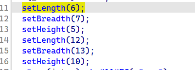

明明是2个局部的class调用成员函数完成一些初始化

结果从IDA的代码并看不出来有什么类啊

也只能通过ecx来判断,,,这是一个class类了

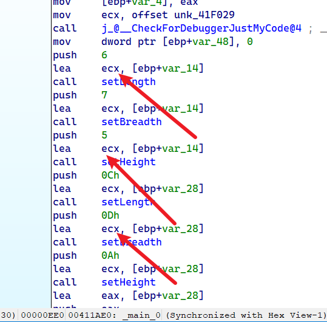


# 成员函数|变量的调用 的逆向分析


class和具体的演示代码如下


```c++
#include <stdio.h>

//using namespace std;

class Box
{
public:
    int length;   // 长度
    int breadth;  // 宽度
    int height;   // 高度
    // 成员函数声明
    int get(void);
    void set(int len, int bre, int hei);
};
// 成员函数定义
int Box::get(void)
{
    return length * breadth * height;
}

void Box::set(int len, int bre, int hei)
{
    length = len;
    breadth = bre;
    height = hei;
}
int main()
{
    Box Box1;        // 声明 Box1，类型为 Box
    Box Box2;        // 声明 Box2，类型为 Box
    int volume = 0;     // 用于存储体积

    // box 1 详述
    
    Box1.length = 6;
    Box1.breadth = 7;
    Box1.height = 5;

    // box 2 详述
    
    Box2.length = 12;
    Box2.breadth = 13;
    Box2.height = 10;

    // box 3 详述
    Box1.set(1, 2, 3);
    Box2.set(16, 8, 12);
    volume = Box2.get();
    
    //cout << "Box3 的体积：" << volume << endl;
    return 0;
}
```


于是在栈里面创建对应的class变量

然后反编译


```c++
int main()
{
    Box Box1;        // 声明 Box1，类型为 Box
    Box Box2;        // 声明 Box2，类型为 Box
    Box Box3;        // 声明 Box3，类型为 Box
    int volume = 0;     // 用于存储体积

    // box 1 详述
    
    Box1.length = 6;
    Box1.breadth = 7;
    Box1.height = 5;

    // box 2 详述
    
    Box2.length = 12;
    Box2.breadth = 13;
    Box2.height = 10;

    // box 3 详述
    Box1.set(1, 2, 3);
    Box2.set(16, 8, 12);
    volume = Box2.get();
    
    //cout << "Box3 的体积：" << volume << endl;
    return 0;
}
```


其中我们得关注内存的布局,成员函数的调用

首先看看这个

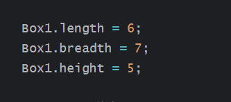

内存布局如下

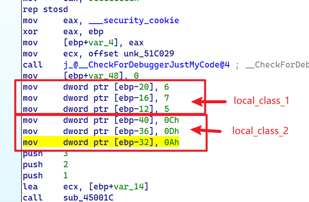

因为我们是基于栈的局部变量创建的一个类

所以class在栈里面

每一个成员之间相差4字节

然后我们看看相同的类,,,他的成员函数是怎么调用的

其中有box1和box2,,,都调用成员函数

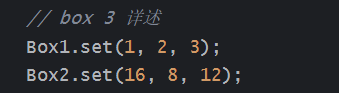

看一下汇编代码

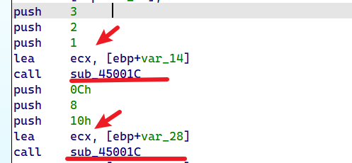

可以发现,,,他传递了不同的ecx

但是调用了相同的函数,,,所以这就算不同的类调用相同的成员函数吧

然后看一下相同的类调用不同的成员函数

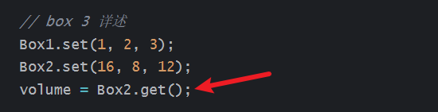

之前是分析set()

现在分析get()


可以看到还是调用函数call 一个地址

传入的参数依然是ecx,,只不过发生变化了


所以发现了什么,,,成员函数他是独立于一个class之外

调用成员函数只需要传入一个ecx指针,然后再调用对应位置的函数即可

# 成员函数和成员的继承


分析一下继承之后有什么变化哈

```c++
#include <iostream>

using namespace std;

// 基类
class Shape
{
public:
    void setWidth(int w)
    {
        width = w;
    }
    void setHeight(int h)
    {
        height = h;
    }
protected:
    int width;
    int height;
};

// 派生类
class Rectangle : public Shape
{
public:
    int getArea()
    {
        return (width * height);
    }
};

int main(void)
{
    Rectangle *Rect=new  Rectangle;//开辟了8个字节
    Rectangle *Rect2 = new  Rectangle;//开辟了8个字节
    Rect->setWidth(1);
    Rect->setHeight(2);
    Rect2->setWidth(3);
    Rect2->setHeight(4);
    // 输出对象的面积
    cout << "Total area: " << Rect->getArea() << endl;
    cout << "Total area: " << Rect2->getArea() << endl;
    return 0;
}
```

我为什么要用new呢?

而不是在堆里面去创建?

因为new的开辟,,他会自动给我们计算一个class需要花销的内存大小


首先`class Rectangle`他是只有一个成员函数的,,所以不占用内存

然后`class Shape`他是2个成员函数,,2个成员变量,,,占用2x4=8字节的内存

我们得探究一下`class Rectangle`  通过继承后,,他自己有什么变化

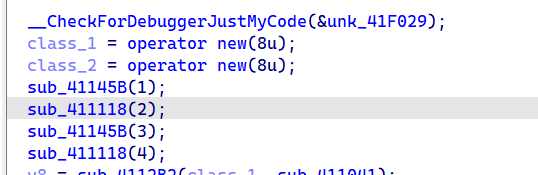

可以看到,,new出来的大小是8字节

然后父类刚好是8字节的大小,,子类就继承了父类的这个大小

于是子类就占用8个字节了


# 权限和继承

public不多说

private就是不对外访问

protect也是不对外访问,,,区别于private体现在在继承上

也就是子类可以访问父类的public和protect,,但是不能访问private

那么这么一说,,public和protect又有什么区别? 对外的话,,不能访问protect


说一下关于继承吧,,,子类可以通过3种方式去继承父类的一些东西

比如提供public,private,protect的方式去继承父类的成员和函数


在子类对父类的访问上,,,一直都是子类可以访问父类的public,protect,,但是不可以访问private

在对外访问上,,,该怎么样就怎么样...

比如你是private,protect继承,那么父类的所有都不对外开放

如果你是public继承,,,只有父类的public对外开放


# 构造函数和析构函数

这个不多说,,以前都知道

主要了解一些他的其它语法,,,因为看懂别人的代码需要这个东西的


> 使用初始化列表来初始化字段


1), 情况1

```c++
Line::Line( double len): length(len)
{
    cout << "Object is being created, length = " << len << endl;
}
```

等价于

```c++
Line::Line( double len)
{
    length = len;
    cout << "Object is being created, length = " << len << endl;
}
```


2), 情况2

还有下面这种,意思是你在编译的时候如果没有传参,,那么就使用默认参数

如果传递了参数就使用自定义的

我感觉这个语法更像是一个宏定义的,,,真正的

`int l = 2, int b = 2, int h = 2`在汇编代码中并没有出现的


```c++
Box(int l = 2, int b = 2, int h = 2)
{
    cout << "调用构造函数。" << endl;
    length = l;
    breadth = b;
    height = h;
}
```


3), 情况3

```c++
class Shape {
protected:
    int width;
    int height;
public:
    Shape(int a = 0, int b = 0)
    {
        width = a;
        height = b;
    }
    int area()
    {
        cout << "Parent class area :" << endl;
        return 0;
    }
};
class Rectangle : public Shape {
public:
    Rectangle(int a = 0, int b = 0) :Shape(a, b)//子类去调用父类的构造函数
    {

    }
    int area()
    {
        cout << "Rectangle class area :" << endl;
        return (width * height);
    }
};
```


其中要注意的地方

```c++
Rectangle(int a = 0, int b = 0) :Shape(a, b)//子类去调用父类的构造函数
```

子类去调用父类的构造函数

现在有一个问题....

子类创建的时候,,子类如果不对父类的构造函数做一些处理

父类的构造函数其实也是会自动调用的

只不过父类的构造处理都是默认的

所以子类要带参数调用父类的构造函数就可以采用如上的形式


# 拷贝构造函数

​	

可以根据经验看一下构造函数的调用情况

```c++
#include <iostream>

using namespace std;

class Line
{
public:
    int getLength(void);
    Line(int len);             // 简单的构造函数
    Line(const Line& obj);      // 拷贝构造函数
    ~Line();                     // 析构函数

private:
    int* ptr;
};

// 成员函数定义，包括构造函数
Line::Line(int len)
{
    cout << "调用构造函数" << endl;
    // 为指针分配内存
    ptr = new int;
    *ptr = len;
}

Line::Line(const Line& obj)
{
    cout << "调用拷贝构造函数并为指针 ptr 分配内存" << endl;
    ptr = new int;
    *ptr = *obj.ptr; // 拷贝值
}

Line::~Line(void)
{
    cout << "释放内存" << endl;
    delete ptr;
}
int Line::getLength(void)
{
    return *ptr;
}

void display(Line obj)
{
    cout << "line 大小 : " << obj.getLength() << endl;
}

// 程序的主函数
int main()
{
    Line line1(10);

    Line line2 = line1; // 这里也调用了拷贝构造函数

    display(line1);// 这里也调用了拷贝构造函数
    display(line2);// 这里也调用了拷贝构造函数

    return 0;
}
```


很奇怪的是

```c++
Line::Line(const Line& obj)
{
    cout << "调用拷贝构造函数并为指针 ptr 分配内存" << endl;
    ptr = new int;
    *ptr = *obj.ptr; // 拷贝值
}
```

如果写成下面这样的话,就g了,编译不通过,,语法错误

```c++
Line::Line(Line* obj)
{
    cout << "调用拷贝构造函数并为指针 ptr 分配内存" << endl;
    ptr = new int;
    *ptr = *obj.ptr; // 拷贝值
}
```


# 友元

涉及友元函数,友元类

友元函数不同与成员函数,,,,

他担任的角色就算一个类的成员身份,,只不过是友元

所以在权限的访问上,它可以对成员读写的


还有就算A不能访问友元B,,但友元B可以访问A


> 是否增加自身大小


我尝试去观察友元是否会增大一个类class的大小

```c++
class Box
{
    
public:
    int height;
    friend void printWidth(Box box);//这东西是否占用
    friend class BigBox;//这东西是否占用
    void setWidth(int wid);
    int width;
};
Box box1;
```

比如我尝试去输出box1和box1.width,box1.height的地址

```c++
00DFF96C
00DFF970
00DFF96C
```


然后发现width地址和box1地址一样,,,width地址和height地址差4

这说明了友元函数和友元类不会增加本类的大小

其中BigBox是有成员和函数的


> 友元函数的调用

在友元函数的调用上,,,其实和成员函数的调用是一模一样的

都是传入一个ecx指针,,然后调用一个函数,,,,


> 友元类的调用

友元类A 访问 类B

A访问B上....调用上都是中规中矩,,传入自己的ecx指针


# static


静态成员函数没有 this 指针，只能访问静态成员（包括静态成员变量和静态成员函数）。

普通成员函数有 this 指针，可以访问类中的任意成员；而静态成员函数没有 this 指针


class的静态变量是全局的且只属于一个class,,,

同时又独立一个类

类只是限制了该静态变量的访问,,,比如对他的访问权限什么的

但是静态变量的生命周期是和类分开的,,,

也就是你没有实例化一个类,,也可以实现对类静态变量的修改

 


比如下面的代码

```c++
#include <iostream>

using namespace std;

class Box
{
public:
    static int objectCount;
    // 构造函数定义
    Box(int l = 20, int b = 20, int h = 90)
    {
       // cout << "Constructor called." << endl;
        length = l;
        breadth = b;
        height = h;
        // 每次创建对象时增加 1
        objectCount++;
    }
    int Volume()
    {
        return length * breadth * height;
    }
    static int getCount()
    {
        return objectCount;
    }
private:
    int length;     // 长度
    int breadth;    // 宽度
    int height;     // 高度
};

// 初始化类 Box 的静态成员
int Box::objectCount = 0;

int main(void)
{

    // 在创建对象之前输出对象的总数
    //cout << "Inital Stage Count: " << Box::getCount() << endl;

    Box Box1(33, 12, 15);    // 声明 box1
    Box Box2(85, 60, 20);    // 声明 box2
    Box::objectCount = 20;
    printf("%d\n", Box1.objectCount);
    Box1.objectCount = 30;
    printf("%d\n", Box2.objectCount);
    return 0;
}
```

实际的输出

```c++
20
30
```

我通过类目Box修改静态变量

所有类的那个都跟着修改

我修改一个已经被实例化的静态变量

另外一个静态变量也跟着修改....

这说明了什么?? 别人就是一个全局变量,,,但加了一些类的属性进去罢了

不论你有多少个实例化的类,,属于该class的静态变量只有一个


然后我们尝试去逆向分析一下上面的代码

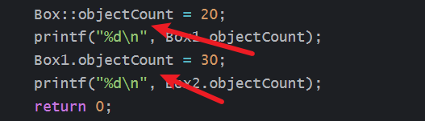

可以看到我们分别从不同的实例化的类去访问静态变量


可以看到,,他调用的是相同的变量


然后我们再来看看

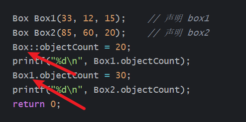

分别从类名,,已经实例化的类去访问静态变量,,如何

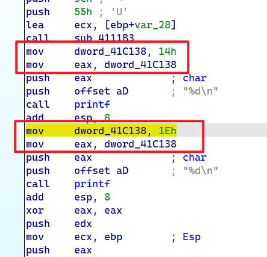

可以看到我们仍然是访问了相同的变量位置


# 运算符重载

就是对已经有的运算符做一个重载

在以前学这个的时候,,好像就很难受的

什么是一个运算符重载

比如一个加法,,结构体+结构体,,,

那么这个加法就需要去重载的

因为不可能重载一个结构体+结构体是吧

应该是内存和内存的value之间做一个加法,,然后把值再次写进内存里面的


所以为了把这个加法实现,,我们就写一个函数,,,这个函数就实现了对加法的一个重载

结构体+结构体,,当然这只是比较抽象的去理解


看一下下面这个demo

```c++
#include <iostream>
using namespace std;

class Box
{
public:

    int getVolume(void)
    {
        return length * breadth * height;
    }
    void setLength(int len)
    {
        length = len;
    }

    void setBreadth(int bre)
    {
        breadth = bre;
    }

    void setHeight(int hei)
    {
        height = hei;
    }
    // 重载 + 运算符，用于把两个 Box 对象相加
    Box operator+(const Box& b)
    {
        Box box;//确实在当前区域创建了一个局部的
        box.length = this->length + b.length;
        box.breadth = this->breadth + b.breadth;
        box.height = this->height + b.height;
        //但是在返回的时候,,不是返回的局部变量,,而是返回的传递进来的一个class*
        return box;//可以返回一个局部的变量?或者是用值的方式调用了默认的拷贝钩爪函数
    }
    /*反编译如下..可以看见返回值是class_3,是参数
        _DWORD *__thiscall sub_4119C0(_DWORD *this, _DWORD *class_3, _DWORD *class_2)
        {
          int v4; // [esp+D4h] [ebp-18h]
          int v5; // [esp+D8h] [ebp-14h]

          __CheckForDebuggerJustMyCode(&unk_41F029);
          v4 = class_2[1] + this[1];
          v5 = class_2[2] + this[2];
          *class_3 = *class_2 + *this;
          class_3[1] = v4;
          class_3[2] = v5;
          return class_3;
        }
    */
private:
    int length;      // 长度
    int breadth;     // 宽度
    int height;      // 高度
};
// 程序的主函数
int main()
{
    Box Box1;                // 声明 Box1，类型为 Box
    Box Box2;                // 声明 Box2，类型为 Box
    Box Box3;                // 声明 Box3，类型为 Box
    int volume = 0;     // 把体积存储在该变量中

    // Box1 详述
    Box1.setLength(6);
    Box1.setBreadth(7);
    Box1.setHeight(5);

    // Box2 详述
    Box2.setLength(12);
    Box2.setBreadth(13);
    Box2.setHeight(10);


    // 把两个对象相加，得到 Box3
    Box3 = Box1 + Box2;

    // Box3 的体积
    volume = Box3.getVolume();
    printf("Volume of Box3 : %d",  volume);

    return 0;
}
```


重点在这

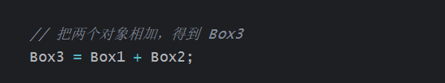

首先整体情况如下

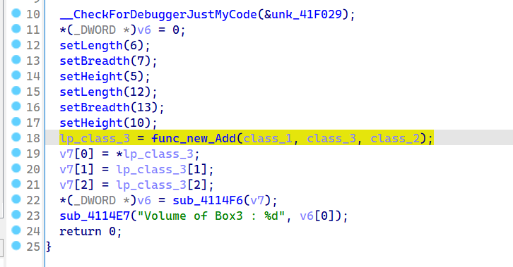

其中传递进去的参数有2个,,ecx如果也算的话,,就是3个参数

然后看一下func_new_Add,也就是我们的运算符重载函数

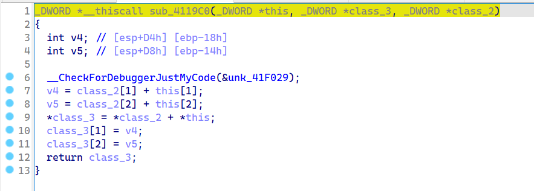

可以看到也是很简单的一个东西

最后返回的是传递进来的参数,,真离谱哈

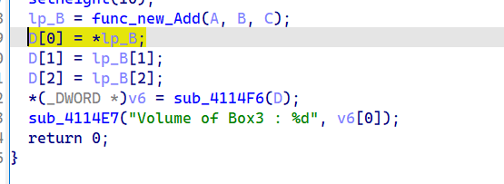

修改了一下变量名字

其中可以看出来差不多是

B=A+C

D=B;

源代码是

```c++
    // 把两个对象相加，得到 Box3
    Box3 = Box1 + Box2;
```

却搞成了

```c++
// 把两个对象相加，得到 Box3
tmp=Box1 + Box2;
Box3 = tmp;
```


其实运输发重载的符号还要很多,,,知道有这么一个东西即可,,


# 多态

其实多态不是一种技术

要说技术还得是继承,,虚函数这些,,,,多态只不过是在2者之间抽离出来的名字


**多态**按字面的意思就是多种形态。

当类之间存在层次结构，并且类之间是通过继承关联时，

就会用到多态。


其实除了C++那些内部函数,,很多东西都在在源代码层面对你做一些限制

然乎实际的C代码并没有体现出什么特别的继承或者多态,,是什么就是什么


## 虚函数

虚函数...

什么是虚函数,,,通过例子就会了解到的


### 分析1


```c++
#include <iostream> 
using namespace std;

class Shape {
protected:
    int width, height;
public:
    Shape(int a = 0, int b = 0)
    {
        width = a;
        height = b;
    }
    //virtual int area()
    int area()
    {
        cout << "f" << endl;
        return 0;
    }
};
class Rectangle : public Shape {
public:
    Rectangle(int a = 0, int b = 0) :Shape(a, b) { }
    int area()
    {
        cout << "s1" << endl;
        return (width * height);
    }
};
class Triangle : public Shape {
public:
    Triangle(int a = 0, int b = 0) :Shape(a, b) { }
    int area()
    {
        cout << "s2" << endl;
        return (width * height / 2);
    }
};
// 程序的主函数
int main()
{
    Shape* shape;
    Rectangle rec(10, 7);
    Triangle  tri(10, 5);

   
    shape = &rec;
    
    shape->area();
    rec.area();
  
    shape = &tri;
    
    shape->area();
    tri.area();
    return 0;
}
```

他的输出如下

```c++
f
s1
f
s2
```

这一看就知道

父类指针指向了子类,,并调用了重写的函数,,,发现还是调用的父类的

对于子类来说,,,重写了父类函数,,调用的话,,还是调用重新的


如果在父类的函数前面加一个东西`virtual`

```c++
virtual int area()
//int area()
{
    cout << "f" << endl;
    return 0;
}
```

输出如下

```c++
s1
s1
s2
s2
```

父类指针指向了子类,,并调用了重写的函数,,,发现 调用的子类的了


然后我们还可以探究探究有了重写

和是否添加virtual对class本身体积有没有什么影响之类的

在父类没添加virtual的时候,,,父类的指针指向子类的话,,也没办法调用子类的重写函数

情况如下,

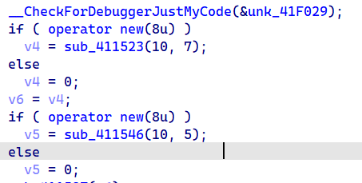

它开辟了8字节的大小

其中因为父类含有2个int,,所以开辟8字节是合理的


然后我们尝试给父类的成员函数加上virtual

```c++
    virtual int area()
    //int area()
    {
        cout << "f" << endl;
        return 0;
    }
```

情况如下

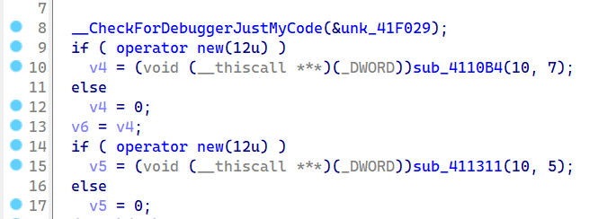

我的天呀...开辟了12个字节

其中我还看到vftable的字样,,,这个东西是在之前没加virtual的时候看不到的

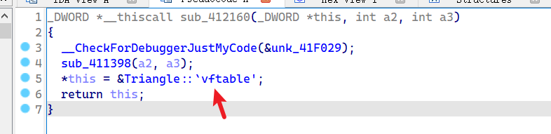

其中可以看到.

```c++
*this = &Triangle::`vftable';
```

之前我们开辟的内存

```c++
*this=x;
*(this+4)=y;
```

所以可以知道大概为什么会多开辟4字节了

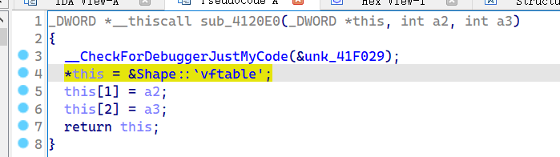

其中*this的值好像一直在变的

比如

```c++
*this = &Shape::`vftable';
*this = &Triangle::`vftable';
```

简单看了一下vftable是什么

好像是一个函数的指针数组

存放了该class的成员函数吧,,,应该是..

通过后来做实验知道

vftable存放的是该类的所有虚函数

子类如果重写了该虚函数,,子类的虚函数表中也有该虚函数

比如下面这个代码


```c++
#include <iostream> 
using namespace std;

class Shape {
protected:
    int width, height;
public:
    Shape(int a = 0, int b = 0)
    {
        width = a;
        height = b;
    }
    virtual int area()
    //int area()
    {
        cout << "f" << endl;
        return 0;
    }
    virtual  int fecho() {
        printf("z\n");
        return 0;
    }
};
class Rectangle : public Shape {
public:
    Rectangle(int a = 0, int b = 0) :Shape(a, b) { }
    int area()
    {
        cout << "s1" << endl;
        return (width * height);
    }
    int fecho() {
        printf("x\n");
        return 0;
    }
};
class Triangle : public Shape {
public:
    Triangle(int a = 0, int b = 0) :Shape(a, b) { }
    int area()
    {
        cout << "s2" << endl;
        return (width * height / 2);
    }
    int fecho() {
        printf("y\n");
        return 0;
    }
};
// 程序的主函数
int main()
{
    Shape* shape;
    Rectangle *rec=new Rectangle(10, 7);
    Triangle  *tri=new Triangle(10, 5);

   
    shape = rec;
    shape->area();
    rec->area();
  
    shape = tri;
    shape->area();
    tri->area();
    return 0;
}
```

虚函数表如下

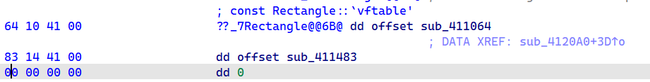


### 分析2

如果父类有虚函数

但是子类不重写虚函数的哈

发现父类子类都会有一个虚函数表

其中子类会继承父类的虚函数表

并且子类和父类的虚函数表是一模一样的


例子如下

```c++
#include <iostream> 
using namespace std;

class Shape {
protected:
    int width, height;
public:
    Shape(int a = 0, int b = 0)
    {
        width = a;
        height = b;
    }
    virtual int area()
    //int area()
    {
        cout << "f" << endl;
        return 0;
    }
    virtual  int fecho() {
        printf("z\n");
        return 0;
    }
};
class Rectangle : public Shape {
public:
    Rectangle(int a = 0, int b = 0) :Shape(a, b) { }
    int area2()
    {
        cout << "s1" << endl;
        return (width * height);
    }
    int fecho2() {
        printf("x\n");
        return 0;
    }
};
class Triangle : public Shape {
public:
    Triangle(int a = 0, int b = 0) :Shape(a, b) { }
    int area2()
    {
        cout << "s2" << endl;
        return (width * height / 2);
    }
    int fecho2() {
        printf("y\n");
        return 0;
    }
};
// 程序的主函数
int main()
{
    Shape* shape;
    Rectangle *rec=new Rectangle(10, 7);
    Triangle  *tri=new Triangle(10, 5);

   
    shape = rec;
    shape->area();
    rec->area();
  
    shape = tri;
    shape->area();
    tri->area();
    return 0;
}
```

然后去查看虚函数表

子类的vftable

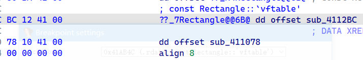

父类的vftable

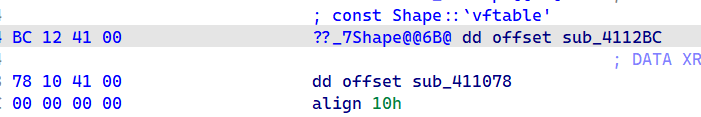

可以看到是一模一样的


### 分析3

子类重写了部分虚函数


子类的表

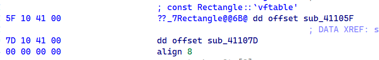

父类的表

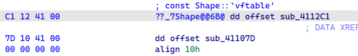

其中可以看到,,,他们都有2个成员

vatable[0]不一样

vftable[1]是一样的

其中vatable[0]就是` int area()`

子类对父类发起了一个重写

vftable[1]是`int fecho()`,子类并没有发起重写

所以子类和父类的`int fecho()`是一样的

然后子类和父类的`int area()`是不一样的


## 纯虚函数


纯虚函数不同于虚函数不同的是

虚函数它并要求子类一点它完成对他的才答应
