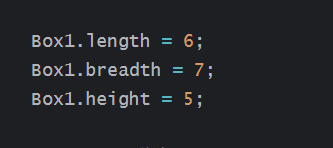
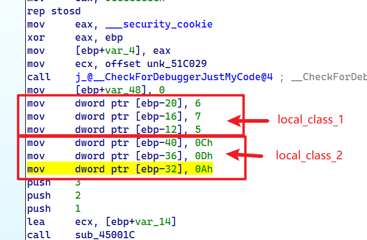
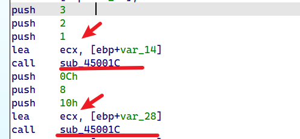
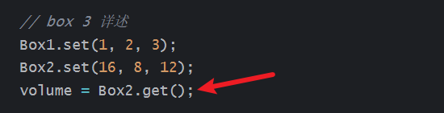
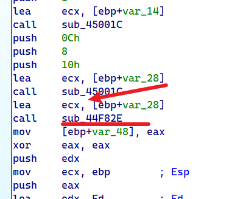

先写一个字在这这里,,,,之后再完善

# 成员函数|变量的调用 的逆向分析


class和具体的演示代码如下


```c++
#include <stdio.h>

//using namespace std;

class Box
{
public:
    int length;   // 长度
    int breadth;  // 宽度
    int height;   // 高度
    // 成员函数声明
    int get(void);
    void set(int len, int bre, int hei);
};
// 成员函数定义
int Box::get(void)
{
    return length * breadth * height;
}

void Box::set(int len, int bre, int hei)
{
    length = len;
    breadth = bre;
    height = hei;
}
int main()
{
    Box Box1;        // 声明 Box1，类型为 Box
    Box Box2;        // 声明 Box2，类型为 Box
    int volume = 0;     // 用于存储体积

    // box 1 详述
    
    Box1.length = 6;
    Box1.breadth = 7;
    Box1.height = 5;

    // box 2 详述
    
    Box2.length = 12;
    Box2.breadth = 13;
    Box2.height = 10;

    // box 3 详述
    Box1.set(1, 2, 3);
    Box2.set(16, 8, 12);
    volume = Box2.get();
    
    //cout << "Box3 的体积：" << volume << endl;
    return 0;
}
```


于是在栈里面创建对应的class变量

然后反编译


```c++
int main()
{
    Box Box1;        // 声明 Box1，类型为 Box
    Box Box2;        // 声明 Box2，类型为 Box
    Box Box3;        // 声明 Box3，类型为 Box
    int volume = 0;     // 用于存储体积

    // box 1 详述
    
    Box1.length = 6;
    Box1.breadth = 7;
    Box1.height = 5;

    // box 2 详述
    
    Box2.length = 12;
    Box2.breadth = 13;
    Box2.height = 10;

    // box 3 详述
    Box1.set(1, 2, 3);
    Box2.set(16, 8, 12);
    volume = Box2.get();
    
    //cout << "Box3 的体积：" << volume << endl;
    return 0;
}
```


其中我们得关注内存的布局,成员函数的调用


首先看看这个



内存布局如下



因为我们是基于栈的局部变量创建的一个类

所以class在栈里面

每一个成员之间相差4字节

然后我们看看相同的类,,,他的成员函数是怎么调用的

其中有box1和box2,,,都调用成员函数


看一下汇编代码



可以发现,,,他传递了不同的ecx

但是调用了相同的函数,,,所以这就算不同的类调用相同的成员函数吧

然后看一下相同的类调用不同的成员函数



之前是分析set()

现在分析get()



可以看到还是调用函数call 一个地址

传入的参数依然是ecx,,只不过发生变化了


所以发现了什么,,,成员函数他是独立于一个class之外

调用成员函数只需要传入一个ecx指针,然后再调用对应位置的函数即可


# 权限和继承

public不多说

private就是不对外访问

protect也是不对外访问,,,区别于private体现在在继承上

也就是子类可以访问父类的public和protect,,但是不能访问private

那么这么一说,,public和protect又有什么区别? 对外的话,,不能访问protect


说一下关于继承吧,,,子类可以通过3种方式去继承父类的一些东西

比如提供public,private,protect的方式去继承父类的成员和函数


在子类对父类的访问上,,,一直都是子类可以访问父类的public,protect,,但是不可以访问private

在对外访问上,,,该怎么样就怎么样...

比如你是private,protect继承,那么父类的所有都不对外开放

如果你是public继承,,,只有父类的public对外开放


# 构造函数和析构函数

这个不多说,,以前都知道

主要了解一些他的其它语法,,,因为看懂别人的代码需要这个东西的


> 使用初始化列表来初始化字段


1), 

```c++
Line::Line( double len): length(len)
{
    cout << "Object is being created, length = " << len << endl;
}
```

等价于

```c++
Line::Line( double len)
{
    length = len;
    cout << "Object is being created, length = " << len << endl;
}
```


# 拷贝构造函数

​	

可以根据经验看一下构造函数的调用情况

```c++
#include <iostream>

using namespace std;

class Line
{
public:
    int getLength(void);
    Line(int len);             // 简单的构造函数
    Line(const Line& obj);      // 拷贝构造函数
    ~Line();                     // 析构函数

private:
    int* ptr;
};

// 成员函数定义，包括构造函数
Line::Line(int len)
{
    cout << "调用构造函数" << endl;
    // 为指针分配内存
    ptr = new int;
    *ptr = len;
}

Line::Line(const Line& obj)
{
    cout << "调用拷贝构造函数并为指针 ptr 分配内存" << endl;
    ptr = new int;
    *ptr = *obj.ptr; // 拷贝值
}

Line::~Line(void)
{
    cout << "释放内存" << endl;
    delete ptr;
}
int Line::getLength(void)
{
    return *ptr;
}

void display(Line obj)
{
    cout << "line 大小 : " << obj.getLength() << endl;
}

// 程序的主函数
int main()
{
    Line line1(10);

    Line line2 = line1; // 这里也调用了拷贝构造函数

    display(line1);// 这里也调用了拷贝构造函数
    display(line2);// 这里也调用了拷贝构造函数

    return 0;
}
```


很奇怪的是

```c++
Line::Line(const Line& obj)
{
    cout << "调用拷贝构造函数并为指针 ptr 分配内存" << endl;
    ptr = new int;
    *ptr = *obj.ptr; // 拷贝值
}
```

如果写成下面这样的话,就g了,编译不通过,,语法错误

```c++
Line::Line(Line* obj)
{
    cout << "调用拷贝构造函数并为指针 ptr 分配内存" << endl;
    ptr = new int;
    *ptr = *obj.ptr; // 拷贝值
}
```


# 友元

涉及友元函数,友元类

友元函数不同与成员函数