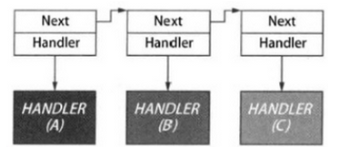

# 介绍


SEH（ Structured Exception Handling ， 结构化异常处理 ）

小名: SEH

和线程相关

异常处理的回调存在于堆栈中

如果想在 try catch 的C++异常中捕获系统异常，

SEH即结构化异常处理（Structured Exception Handling)

当程序出现错误时，系统把当前的一些信息压入堆栈，然后转入我们设置好的异常处理程序中执行，


每个线程的FS: [0]处都是一个指向包含异常处理程序的结构的指针

这个结构又可以指向下一个结构，从而形成一个异常处理程序链。





```c
struct _EXCEPTION_REGISTRATION_RECORD
{
    struct _EXCEPTION_REGISTRATION_RECORD *Next; //下一个节点
    PEXCEPTION_ROUTINE Handler;				//异常处理函数的地址
} EXCEPTION_REGISTRATION_RECORD;
//Next 为指向下一个链表的指针,直到遇到 0xFFFFFFFF 结束
```


当发生异常时，系统就沿着这条链执行下去，直到异常被处理为止

其它异常的处理形式都是对SEH的封装

VC++中，通过提供四个微软关键字使得程序员能够良好的使用这一机制

```c
__try{}、
__finally{}、
__except{}、
__leave
无论 __try 块中的指令以何种方式退出，都必然会执行 __finally 块
```

try finale except 是局部的SEH

结构化异常处理（SEH）是Windows操作系统提供的强大异常处理功能。

而Visual C++中的__try{}__finally{}和__try{}/__except{}结构本质是对Windows提供的SEH的封装


# 处理函数

关于Handler和except_handler4谁先执行?

这得看当前的SEH链表,谁是第一个谁就先遍历


## except_handler4

其实我们的try catch 就是通过except_handler4注册的

而汇编手动注册的东西 是基于FS(x86),GS(x64)的SEH链注册的,而且采用的是头插法

那么手动汇编注册的异常处理会先于except_handler4


如果你的代码中长得像这样

```nasm
push    ebp
mov     ebp, esp
push    0FFFFFFFEh
push    offset stru_419230;这里是特征
push    offset __except_handler4;这里是特征
mov     eax, large fs:0 ;这里是特征
push    eax
add     esp, 0FFFFFF38h
push    ebx
push    esi
push    edi
lea     edi, [ebp+ms_exc]
xor     ecx, ecx
mov     eax, 0CCCCCCCCh
rep stosd
mov     eax, ___security_cookie
xor     [ebp+ms_exc.registration.ScopeTable], eax;这里是特征
xor     eax, ebp
push    eax             ; char
lea     eax, [ebp+ms_exc.registration];这里是特征

mov     large fs:0, eax;这里是特征
```

说明,差不多就用了try except了


SEH 函数返回值

```c
__except 后的括号中会存在一个异常过滤表达式表达式的返回值必定是一下说明的几个之一
EXCEPTION_EXECUTE_HANDLER(1): 	//自己处理,EIP不会返回,直接去父级的__except{}
EXCEPTION_CONTINUE_SEARCH(0): 	//把异常丢给下一位嘉宾
EXCEPTION_CONTINUE_EXECUTION(-1): //自己处理,EIP会根据CONTEXT做一个返回 ,EIP原理是异常发生的地方
```


### try, except 


在 VS 的同一个函数中无论编写了多少个 SEH， 编译器实际上只会安装一个叫做 except_handler4 的函数

然后的话,一个try只能匹配一个except(我这里不是指的嵌套)

```c
#include <windows.h>
#include <stdio.h>
// 带有异常处理函数的函数
void test1()
{
    int x = 10;
    __try
    {
        printf("__try - { ... }\n");
        __try
        {
            printf("__try -- { ... }\n");
            x = x / 0;
        }
        __except (0)
        {
            printf("__except (1) --{ ... }\n");
        }
    }
    __except (1)//如果返回-1.会陷入exit的结果,返回1就是不再去往异常处
    {
        printf("__except (1) - { ... }\n");
    }
}

// 没有异常处理函数的函数
void test2()
{

}

// 遍历当前程序中已经存在的异常处理函数
void ShowSEH()
{
    // 定义一个结构体指针，用于保存 SEH 链表的头节点
    PEXCEPTION_REGISTRATION_RECORD header = 0;

    // 通过 FS:[0] 找到 ExceptionList 的头节点
    __asm push fs : [0]
    __asm pop header

        // 遍历异常处理链表，链表以 -1 结尾
        while (header != (EXCEPTION_REGISTRATION_RECORD*)-1)
    {
        printf("function: %08X\n", header->Handler);
        header = header->Next;
    }
    printf("\n");
}

int main()
{
    test1();
    test2();
    ShowSEH();
    ShowSEH();
    return 0;
}
```

一单try后面出现异常,他不是往回运行,而是去except处理函数


### finally , leave


另外就是这个finally块为什么except块不是共存的呀

无论 __try 以何种方式退出，都会执行finally这里


```c
#include <windows.h>
#include <stdio.h>

int main(void)
{
    __try
    {
        printf("异常代码可能发生部分\n");
        __leave; // 使用 __leave 跳出当前的 __try ,这是正常退出的方式之一
        //goto flag; //异常退出方式
    }
    __finally
    {

        // 无论 __try 以何种方式退出，都会执行这里的指令
        printf("退出\n");
        if (AbnormalTermination())
            printf("异常退出\n");
        else
            printf("正常退出\n");
    }
    flag:
    return 0;
}
```


## Handler 手动注册

是的注册的东西,它是位于SEH大链的

关于汇编手动注册的返回值,

```c
// Exception disposition return values
enum _EXCEPTION_DISPOSITION
{
    ExceptionContinueExecution,         // 0 继续执行异常代码 (可以视为已经处理)
    ExceptionContinueSearch,            // 1 丢给下一个异常处理器
    ExceptionNestedException,           //在OS内部使用
    ExceptionCollidedUnwind             //在OS内部使用
} EXCEPTION_DISPOSITION;
```


返回EXCEPTION_EXECUTE_HANDLER时则表示异常被处理，

会先把内部的__finally块执行完，

再跳到自身的__except块中执行。

反正不会在以前绊脚摔跟头的地方那里继续执行

返回EXCEPTION_CONTINUE_EXECUTION时表示该异常被忽略，继续在异常发生的地方开始执行

ps: 说的好像有点问题,以后实践在解决吧

下面的处理函数

```c
// SEH handler
EXCEPTION_DISPOSITION __cdecl _except_handler(
    _In_ struct _EXCEPTION_RECORD* _ExceptionRecord,
    _In_ void*                     _EstablisherFrame,
    _Inout_ struct _CONTEXT*       _ContextRecord,
    _Inout_ void*                  _DispatcherContext
);
```

注册

手动直接注册

```nasm
push @_except_handler    ;异常处理器
push dword ptr fs:[0]     ;取出 SEH链表头
mov dword ptr fs:[0],esp  ;添加链表
```

卸载

```nasm
pop dword ptr fs:[0]    ;还原链表头
add esp,4    ;删除 异常处理器
```

参数1(lp)

一个指向EXCEPTION_RECORD结构的指针

```c
typedef struct _EXCEPTION_RECORD {
    DWORD ExceptionCode; //异常的类型
    DWORD ExceptionFlags;
    struct _EXCEPTION_RECORD *ExceptionRecord; //这个类型和自己是一样的 ?
    PVOID ExceptionAddress; //异常发生的地址 !!!!!!
    DWORD NumberParameters;//含有的元素个数
    DWORD ExceptionInformation[EXCEPTION_MAXIMUM_PARAMETERS];
} EXCEPTION_RECORD;
```

参数2(lp)

是一个指向establisher帧结构的指针。它是SEH中一个至关重要的参数，但是现在你可以忽略它。

参数3(lp)

一个指向CONTEXT结 构的指针

这个CONTEXT结构就是GetThreadContext和SetThreadContext这两个API中使用 的那个CONTEXT结构

```c
typedef struct _CONTEXT
{
    DWORD ContextFlags;
    DWORD Dr0;
    DWORD Dr1;
    DWORD Dr2;
    DWORD Dr3;
    DWORD Dr6;
    DWORD Dr7;
    FLOATING_SAVE_AREA FloatSave;
    DWORD SegGs;
    DWORD SegFs;
    DWORD SegEs;
    DWORD SegDs;
    DWORD Edi;
    DWORD Esi;
    DWORD Ebx;
    DWORD Edx;
    DWORD Ecx;
    DWORD Eax;
    DWORD Ebp;
    DWORD Eip;
    DWORD SegCs;
    DWORD EFlags;
    DWORD Esp;
    DWORD SegSs;
} CONTEXT;
```

参数4

被称为DispatcherContext。它暂时也可以被忽略。

```c
#include <stdio.h>
#define WIN32_LEAN_AND_MEAN
#include <windows.h>
#include <stdio.h>

DWORD scratch;
EXCEPTION_DISPOSITION _cdecl _except_handler(struct _EXCEPTION_RECORD* ExceptionRecord,
    void* EstablisherFrame,
    struct _CONTEXT* ContextRecord,
    void* DispatcherContext)
{
    unsigned i;
    // 指明是我们让流程转到我们的异常处理程序的
    printf("Hello from an exception handler\n");
    // 改变CONTEXT结构中EAX的值，以便它指向可以成功进写操作的位置
    ContextRecord->Eax = (DWORD)&scratch;
    // 告诉操作系统重新执行出错的指令
    return ExceptionContinueExecution; //ExceptionContinueSearch;// ExceptionContinueExecution; //基于异常表达式的返回值, 基于SEH函数的返回值?
}

int main()
{
    DWORD handler = (DWORD)_except_handler;
    __asm
    {
        // 创建EXCEPTION_REGISTRATION结构：
        push handler; // handler函数的地址
        push FS : [0] ; // 前一个handler函数的地址
        mov FS : [0] , ESP; // 安装新的EXECEPTION_REGISTRATION结构
    }
    __asm
    {
        mov eax, 0;     // 将EAX清零
        mov[eax], 1; // 写EAX指向的内存从而故意引发一个错误
    }
    printf("After writing!\n");
    __asm
    {
        // 移去我们的EXECEPTION_REGISTRATION结构
        mov eax, [ESP];    // 获取前一个结构
        mov FS : [0] , EAX; // 安装前一个结构
        add esp, 8;      // 将我们的EXECEPTION_REGISTRATION弹出堆栈
    }
    return 0;
}
```


# 回调问题?


我暂时没看懂

但是发现

如果返回异常处理是下面这句话,就不会再次回调那个异常处理函数,并且不会进入except

```c
ContextRecord->Eip+=0xA;//指向下一个汇编语句,0xA是我看汇编找到的
    return ExceptionContinueExecution;
}
```


```c

#define WIN32_LEAN_AND_MEAN
#include <windows.h>
#include <stdio.h>
EXCEPTION_DISPOSITION
__cdecl _except_handler(
    struct _EXCEPTION_RECORD* ExceptionRecord,
    void* EstablisherFrame,
    struct _CONTEXT* ContextRecord,
    void* DispatcherContext)
{
    printf("Home Grown handler: Exception Code: %08X Exception Flags %X",
           ExceptionRecord->ExceptionCode, ExceptionRecord->ExceptionFlags);

    if (ExceptionRecord->ExceptionFlags & 1)
        printf(" EH_NONCONTINUABLE");
    if (ExceptionRecord->ExceptionFlags & 2)
        printf(" EH_UNWINDING");
    if (ExceptionRecord->ExceptionFlags & 4)
        printf(" EH_EXIT_UNWIND");
    if (ExceptionRecord->ExceptionFlags & 8) 		// 注意这个标志
        printf(" EH_STACK_INVALID");
    if (ExceptionRecord->ExceptionFlags & 0x10)   	// 注意这个标志
        printf(" EH_NESTED_CALL");
    printf("\n");

    // 我们不想处理这个异常，让其它函数处理吧
    return ExceptionContinueSearch;
}

void HomeGrownFrame(void)
{
    DWORD handler = (DWORD)_except_handler;
    __asm
    {
        // 创建EXCEPTION_REGISTRATION结构：
        push handler       // handler函数的地址
            push FS : [0]        // 前一个handler函数的地址
        mov FS : [0] , ESP     // 安装新的EXECEPTION_REGISTRATION结构
        }

    *(PDWORD)0 = 0; // 写入地址0，从而引发一个错误
    printf("I should never get here!\n");

    __asm
    {
        // 移去我们的EXECEPTION_REGISTRATION结构
        mov eax, [ESP]     // 获取前一个结构
            mov FS : [0] , EAX // 安装前一个结构
            add esp, 8        // 把我们EXECEPTION_REGISTRATION结构弹出堆栈
        }
}

int main()
{
    __try
    {
        HomeGrownFrame();
    }
    __except (EXCEPTION_EXECUTE_HANDLER)
    {
        printf("Caught the exception in main()\n");
    }

    return 0;
}
```