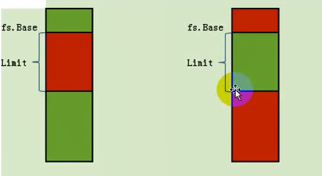
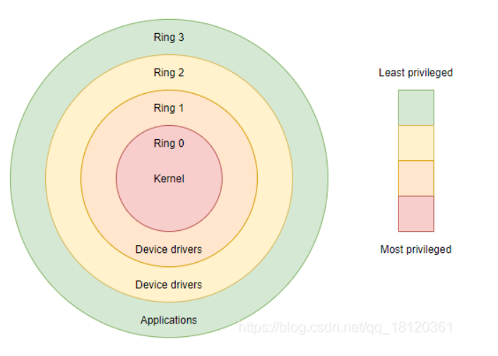

# 段寄存器 

段寄存器分为可见的部分和不可见的部分

段寄存器可见的是16位,也就是下面这个东西


<p style="color:#00FA9A;font-size:22px">
   也称之为段选择子,请记住这个名字,,后面会提及的
</p>


这个小小的WORD数据,就决定了很多的东西的

这个word寄存器大概的结构如下


他的成员有映射了很多的东西

后面会后面会娓娓道来 


## 简单介绍

下面是简单的说明了一下8个段寄存器是干嘛的,后面遇到会详细说

简单的了解一下即可

ES: 附加段寄存器ES（Extra Segment）指出当前程序使用附加数据段的段基址，该段是串操作指令中目的串所在的段

CS: 代码段寄存器 （Code Segment）  存放当前正在运行的程序代码所在段的段基址

SS: 堆栈段寄存器SS（Stack Segment）指出当前堆栈的底部地址，即存放堆栈段的段基址。

DS: 数据段寄存器DS（Data Segment）指出当前程序使用的数据所存放段的最低地址，即存放数据段的段基址。

FS:

GS:

---

LDTR: Local Description Tabel Register  局部描述符号表寄存器,指明了IDT

GDTR: Global Description Tabel Register  全局描述符号表寄存器,指明了GDT

TR:  指明了TSS位置和大小

SDTR: 指明了SDT表在哪里 

段和段之间是可以交叉的

比如数据段和栈段会存在一个包含的关系


## 关于他的读写

<p style="color:#FFB5C5;font-size:20px">
    先不说权限检查什么的<br>
    直接读写就对了<br>
    后面会说到相关的权限检查
</p>


读写大多数遇到的情况还是mov,其它都是少数情况

了解一下


### 基于mov

mov可以实现一个寄存器的读写

后面大多数情况下都是使用mov实现段寄存器的一个读写

比如后期提权什么的,需要用到这些读写

ps:对LDTR和TR的读写,用的不是mov


读取段寄存器 :只能拿着16位寄存器去读取数据

```assembly
mov ax,ES 
```

修改段寄存器 :会根据你的段选择子和一些附带的其它信息写入12字节

```assembly
mov DS,ax 
```


> 基于mov指令实现属性探测

在x86下.我们可以看如下寄存器表示图.


下面的表格是直接给出的参考数据,仅供参考,

| 寄存器名称      | 段选择子(Select) | 段属性(Attributes) | 段基址(Base) | 段长(Limit) |
| :-------------- | :--------------- | :----------------- | :----------- | :---------- |
| ES(附加扩展段)  | 0x0023           | 可读,可写          | 0x0000000    | 0xFFFFFFFF  |
| CS(代码段)      | 0x001B           | 可读,可执行        | 0x00000000   | 0xFFFFFFFF  |
| SS(堆栈段)      | 0x0023           | 可读,可写          | 0x00000000   | 0xFFFFFFFF  |
| DS(数据段)      | 0x0023           | 可读,可写          | 0x00000000   | 0xFFFFFFFF  |
| FS(分段机制)    | 0x003B           | 可读,可写          | 0x7FFDF000   | 0xFFF       |
| GS(x64下才生效) | 未使用           | 未使用             | 未使用       | 未使用      |

 

简单的检测, 是否可写

其实这里你也可以故意的去引发一些异常或者什么的

比如探测ss是否可以写

```c
int var = 0;
int main(int argc, char* argv[])
{
    __asm
    {
        mov ax,ss
        mov ds,ax
        mov dword ptr ds:[var],eax
    }
	return 0;
}
```


简单的检测Base属性 

```c
int var = 0;
 
int main(int argc, char* argv[])
{
    __asm
    {
        mov ax,fs
        mov gs,ax        //不要使用ds，否则编译不通过
        mov eax,gs:[0]   //fs.base+0
 		
        mov dwrod ptr ds:[var],eax
 		//如果BASE不存在的话,相当于mov dwrod ptr [0+0],eax,会触发一个异常
        //如果BASE存在的话,相当于mov dwrod ptr [BASE+0],eax,可能不会触发一个异常   
    }
	return 0;
}
```


检测Limit属性,其实就是Limit限制了你的寻址范围

```c
//报错，fs访问越界，证明Limit真实存在
int var = 0;
int main()
{
    __asm
    {
        mov ax,fs     
        mov gs,ax      //此处如果换成ds则会出现编译不过的问题
        mov eax,gs:[1000]  //fs的limit是FFF 但是读0x1000则越界了
        //访问的地址相当于下面的 但是DS的Limit是0xFFFFFFFF
        //mov eax,dword ptr ds:[0x7FFDF000+0x1000]
        mov dword ptr ds:[var],eax
    }
    
}
```


遇到的一些问题,这个代码运行就会出错,单步调试就不会出错,离谱

````c++
#include<stdio.h>
#include<windows.h>
//	int var = 0;
int main(int argc, char* argv[])
{
	int var = 0;
    __asm
    {
        mov ax,cs
        mov ds,ax
		mov edx,1
        mov dword ptr ds:[var],edx
    }
	printf("%d",var);
	return 0;
}
````


还有很多demo的例子,上面的例子是海哥的,一些火哥的例子之后再回顾一下

他的例子大多数是提出疑问,而不是说去证明一些上面东西,


### 基于L系列指令


L是Load的意思

```
LES,LSS,LDS,LFS,LGS
```

但是在使用的时候也有很多讲究

 

```c
#include<stdio.h>
#include<stdlib.h>
#include<string.h>
#include<windows.h>

int main()
{
	char buff[6];
	_asm {
		lea eax, buff;
		mov bx, ds;
		mov word ptr [eax+4], bx;
		les ecx, fword ptr [eax]
	}
	
	return 0;
}
```

fword的意思就是取出6个字节

les会把高2字节(段选择子)给es,也就是把数组最后2个字节给段选择子

低4字节给ecx

也就是说: 我们可以把一个tmp[6]的tmp[4,5]作为段选择子,然后赋值给寄存器


### sgdt/lgdt


```c++
#include<stdio.h>
#include<windows.h>
 
 
int main(int argc, char** argv)
{

	char x[16];
	__asm {
		sgdt x;
	}
	printf("%x,%x\n", *(DWORD*)&x[2], *(WORD*)x);
	//-> 4b590000,7f
	return 0;
}
```


## 段选择子

接下来,其实是我们细说段选择子这个结构了


比如数据是	


所以它大概的结构

```c
strct
{
	2个bit位 RequestPrivilegeLevel; //请求特权级别
	1个bit位 TableIndicator; //查哪一个数组
	15个bit位 Index;//数组索引值
}
```

ps: 数组是QWORD Arr[xx]


先简单的介绍一下这些结构的名字

RPL: 请求权限,和未来的CPL有关系

根据RPL.我们又可以引出其它东西

CPL: 当前权限

DPL:  最低可访问我的权限


然后是其它成员,比如Ti,Ti这个东西又和另外一个成员Index有关

因为Ti决定了我们要去找哪一张表

然后找到表后,取出哪一个成员就和Index有关了


所以有哪些表?

有GDTR,LDTR

这些表都是基于QWORD 的Arr数组,所以每次遍历是+8哟

关于GDTR,LDTR有什么区别,,我们以后再说

```c++
TI=0,查GDT表
TI=1,查LDT表
```

但是可以了解一下

GDTR:   Global Description Tabel Register  全局描述符号表寄存器 有2个值,GDTR表的开始位置和表的大小

LDTR: Local Description Tabel Register  局部描述符号表寄存器 有2个值,LDTR表的开始位置和表的大小

然后Index当然就是在表里面寻找成员了,但是寻找好像不是那么简单的线性寻找

复杂的后面再说


# 段描述符号表成员


<p style="color:#FFB5C5;font-size:26px">
    遇到的很多概念,如果不理解没关系,后面会慢慢的get到,然后回来补充
</p>


段描述符, 不是指的是之前的段寄存器ES,DS,CS,也不是96位的那个完整的段寄存器

而是位于QWORD Arr[xxx]的数组成员

如下图


段描述符号和段寄存器之间有一个映射关系,,差不多就是说,段寄存器的一些成员决定了我们要去哪个表寻找哪个成员

一个段寄存器, 只会指向一个段描述符

段描述符有很多个,段寄存器可以选择性的指向任何一个(得通过检查)


如果把8字节合并在一起的话,从低地址往高地址看

为什么看上去这么别扭..其实是一个兼容性导致的

为了向下兼容,变成了这样子


顺便回忆一下段寄存器结构,我没有在内存真正的找到过,他是否存在,我表示未知

```c
struct Segment
{
    WORD Selecter;  //段选择子 ,类似于一个index的索引值,索引了一张表
    WORD Attribute; //段属性, 表示了当前段寄存器的 R W X 属性读写执行
    DWORD Base;     //基址,表示段的起点 
    DWORD limit;    //基址的长度 
}//12字节,96位
```


## Base和Limit

(Base:DWORD `[0,15]+[16,23]+[24,31] `


Base由3部分构成(1+1+2=4)


Limit:DWORD但是,**数据是20个bit位** `[0,15]+[16,19]`


不是说我们只看Base和Limit就可以确定一个范围

还有就是范围 不是说就是Base[0,Limit]

这里面涉及很多东西,,,,后面再说

另外我还搞得不是很明白的


## Attribute


对于没介绍的成员,大多数是没用的,或者不知道的


### P位


```
P=1,该段描述符有效
P=0,反之无效
```

通过指令将段描述符加载至段寄存器的时候，CPU第一件事就是检查该段描述符的P位。

如果P位等于0，那么其他的检查就不做了。只有当P位为1的时候才会做后续的其他检查


### S位


段描述符分为了2大类

```
S=1 : code or data的描述符
S=0 : 系统段 描述符
```

系统段描述符可能是调用门、中断门、任务门、TSS段

如果S=0,那么这个段就会有一点不同了

其实S和TYPE域结合来看,,,会更加容易理解


### Type域 [8,11]


#### 图表概览

关于作用的分类


关于读写的属性表

)


#### 介绍


占据4位 ,可以形成一个16进制

下面是基于S=1的情况,引入介绍

`Attribute.DPL` 它占据2个bit位,要么是0b11,要么是0b00

代码段或者数据段一定有: S=1,P=1 ,然后DPL=0b00或者0b11

P+DPl+S=4个比特位,可以形成一个16进制

<p style="color:#FFB5C5;font-size:20px">
    所以,对于代码段或者数据段而言,这4个bit位的值要么是0x9,要么是0xF：
</p>


然乎继续Attribute.Type域

下面主要介绍的是代码段和数据段的Type域, 系统段的Type域后面介绍, 


##### [11]位


ps: 32位中的第11位,不是Attribute的11位

```
[11]=1, 指明代码段
[11]=0, 数据段
```

然后,换句话说,如果Type域>7,那么就是代码段

Type域的属性会根据你是不同的段,各个属性值会有不同的意义


##### [8, 9,10]


###### 数据段的AWE


A属性: 该段是否被访问过

W属性: 是否可写 write

E属性: 奇怪的拓展属性

---

A: 表示被访问过

W: 0是只能读, 1是可读可写

E: 0,向上拓展 ,1是向下拓展

如果E=0 向上拓展,,那么有效段范围就是红色的 左图

如果E=1,向下拓展,那么有效段范围就是红色的 右图



关于奇怪的拓展属性

了解一下,以后有需求的时候,再来学习补充


###### 代码段的AWC

1.   A属性: 该段是否被访问过
2.   W属性: 是否可读 read
3.   C属性: 
     1.   为1表示一致代码段 只能低级越权访问
     2.   为0表示非一致代码段   只能 低访问低, 高访问高, 互不干扰


一般情况下,我们的C位都是0, C=1的都是恶意构造的

`<8` 都是16位的

`>8` 的都是32位


##### 小实验


首先写一个简单的exe,拖进xdbg


发现是CS: -> 0b11011

RPL: 0b11,强求权限是3

TI: 0 去GDT表索引

index: 0b11 , 索引值是3

所以目标的段描述符号


有也就是`00cf9300-0000ffff`

然后在空白位置8003f000写入

```c++
eq 8003f000 00cf9700`0000ffff
//00cf9300`0000ffff -> 00cf9700`0000ffff 
```

然后


然后就是g

```c++
#include<stdio.h>

int main()
{
	int value=0;
	printf("Hello\n");
	__asm{
		mov ax,0x93;
		mov ss,ax
		mov ebx,0x20
		mov dword ptr ds:[value],ebx;
	}
	printf("%d",value);
	return 0;
}
```

不知道为什么,,ss的写入,或者ds的写入,,,他都异常,,,,

下`


### DB位


感觉的话,D位是用于16位CPU和3位CPU过度的一个属性位


位于高4字节的22位


数据段用B去描述

代码段用D去描述


DB位会对3种产生影响

<p style="color:#FFB5C5;font-size:16px">
    对CS段的影响：
</p>


D = 1，采用32位寻址方式。这是x86默认的寻址方式

D = 0，采用16位寻址方式。

<div style="color:#00CED1;font-size:16px">
	硬编码指令前缀67：改变寻址方式。<br>
</div>


```
MOV DWORD PTR SS:[EBP-0x18], ESP //32位寻址
MOV DWORD PTR DS:[DI-0x18], ESP //加了67的前缀的16位寻址方式
```


比如32位模式下,,使用一些和16位相关的操作数什么的,要加前缀

就是因为这个D位..而32的的操作数却不需要加前缀,,,那时因为这个是默认的


<p style="color:#FFB5C5;font-size:16px">
    对SS段的影响：
</p>


D = 1，隐式对栈访问指令（会修改ESP，如：PUSH、POP、CALL）使修改ESP

D = 0，隐式对栈访问指令（会修改SP，如：PUSH、POP、CALL）修改SP


<p style="color:#FFB5C5;font-size:16px">
    对向下扩展的数据段的影响：
</p>


D = 1，段上限为4GB。

D = 0，段上限为64KB。


其实D干的事情,就是限制段的Limit吧.个人呢理解

以前寻址最大时0xFFFFFFFF,现在变为了64k的寻址范围


### G位


Limit在取数据的时候,然后是20位,一般都是0xFFFFF,

但是我们知道段的最大长度,但是可以是0xFFFFFFFF

那是如何实现的?

依靠G位

```
G位=1,最大长度0xFFFFFFF
G位=0,最大长度是0xFFFFF
```


比如Base=10, Limit=20

当G=0,然后范围是10,20

当G=1.然后范围是10,20+1x0x1000


Base=0xffff0000,Limit=0x1000,G=0

如果Base>Limit,用Base+Limit作为基址

当然还需要很多例子来帮助理解


### DPL

你用什么权限来访问我


关于RPL,DPL,CLP的权限检查

之后可以看看这个文章

https://www.cnblogs.com/chenwb89/p/operating_system_004.html

https://blog.csdn.net/better0332/article/details/3416749s


<p style="color:#FFA500;font-size:24px">
    CPU分级:
</p>




为什么要分级？

1.  因为对CPU来说，有些特权指令是只有在0环(Ring 0)才可以使用的。
2.  Windows系统只使用了CPU中的两个环，R0和R3。

0环的地址好像是0x80000000~0xFFFFFFFF


RPL <=CPL,	CPL<=DPL


<p style="color:#FFA500;font-size:24px">
    引入介绍CPL:
</p>


大名:Current Privilege Level 当前特权级别，

在CS和SS中储存的段选择子后2位。 然后CS和SS处于的环级别是一致相同的

CS什么权限,SS就是什么权限,如果不相同,

也就是说,要想知道当前程序处于什么环,就去看SS/CS的CPL位

就之前,我们对段选择子的定义是


但是对于CS,SS,它的那个最后2位,不叫RPL,叫CPL 

比如

```
CS:0023 = 0b100011 CPL=0b11=2
SS:002B = 0b101011 CPL=0b11=3
```

所以就可以看出,是三环?应该把


<p style="color:#FFA500;font-size:24px">
    开始DPL:
</p>


大名 :Descriptor Privilege Level,描述符特权级别。

通俗的理解：

如果你想访问我，那么你应该要具备什么特权。如果权限存在越级访问,是不允许的

因为Windows中只使用了0环和3环。所以在Windows中，DPL只会是00或者11

eg:

引入:

AX是段选择子,含有成员RPL(希望请求的权限)

AX指向的段,含有成员DPL(GFTR[index]该段的权限)

该指令处于CS,CS和SS还有CPL(当前环境的权限)

```
MOV DS, AX//将AX指向的段描述符加载至DS段寄存器。
//如果AX指向的段DPL(描述符特权级别) = 0，
//但当前程序的CPL(当前进程特权级别) = 3，
//这行指令(MOV DS, AX)是不会成功的，因为段权限检查无法通过。
```


<p style="color:#FFA500;font-size:24px">
    引入RPL:
</p>


大名: Request Privilege Level,请求特权级别


-   RPL是段选择子的成员，每个段的段选择子都有自己的RPL。
-   RPL就是一个数值，意味着你可以随便写[0,3]，RPL可以随意指定。
-   但DPL不同，每个段描述符只有唯一的DPL。


<p style="color:#FFA500;font-size:24px">
    数据段权限如何检查:
</p>


下面以数据段检查为例,其它段检查会不同,后面会介绍,[点击我就跳转]()


比如当前程序处于0环，也就是说CPL = 0。

```
											//CPL=0
MOV AX, 000B      //0000 0000 0000 1011，	 RPL = 3
MOV DS, AX        //AX指向的段描述符的			DPL = 0
```

数据段的权限检查依据

-   CPL <= DPL 且 RPL <= DPL (数值上的比较)
-   只有CPL与RPL都要小于等于DPL的时候，上面的两行指令才能加载成功，否则会失败

也就是当前权限CPL和请求权限RPL都得大于索引成员的权限DPL(向下访问,不能越级访问)


关于为什么有3个权限,2个不香吗?

<div style="color:#FFB5C5;font-size:16px">
    例如写代码时， <br>
    可以使用 "读写" 的权限去打开一个文件，
    但是为了避免出错， <br>
    有些时候我只想使用我能够得到的权限中的部分权限, <br> 
    比如我请求 "只读" 的权限去打开一个文件。可能我原本的可以获取所有权限 <br>
</div>


小结:

<div style="color:#00CED1;font-size:16px">
    CPL(Current Privilege Level)：当前进程特权级别。（CS和SS中储存的段选择子后2位。）<br>
	DPL(Descriptor Privilege Level)：描述符特权级别。（如果想访问，应该具备什么样的权限。） <br>
	RPL(Request Privilege Level)：请求特权级别。（使用什么样的权限去访问。<br>
</div>


# 段权限检查


这个东西主要是抓住本质...

次要的东西就是根据本质特征

然后慢慢的去推导


1), CPL

CPL是对CS的RPL的一种别称

所以CPL=CS.RPL


2), RPL

RPL是段选择子的成员

RPL的意思一个对段访问的请求权限啊,,这个权限的作用不是特别大

另外不是说你申请了某个访问权限,别人就一定给你对应的访问权限

然后当前的RPL很可能是以后的CPL, 因为CPL就是用RPL申请的

只不过有时候申请不通过罢了


3), DPL

这个权限,,以段的角度来说,,就是你要访问我,,最低应该具备的权限

也可能是说你访问我应该具备的权限吧..目前理解得不是很到位


在正常情况下,,CPL=DPL,然后不关注RPL

在权限角度 , min(CPL,RPL)=DPL


然后CS和SS在权限上要保持一直

<p style="color:#FFB5C5;font-size:16px">
    CS.DPL==CS.RPL==SS.DPL==SS.RPL
</p>


权限角度: CS的CPL>= 目标的RPL, 目标的RPL>目标的DPL

同时,CS的CPL>=CS的DPL

CS的CPL>=DS的RPL,DS的RPL>=DS的DPL,所以CS的CPL>=DS的DPL


接下来又说说 一致代码段和非一致代码段,,在权限上有什么特点

> 非一致代码段: 

CPL==DPL,RPL>=DPL (权限上)

为什么?

首先RPL就是一个小丑,,所以权限卡得不是很严.RPL>=DPL就行

然后非一致代码段是 不同级别的权限各自访问各自的,,所以就是CPL=DPL,而不会存在CPL在权限上高于DPL或者什么之类的


> 一致代码段:

 CPL<=DPL  (权限上)

为什么?

因为一致代码段 只能低权限越级访问高权限

所以存在CPL权限低于目标段的DPL