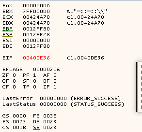
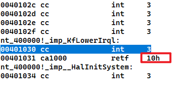
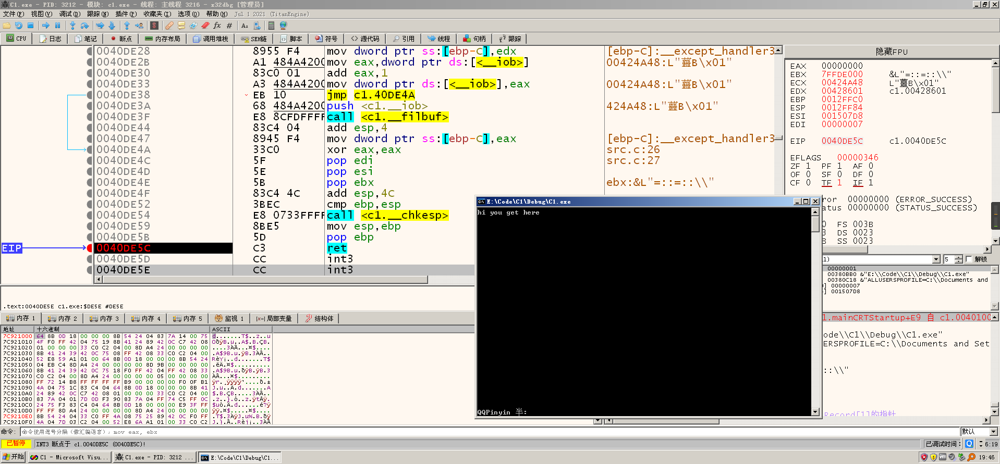

# 调用门

Windows系统没有再使用调用门，但是使用了中断门

学习调用门是为了更好地理解中断门 后续讲解中断门


调用门的执行情况,现在看不懂没关系


如果GDT表的成员不是段描述符的话,可能是调用门

调用门的结果如下


下面是以前的段描述符,可以对比一下

小端序如下


其中


因为有调用门,所以有固定的1100的数值,为0xC

其中又有0000,所以组成了0x0C


关于参数的个数,,其实卡得不是那么死

虽然最多15个

你说几个,他就会push到栈里面去

只要我们获取了三环的ESP/EBP,

我们就可以按照我们约定俗成的调用约定,来提取任意多个参数进来,


经过这么一说,,原来有些调用门还不是用来提权的哟?


为什么调用门不稳定?

在GDT的`0x80003F00~0x80003F90` 这段空间中,,,操作系统一直在修改他的地址

所以如果你把调用门写在一个经常变化的内存中,就容易g

所以我们的调用门都用在`00~90` 之间

别人说的: 能用GDT构建的,就不用IDT,,以为IDT容易被检测

IDT前31个成员基本上是固定的,GDT经常在修改,所以不容易被检测

 


另外call far不会把返回地址压入R3的堆栈


## 无参

Windows中并没有使用调用门，所以需要手动构造一个调用门。

然后调用门也有段描述符,也存在于GDTR表中,下面就是调用门专用的描述符定义


S位指明了是系统段

Offset in Segment: 指明了前往的EIP(弥补了之前无效的EIP)

SegmentSelector:  指明了前往的段寄存器(一个新的段选择子)

Type域`1 1 0 0`指明了是一个32位的调用门

所以对于一个调用门的,段描述符固定的部分是有

S=0

Typ=1100

所以,我们通过要构造一个调用门的话(8字节构造)

```c
---高位地址
Offset in Segment 31:16 = 0x0000		//暂定
					  P = 1	
					DPL = 二进制:11		//该段的权限,不太理解
					S	= 0
				   TYPE	= 二进制:1100
			Param.Count = 二进制:00000		//几个参数
	   Segment Selector = 0x0008		//段选择子
Offset in Segment 15:00 = 0x0000		//暂定
--- 地位地址
```


下面是一个通过调用门提权的操作

然后因为我没有环境,就写了一些自己的理解在代码注释里面

```c
#include <windows.h>
#include <stdio.h>
char Hello[]="Hello World\n";
void __declspec(naked) enHancePrivilege()
{
    
    __asm
    {
 /*
        push ebp
        mov ebp,esp
        sub esp,16
        lea eax,Hello
        push eax
        call eax
        add esp,4
        pop ebp
        mov esp,ebp
        pop ebp
 */
        retf        //注意返回, 不能是ret!
    }
}

int main()
{
    char buff[6];

    *(DWORD*)&buff[0] = 0x00000000; //可以随便写, 这个就是EIP, EIP是废弃的
    *(WORD*)&buff[4] = 0x48;        //不能随便写,涉及了索引值和RPL 通过它寻找调用门的描述符.
    //而调用门的段描述符涉及了最后前往的XX:EIP

    __asm
    {
        call fword ptr[buff]        //长调用
    }

    getchar();

    return 0;
}
```


```
0: kd> eq 8003f048 0040EC0000081020
0: kd> dq 8003f000
8003f000  00000000`00000000 00cf9b00`0000ffff
8003f010  00cf9300`0000ffff 00cffb00`0000ffff
8003f020  00cff300`0000ffff 80008b04`200020ab
8003f030  ffc093df`f0000001 0040f300`00000fff
8003f040  0000f200`0400ffff 0040ec00`00081020
8003f050  80008955`27000068 80008955`27680068
8003f060  00009302`2f40ffff 0000920b`80003fff
8003f070  ff0092ff`700003ff 80009a40`0000ffff

```

首先代码运行到call far的时候,程序会终止到windbg的0环调试器

```
Single step exception - code 80000004 (first chance)
First chance exceptions are reported before any exception handling.
This exception may be expected and handled.
00401020 55              push    ebp

```


当我们进入调用前



进入调用后,出现在windbg调试器

```
0: kd> r esp
esp=ee9badd0 //新的栈
0: kd> dd ee9badd0
ee9badd0  	0040de39 //返回的EIP
            0000001b //以前的CS
            0012ff28 //以前的ESP
            00000023 //以前的CS
ee9bade0  	805470de 
            f7353b85 
            85f187e0 
            00000000
ee9badf0  	...

```


然后是一个通过提权后,读取高2G内存搞事的代码 

```c
#include <windows.h>
 
BYTE GDT[6] = {0};
DWORD dwH2GValue;
 
void __declspec(naked) GetRegister()
{
    __asm
    {
        pushad
        pushfd
 
        mov eax,0x8003f00c    //读取高2G内存
        mov ebx,[eax]
        mov dwH2GValue,ebx
        sgdt GDT;             //读取GDT
 
        popfd
        popad
 
        retf                  //注意返回, 不能是ret
    }
}
 
void PrintRegister()
{
    DWORD GDT_ADDR = *(PDWORD)(&GDT[2]);
    WORD GDT_LIMIT = *(PWORD)(&GDT[0]);
 
    printf("%x %x %x\n", dwH2GValue,GDT_ADDR,GDT_LIMIT);
}
 
int main()
{
    char buff[6];
    __asm
    {
        mov ebx,ebx
        mov ebx,ebx
    }
 
    *(DWORD*)&buff[0] = 0;
    *(WORD*)&buff[4] = 0x48;//CS 去往:GDT 索引:9 然后请求:R0
 
    
    //调用门:0040ec00`00081020
    __asm
    {
        call fword ptr[buff]//进入调用门
    }
 
    PrintRegister();
 
    getchar();
 
    return 0;
}
```

运行结果


后面,海东老师讲到

读取GDTR的指令`SGDT`在ring3也可以正常使用

于是我自己跑了一下

```c
#include <windows.h>
#include<stdio.h>
BYTE GDT[6] = { 0 };

void __declspec(naked) GetRegister()
{
    __asm
    {
        sgdt GDT;
        ret        
    }
}

void PrintRegister()
{
    DWORD GDT_ADDR = *(PDWORD)(&GDT[2]);
    WORD GDT_LIMIT = *(PWORD)(&GDT[0]);

    printf("%x %x\n",GDT_ADDR, GDT_LIMIT);
}

int main()
{
    GetRegister();
    PrintRegister();
    return 0;
}
```

输出

```
4b590000 7f
```

啊这...好像不太对

但是,这个指令有个神奇的效果(程序调试的时候,莫名其妙的跑飞)


## 有参

其实也就说设置一下参数个数,然后再push

调用门配置

```
---高位地址
Offset in Segment 31:16 = 0x0000		// 暂定
					  P = 1
					DPL = 二进制:11
					S	= 0
				TYPE	= 二进制:1100
			Param.Count = 二进制:00011	// 注意变化！
	   Segment Selector = 0x0008
Offset in Segment 15:00 = 0x0000		// 暂定
--- 地位地址
```


假如有参数

他会在R3,把参数压入栈中

同时,在调用门返回的时候

也是在R3把那几个数据给pop出栈

虽然真正的ret在R0的

但是堆栈的平衡却在R3


# 门的权限检查


首先在调用call的时候

权限角度,跳转前

CPL<=DPL : 也就是要提权的意思

门的段选择子的RPL==门的段选择子的DPL : 也就是权限要同级的意思,,,RPL是未来的DPL

ps:我们没有去管门的DPL,和访问门的RPL


其实这一个仍然不是很清楚的

因为段选择子有RPL,门有DPL,门里面的段选择子也有DPL和RPL

所以哪一个和哪一个之间比较呢???

所以我们有2个DPL,2个RPL,一个CPL


比入实验1无参用的调用门

用的门是0x48, 

0x48对应的段选择子是0xB0或者0x08

当然CPL=R3

0xB0中,RPL=R0,对应的DPL=R0,所以权限检查通过

0x08中,RPL=R0,对应的DPL=R0,所以权限检查通过


# 实验


## 实验1 无参


```c++
0: kd> dq gdtr L32
8003f000  00000000`00000000 00cf9b00`0000ffff
8003f010  00cf9300`0000ffff 00cffb00`0000ffff
8003f020  00cff300`0000ffff 80008b04`200020ab
8003f030  ffc093df`f0000001 7f40f3fd`d0000fff
8003f040  0000f200`0400ffff 00000000`00000000
8003f050  80008955`27000068 80008955`27680068
8003f060  00009302`2f40ffff 0000920b`80003fff
8003f070  ff0092ff`700003ff 80009a40`0000ffff
8003f080  80009240`0000ffff 00009200`00000000
8003f090  00000000`00000000 00000000`00000000
8003f0a0  890089a6`53280068 00000000`00000000
8003f0b0  00000000`00000000 00000000`00000000
8003f0c0  00000000`00000000 00000000`00000000
0: kd> eq 8003f048 0040ec00`00b0100a //构造调用门去8003f0b0
0: kd> eq 8003f0b0 00cf9b00`0000ffff //R0
0: kd> eq 8003f0b8 00cffb00`0000ffff //R3,为什么要这一步操作...我不明白...发现这是一个多余的操作
    
    
//上面3个指令,用一个eq 8003f048 0040ec00`0008100a 即可
//如果是参数4个, eq 8003f048 0040ec04`0008100a 即可
```

不明白,,经常windbg会卡死,也就输输入一条eq之后,就开始busy了

之后我把360给关闭了,eq后卡死的次数变少了


ps: 100a你偏移要和call fword的偏移是一样的


正常情况如下


然后windbg反应


情况1

### vc6去调试情况A


打断点的情况如下


windbg出现报错

```c++
Single step exception - code 80000004 (first chance)
First chance exceptions are reported before any exception handling.
This exception may be expected and handled.
nt_400000!_imp__VidSetTextColor+0x2:
00b0:0040100a e911000000      jmp     nt_400000!_imp__VidCleanUp (00401020)
0: kd> g
//然后继续正常运行
```

期间出现1次停止,估计是遇到异常

异常是Single step exception -然后g一下,完美运行


### vc6去调试情况B


F9之后正常运行


### vc6去调试情况C


这一次没有在windbg停住

windbg没有出现异常

反而是vc6遇到异常,然后F9完成运行


### vc6去调试情况D

vc6去调试也是这种情况,遇到几次异常,,


然后就F9不管


### vc6去运行情况E

完美运行,没有异常

但是有些时候,运行还是报错


### x32dbg去调试

遇到异常,,,


,然后F9不管,,,还是可以完整运行程序


### what?

怎么这么多意料之外的事情

说是不稳定

以后才可能搞得明白吧

## 实验2 有参


在`实验1 无参`的基础上,我们继续实验

```c++
eq 8003f048 0040ec04`00b0100a
```

参数4个

```c++
#include<stdio.h>
#include <stdlib.h>

void _declspec(naked) test()
{
	__asm{
		int 3;//方便后面的调试,去查看寄存器和堆栈

		retf;
	}
}
int main()
{
	char buf[]={0,0,0,0,0x48,0};
	*(int*)buf=(int)test;
	printf("%X\n",test);
	__asm{
		push fs;
		push 1;
		push 2;
		push 3;
		push 4;
		call fword ptr ds:[buf];
		pop fs;
	}
	printf("hi you get here\n");
	getchar();
	return 0;
}
```


当windbg停下来

```c++
0: kd> dc esp
0040de06 ;返回的IP
0000001b ;返回的CS
00000004 
00000003   
00000002 
00000001 
0012ff14 ;返回的ESP
00000023 ;返回的SS
```


如果g一下的话,,,系统就Game Over了

为什么? 以为堆栈没有平衡

没平衡的是传递进去的那4个参数

其中

`0040de06 0000001b`是CS:IP

`0012ff14 00000023`是SS:SP

`00000004 00000003 00000002 00000001`是传递进来的参数


所以我们要去平衡堆栈

```c++
void _declspec(naked) test()
{
	__asm{
		int 3;//方便后面的调试,去查看寄存器和堆栈
		retf 4*4;
	}
}
```


于是断点运行

```c++
0: kd> eq 8003f048 0040ec04`0008100a
0: kd> g
watchdog!WdUpdateRecoveryState: Recovery enabled.
Single step exception - code 80000004 (first chance)
First chance exceptions are reported before any exception handling.
This exception may be expected and handled.
nt_400000!_imp__VidSetTextColor+0x2:
0040100a e921000000      jmp     nt_400000!_imp_KfLowerIrql (00401030)
0: kd> g
Break instruction exception - code 80000003 (first chance)
nt_400000!_imp_KfLowerIrql:
00401030 cc              int     3

```





可以看到成功运行




## 实验3  提权调用内核API

调用一个 RtlInitAnsiString

先去获取该函数的地址


```c++
0: kd> r idtr
idtr=8003f400
0: kd> uf RtlInitAnsiString
nt!RtlInitAnsiString:
8052f734 57              push    edi
8052f735 8b7c240c        mov     edi,dword ptr [esp+0Ch]
8052f739 8b542408        mov     edx,dword ptr [esp+8]
8052f73d c70200000000    mov     dword ptr [edx],0
8052f743 897a04          mov     dword ptr [edx+4],edi
8052f746 0bff            or      edi,edi
8052f748 741e            je      nt!RtlInitAnsiString+0x34 (8052f768)

```


vc 源码如下

```c++
#include<stdio.h>
#include <stdlib.h>
#include <windows.h>

typedef struct _STRING {
    WORD Length;
    WORD MaximumLength;
    char* Buffer;
} STRING;

STRING sz_dest;
char sz_src[]="D0g3.21.Reverse.redqx";

typedef  int (__stdcall *lp_RtlInitAnsiString)( STRING* DestinationString, char* SourceString);
lp_RtlInitAnsiString lp_Nt_func =(lp_RtlInitAnsiString)0x8052f734;


void _declspec(naked) test()
{
	//视频将的是在这里保存一个环境,,,我是真没看明白的
	__asm{
		int 3;
//		pushad;
//		pushfd;
//		push fs;
		mov ax,0x30;
		mov fs,ax;
		lea eax,sz_src;
		push eax;
		lea eax, sz_dest;
		push eax;
		call lp_Nt_func;
//		pop fs;
//		popfd;
//		popad;
		retf;
	}
}
int main()
{
	char buf[]={0,0,0,0,0x48,0};
	printf("%08X\n",test);
	__asm{
		pushad;
		pushfd;
		push fs;
		call fword ptr buf;
		pop fs;
		popfd;
		popad;
	}
	printf("%s\n",sz_dest.Buffer);
	getchar();
	return 0;
}

```


然后去简单的构造一个调用门

```c++
kd> eq 0040ec00`0008100a
```


然后就正常的往下走

正常情况如下,完美运行


像这种代码的话,我就会运行失败的,,,,可能是返回的时候失败

但是具体原因还不知道的

```c++
void _declspec(naked) test()
{
	//视频将的是在这里保存一个环境,,,我是真没看明白的
	__asm{
		int 3;
		pushad;
		pushfd;
		push fs;
		mov ax,0x30;
		mov fs,ax;
		lea eax,sz_src;
		push eax;
		lea eax, sz_dest;
		push eax;
		call lp_Nt_func;
		pop fs;
		popfd;
		popad;
		retf;
	}
}
int main()
{
	char buf[]={0,0,0,0,0x48,0};
	printf("%08X\n",test);
	__asm{
		//pushad;
		//pushfd;
		//push fs;
		call fword ptr buf;
		//pop fs;
		//popfd;
		//popad;
	}
	printf("%s\n",sz_dest.Buffer);
	getchar();
	return 0;
}
```


## 实验4


未运行

代码

```c
#include <windows.h>

DWORD x;
DWORD y;
DWORD z;

void __declspec(naked) CateProc()
{
	__asm
	{
		pushad //依次将EAX、ECX、EDX、EBX、ESP、EBP、ESI、EDI，执行后ESP- 32
		pushfd //之后后ESP-4
		//此刻堆栈已经有新的36个字节的数据0x24
            
		mov eax,[esp+0x24+8+8]
		mov dword ptr ds:[x],eax
		mov eax,[esp+0x24+8+4]
		mov dword ptr ds:[y],eax
		mov eax,[esp+0x24+8+0]
		mov dword ptr ds:[z],eax

		popfd
		popad

		retf 0xC			// 注意堆栈平衡 写错蓝屏
	}
}

void PrintRegister()
{
	printf("%x %x %x \n", x, y, z);
}

int main(int argc, char* argv[])
{
	char buff[6];
	*(DWORD*)&buff[0] = 0x12345678;
	*(WORD*)&buff[4] = 0x48;
	__asm
	{
		push 1					// 参数1
		push 2					// 参数2
		push 3					// 参数3
		call fword ptr[buff] 	// 压入SS ESP CS IP 这里依次压入16 32 16 32 所以
	}
	PrintRegister();
	getchar();
	return 0;
}

```


## int 8逆向


cli 指令让EFLAG的if位置零,

可屏蔽置空...然后别人就不可以打断它

