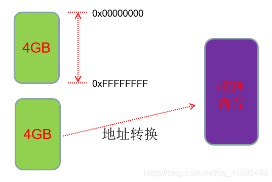
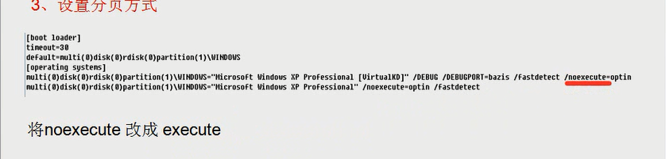
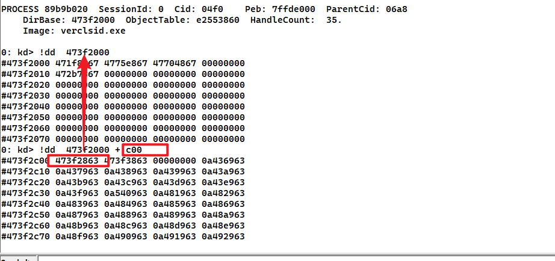
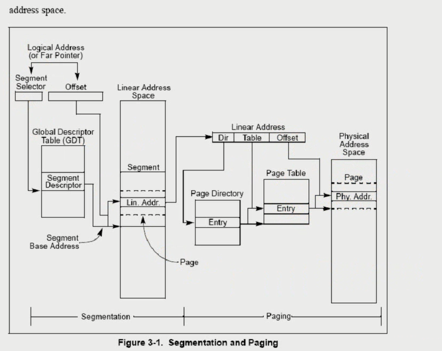
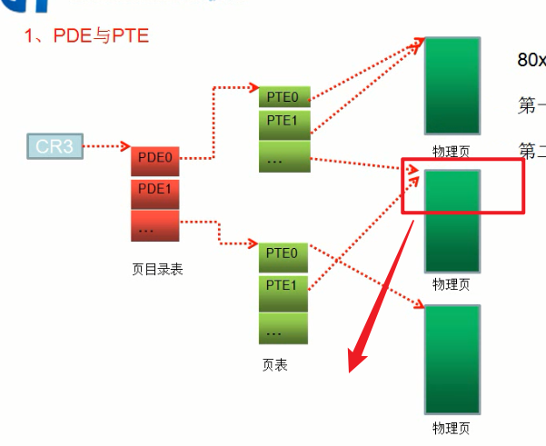
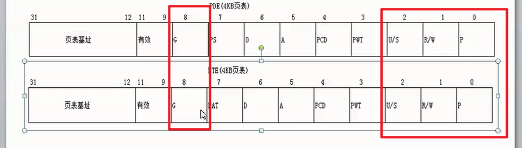
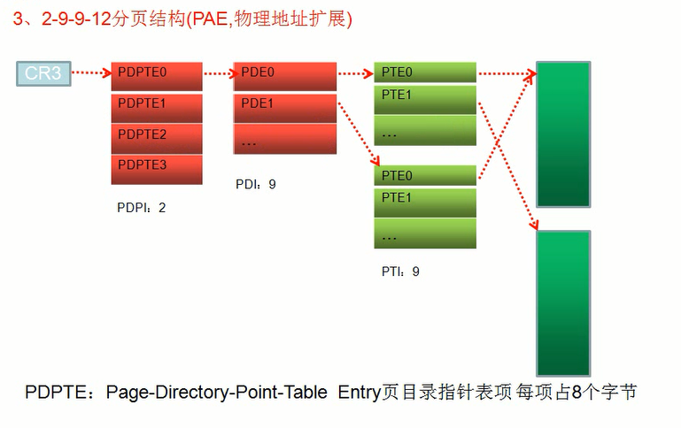
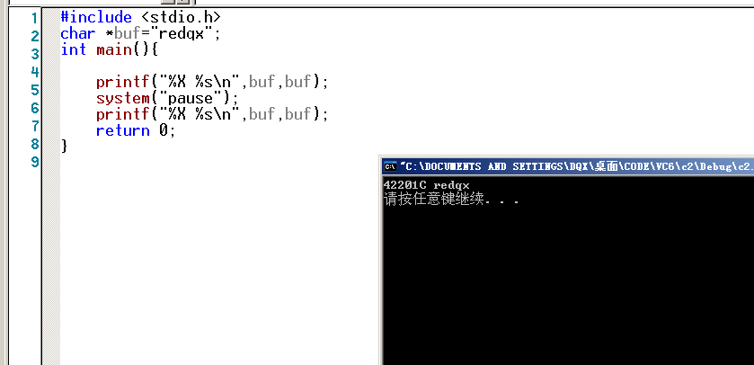
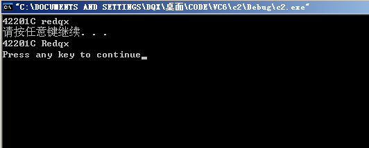

# 引入

4GB内存空间

大家可能都听说过，每个程序在运行时，操作系统都会为其分配一段4GB的内存空间。

但是我们的内存容量很可能最多只够为一个进程分配4GB的内存空间，如何做到为每个进程都分配呢？

实际上，进程被分配到的`4GB内存空间`只是虚拟的的内存空间，

并不是指真正意义上的物理内存，虚拟内存与物理内存之间有一层转换关系

ps: 那`4GB内存空间`是假的




看到的问题:

什么时候用大页..什么非分页内存交换什么的


# 地址


## 有效地址-线性地址


物理地址

以如下为例

```
MOV eax,dword ptr ds:[0x12345678]
```

其中，

0x12345678 是**有效地址**

ds.Base + 0x12345678 是**线性地址**

注意：当段[寄存器](https://so.csdn.net/so/search?q=寄存器&spm=1001.2101.3001.7020)的Base为0时，**有效地址**=**线性地址**，

大多数时候都是如此；但也有特殊情况，比如**fs段寄存器**的Base不为0


## 物理地址


描述：

我们平时所用到的**系统DLL**（动态链接库）存在于物理地址中，

当程序想要调用某个DLL时，DLL便会映射一份线性地址给程序，

这样程序就能够通过线性地址找到DLL的物理地址


关于实验,我没去做,就说一下自己的理解吧

首先打开一个notpad.exe,往里面写入内容

然后用CE附加这个进程,然后用Unicode的方式扫描扫描字符串,寻找该内容

最后就可以获取一个线性地址

然后我们要做的就是把线性地址转化到物理地址

这里我们以`10-10-12`分页的方式为例

<div  style="color:#FFB5C5;font-size:16px">
    tips:<br>
    10-10-12的意思,就是把一个32位的数据分为10bit,10bit,12bit<br>
	然后10个bit位大小最大是1023,<br>
    也即是1024个数据<br>
</div>


如果通过CE获取的线性地址是0x06765140

然后我们划分数据,把3个数据提取出来,因为最后的12bit刚好3个16进制位,就不用划分了

```
0    6    7    6    5    140
=
0000 0110 0111 0110 0101 140
=
0000011001		// 0x19
1101100101		// 0x365
140				// 12个比特位刚好三个字节
```

所以我们提取出来就是0x19,0x365,0x140,

这3个数据是什么? 其实也就是一些表的索引值


```
!process 0 0 寻找进程,然后获取DirBase 是一个进程的物理地址
```

加入我们获取的DirBase是`0bd1000`

然后我们

tips:`!dd`是查看物理地址

```
!dd 0bd1000 + 0x19*4 //成员是DWORd Arr1[xx]
```

然后可以获取一个4字节数据,把后3位16进制置为0(后面讲诉)

```
!dd 08F17000 + 0x365*4	//成员是DWORd Arr2[xx]
```

然后可以获取一个4字节数据,把后3位16进制置为0(后面讲诉)

```
!dd 1D075000 + 0x140  //成员是BYTE Arr3[xx]
```


# 分页

设置分页的方式




在该是在xp的C:/booit.ini文件里面修改的


12-10-10分页,,,指的是4字节本被分割为这几个bit位


## CR3





在0xC00的偏移处,,又指向了字节

0x473F2863->(取出后三位)->0x473F2000


## 10-10-12

这种分页方式基本上绝种了

只有xp才会用,基本上都是2-9-9-12分页的


10-10-12有什么含义呢?

CPU 规定xxx是4K,也就是4096个字节

10个bit位可以容纳1024个范围,,2^10=1024

同时2^10x2^10x2^12=4GB

本来0xffffffff~0就是4GB的范围,,,,

### PDE&PTE




很多PDE组成了一张PDT

很多PTE组成了一张PTT

ps: 名字很绕可的


PTE会指向一个4k的区域

对于小页,才会有PTE,每一个PTE都指向4k

对于大页,,不会有PTE,,大页不再指向一个4KB,而是指向一个4MB


物理页大小都是4kb

一个页表能包含的物理页的页数是1024,,, 所以一个页表可以表示的范围就是1024*4kb=4mb

对于10-10-12分页的来说,他最多1024个页表,,,所以范围就是1024*4mb=4GB




像这种情况就是内存共享

不同的进程指向了相同的物理页

这个东西好像蛮有意思的


### 属性分析


属性位都是占3位数,也就是12bit


下面这是大端序的表示

物理页的属性: PDE&PTE,但又不是完全的与的关系

PDE:

```c++
|<------ 31~12------>|<------ 11~0 --------->| 比特
                     |b a 9 8 7 6 5 4 3 2 1 0| 
|--------------------|-|-|-|-|-|-|-|-|-|-|-|-| 占位
|<-------index------>| AVL |G|P|0|A|P|P|U|R|P| 属性
                             |S|   |C|W|/|/|
                                   |D|T|S|W|
```


PTE:

```c++
|<------ 31~12------>|<------ 11~0 --------->| 比特
                     |b a 9 8 7 6 5 4 3 2 1 0|
|--------------------|-|-|-|-|-|-|-|-|-|-|-|-| 占位
|<-------index------>| AVL |G|P|D|A|P|P|U|R|P| 属性
                             |A|   |C|W|/|/|
                             |T|   |D|T|S|W|
```


P位: 是否有效,,还有一个功能,,不太知道,,,以后去了解

R/W: 0是只读,1是可写


U/S: 普通用户和超级用户,,,1表示普通用户/超级用户都可以访问,,0表示只能超级用户(R0,R1,R2)访问

Hint: R3是否可以读写高2G,就是在这里对物理页做了一个限制😏


A: 是否有访问过

D: 是否被写过

G: 全局的位,,和TLb有关系,,后面会讲到的

P: 是否是大页,只对PDE有效

其实重要的没几位



P=0,就不需要访问了,因为无效的

PS=0,,说明有PTE存在

PS=1,说明没PTE存在,那就直接读写内存,(所以没PTE对吧?)

比如虚拟地址12345678,PS=1

通过(10-22)拆分

10获取index

22获取偏移


```c++
12345678;
0x48;
0x345678;
//后12位还是变为0哈
```

通过CR3找到PDT,

然后PDT[0x48]+0x345678就结束了

 


PDE[1]: 31930867 -> '0b100001100111'

PTE [0]: 1adc4025 -> '0b000000100101'


为什么有2个属性? PDE,PTE?

首先我认为PTE是对PDE的精细控制

然后PTE是对整个4m的控制,PTE是对4k的控制

有些页的描述她没有PTE,比如大页,,所以为了兼容性,,,会用到PDE来控制属性

如果也有PTE存在,,则更加精细化控制


## 2-9-9-12





## 简单介绍

CR3：唯一一个存储物理地址的寄存器。

在Windows中，页大小是4KB。在后期会接触到另一种页，有4MB大小，称为大页。

CR3里面存储的地址，指向的PDT，表中每个成员称为PDE,PTE指向的才是真正的`物理页`。

无论是PDE或者PTE，都是4字节。它的十六进制形式的后三位存储的是属性


然后说一下为什么0地址不能读写

因为0地址一般不会给他分配物理页

那么,如果我们手动给他分配物理页的话,是完全可以实现0地址的读写

关于0地址读写问题,我希望后面你自己写个小实验


寻找我们已经分配的物理页


```c
#include "stdafx.h"
 
int main(int argc, char* argv[])
{
    int x = 1;
 
    printf("x的地址:%x\n", &x);
 
    getchar();
 
    //向0地址写入数据
    *(int*)0 = 123;
 
    //读取0地址上的数据
    printf("0地址数据:%x\n", *(int*)0);
 
    return 0;
}
```


1.  PTE可以指向物理页，也可以没有指向物理页。
2.  多个PTE可以指向一同一个物理页。
3.  一个PTE只能指向一个物理页


## 小实验




因为是10-10-12分页

所以就有了10bit,10bit的划分

因为20bit刚好是5个数字,,,所以这个特征还是比较好记住的


拆分字符串的虚拟地址

```c++
0042201C

0 0 4 2 2 | 0 1 C
0000 0000 0100 0010 0010
0000000001=1
0000100010=0x22

01C在后面还大有用途
```


首先找到CR3

```c++
PROCESS 89c99b30  SessionId: 0  Cid: 0b90    Peb: 7ffdf000  ParentCid: 0b88
    DirBase: 31cbd000  ObjectTable: e28c7290  HandleCount:  84.
    Image: c2.exe
```


然后找PDE

```c++
0: kd> !dd 31cbd000
//这些都是PDT数组,也就2个
#31cbd000 319f1867 31930867 00000000 00000000
```


解释一下什么意思

```c++
0042201C

0 0 4 2 2
0000 0000 0100 0010 0010
0000000001=1 //index->1
0000100010=0x22 //index->0x22

```

因为是索引1

```c++
0: kd> !dd 31cbd000//CR3_value
//这些都是PDT数组,也就2个
#31cbd000 319f1867 31930867 00000000 00000000
```

所以取出成员 `319f1867` ,去掉后3位,`319f1000`

然后拿着 `319f1000`  和索引0x22

```c++
0: kd> !dd 31930000 + 0x22*4
#31930088 1adc4025 1ad85025 2f349867 1af07225
#31930098 00000000 2f386867 31b88867 2f38b867
#319300a8 318c5825 00000000 00000000 00000000
#319300b8 00000000 00000000 00000000 00000000
#319300c8 00000000 00000000 00000000 00000000
#319300d8 00000000 00000000 00000000 00000000
#319300e8 00000000 00000000 00000000 00000000
#319300f8 00000000 00000000 00000000 00000000
```


然后拿到地址`1adc4025` ,去掉后三位`1adc400`

因为字符串的虚拟地址是`0042201C`,然后拿出后三位`01C`

凑在一起`1adc401C`

然后去查看地址

```c++
0: kd> !db 1adc401C
#1adc401c 72 65 64 71 78 00 00 00-70 61 75 73 65 00 00 00 redqx...pause...
#1adc402c 2e 5c 00 00 70 72 69 6e-74 66 2e 63 00 00 00 00 .\..printf.c....
#1adc403c 66 6f 72 6d 61 74 20 21-3d 20 4e 55 4c 4c 00 00 format != NULL..
#1adc404c 69 33 38 36 5c 63 68 6b-65 73 70 2e 63 00 00 00 i386\chkesp.c...
#1adc405c 00 00 00 00 54 68 65 20-76 61 6c 75 65 20 6f 66 ....The value of
#1adc406c 20 45 53 50 20 77 61 73-20 6e 6f 74 20 70 72 6f  ESP was not pro
#1adc407c 70 65 72 6c 79 20 73 61-76 65 64 20 61 63 72 6f perly saved acro
#1adc408c 73 73 20 61 20 66 75 6e-63 74 69 6f 6e 20 63 61 ss a function ca
```

可以看到目标字符串已经被找打了

然后我们修改一下

```c++
0: kd> !eb 1adc401c 52
0: kd> !db 1adc401C
#1adc401c 52 65 64 71 78 00 00 00-70 61 75 73 65 00 00 00 Redqx...pause...
#1adc402c 2e 5c 00 00 70 72 69 6e-74 66 2e 63 00 00 00 00 .\..printf.c....
#1adc403c 66 6f 72 6d 61 74 20 21-3d 20 4e 55 4c 4c 00 00 format != NULL..
#1adc404c 69 33 38 36 5c 63 68 6b-65 73 70 2e 63 00 00 00 i386\chkesp.c...
#1adc405c 00 00 00 00 54 68 65 20-76 61 6c 75 65 20 6f 66 ....The value of
#1adc406c 20 45 53 50 20 77 61 73-20 6e 6f 74 20 70 72 6f  ESP was not pro
#1adc407c 70 65 72 6c 79 20 73 61-76 65 64 20 61 63 72 6f perly saved acro
#1adc408c 73 73 20 61 20 66 75 6e-63 74 69 6f 6e 20 63 61 ss a function ca
```

然后继续运行程序

可以看到已经被我们修改了



