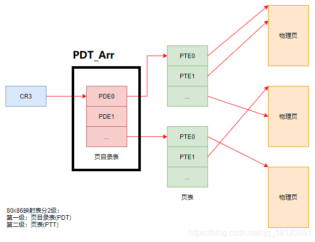

# 引入

4GB内存空间

大家可能都听说过，每个程序在运行时，操作系统都会为其分配一段4GB的内存空间。

但是我们的内存容量很可能最多只够为一个进程分配4GB的内存空间，如何做到为每个进程都分配呢？

实际上，进程被分配到的`4GB内存空间`只是虚拟的的内存空间，

并不是指真正意义上的物理内存，虚拟内存与物理内存之间有一层转换关系

ps: 那`4GB内存空间`是假的


看到的问题:

什么时候用大页..什么非分页内存交换什么的


# 地址


## 有效地址-线性地址


物理地址

以如下为例

```
MOV eax,dword ptr ds:[0x12345678]
```

其中，

0x12345678 是**有效地址**

ds.Base + 0x12345678 是**线性地址**

注意：当段[寄存器](https://so.csdn.net/so/search?q=寄存器&spm=1001.2101.3001.7020)的Base为0时，**有效地址**=**线性地址**，

大多数时候都是如此；但也有特殊情况，比如**fs段寄存器**的Base不为0


## 物理地址


描述：

我们平时所用到的**系统DLL**（动态链接库）存在于物理地址中，

当程序想要调用某个DLL时，DLL便会映射一份线性地址给程序，

这样程序就能够通过线性地址找到DLL的物理地址


关于实验,我没去做,就说一下自己的理解吧

首先打开一个notpad.exe,往里面写入内容

然后用CE附加这个进程,然后用Unicode的方式扫描扫描字符串,寻找该内容

最后就可以获取一个线性地址

然后我们要做的就是把线性地址转化到物理地址

这里我们以`10-10-12`分页的方式为例

<div  style="color:#FFB5C5;font-size:16px">
    tips:<br>
    10-10-12的意思,就是把一个32位的数据分为10bit,10bit,12bit<br>
	然后10个bit位大小最大是1023,<br>
    也即是1024个数据<br>
</div>


如果通过CE获取的线性地址是0x06765140

然后我们划分数据,把3个数据提取出来,因为最后的12bit刚好3个16进制位,就不用划分了

```
0    6    7    6    5    140
=
0000 0110 0111 0110 0101 140
=
0000011001		// 0x19
1101100101		// 0x365
140				// 12个比特位刚好三个字节
```

所以我们提取出来就是0x19,0x365,0x140,

这3个数据是什么? 其实也就是一些表的索引值


```
!process 0 0 寻找进程,然后获取DirBase 是一个进程的物理地址
```

加入我们获取的DirBase是`0bd1000`

然后我们

tips:`!dd`是查看物理地址

```
!dd 0bd1000 + 0x19*4 //成员是DWORd Arr1[xx]
```

然后可以获取一个4字节数据,把后3位16进制置为0(后面讲诉)

```
!dd 08F17000 + 0x365*4	//成员是DWORd Arr2[xx]
```

然后可以获取一个4字节数据,把后3位16进制置为0(后面讲诉)

```
!dd 1D075000 + 0x140  //成员是BYTE Arr3[xx]
```


# 分页

设置分页的方式


在该是在xp的C:/booit.ini文件里面修改的


12-10-10分页,,,指的是4字节本被分割为这几个bit位


## 10-10-12

10-10-12有什么含义呢?

CPU 规定xxx是4K,也就是4096个字节

10个bit位可以容纳1024个范围,,2^10=1024

同时2^10x2^10x2^12=4GB

本来0xffffffff~0就是4GB的范围,,,,

### PDE&PTE





PTE会指向一个4k的区域

对于小页,才会有PTE,每一个PTE都指向4k

对于大页,,不会有PTE,,大页不再指向一个4KB,而是指向一个4MB


物理页大小都是4kb

一个页表能包含的物理页的页数是1024,,, 所以一个页表可以表示的范围就是1024*4kb=4mb

对于10-10-12分页的来说,他最多1024个页表,,,所以范围就是1024*4mb=4GB


像这种情况就是内存共享

不同的进程指向了相同的物理页

这个东西好像蛮有意思的


## 简单介绍

CR3：唯一一个存储物理地址的寄存器。

在Windows中，页大小是4KB。在后期会接触到另一种页，有4MB大小，称为大页。

CR3里面存储的地址，指向的PDT，表中每个成员称为PDE,PTE指向的才是真正的`物理页`。

无论是PDE或者PTE，都是4字节。它的十六进制形式的后三位存储的是属性


然后说一下为什么0地址不能读写

因为0地址一般不会给他分配物理页

那么,如果我们手动给他分配物理页的话,是完全可以实现0地址的读写

关于0地址读写问题,我希望后面你自己写个小实验


寻找我们已经分配的物理页


```c
#include "stdafx.h"
 
int main(int argc, char* argv[])
{
    int x = 1;
 
    printf("x的地址:%x\n", &x);
 
    getchar();
 
    //向0地址写入数据
    *(int*)0 = 123;
 
    //读取0地址上的数据
    printf("0地址数据:%x\n", *(int*)0);
 
    return 0;
}
```


1.  PTE可以指向物理页，也可以没有指向物理页。
2.  多个PTE可以指向一同一个物理页。
3.  一个PTE只能指向一个物理页


## 属性


## 小实验


