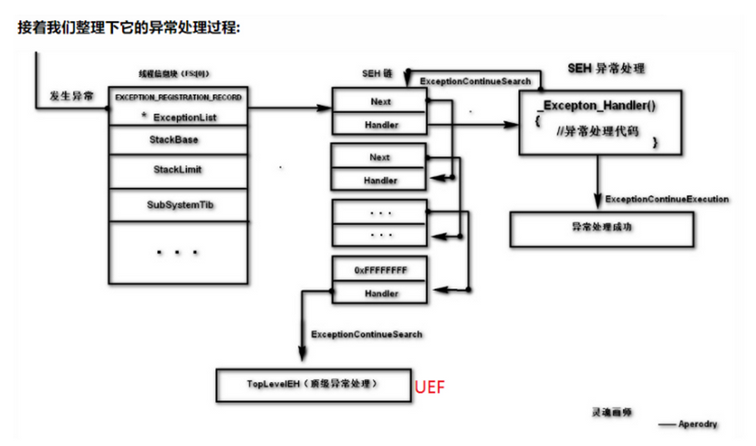

# 返回

关于手动汇编注册的返回类型

```
// Exception disposition return values
enum _EXCEPTION_DISPOSITION
{
    ExceptionContinueExecution,         // 0 继续执行异常代码 (可以视为已经处理)
    ExceptionContinueSearch,            // 1 丢给下一个异常处理器
    ExceptionNestedException,           //在OS内部使用
    ExceptionCollidedUnwind             //在OS内部使用
} EXCEPTION_DISPOSITION;
```

关于VEH/UEF/VCH的返回类型

```
EXCEPTION_EXECUTE_HANDLER(1) 执行except代码
EXCEPTION_CONTINUE_SEARCH(0) 寻找下一个
EXCEPTION_CONTINUE_EXECUTION(-1) 重新执行
```

VCH不是一个处理异常的东西,他是老板

非调试状态:

当VEH

返回`EXCEPTION_CONTINUE_SEARCH , EXCEPTION_EXECUTE_HANDLER` 都会进入 SEH|UEF|死掉

返回`EXCEPTION_CONTINUE_EXECUTION` 进入 VCH 通报异常已经处理,然后去往ContextRecord->Eip

当SEH

返回 EXCEPTION_CONTINUE_SEARCH , 进入UEF|死掉

返回 EXCEPTION_EXECUTE_HANDLER 进入 __except(){}不在回去,然后继续执行,也不进入VCH

返回 EXCEPTION_CONTINUE_EXECUTION 进入 VCH 通报异常已经处理,然后去往ContextRecord->Eip

当UEF

返回 EXCEPTION_EXECUTE_HANDLER ,然后程序自己g,退出了,

返回 EXCEPTION_CONTINUE_SEARCH ,然后程序非常g,退出了,

返回 EXCEPTION_CONTINUE_EXECUTION 进入 VCH 通报异常已经处理,然后去往ContextRecord->Eip

VCH的

前面只有返回 EXCEPTION_CONTINUE_EXECUTION 才可以进入VCH后,

VCH无论返回什么都会去往 `pExcepInfo->ContextRecord->Eip` 的地方

__finally是无论异常怎么处理都会计入的地方

也就是g之前也会进入finall

# 处理过程 🟥

当异常被处理，并且返回EXCEPTION_CONTINUE_EXECUTION时，会触发VCH。

说的通俗一点：

VCH就好像是老板，而VEH和SEH、UEF等算是打工的，

它们是"异常处理器"，而VCH是"继续处理器"。

当异常这个烂摊子让"打工的"收拾完之后，会通知"老板"，老板来做决定。

如果没人处理异常，烂摊子没人收拾，老板自然不会去"收拾烂摊子"了。

- -bxc <<看雪>>

图1


图2

