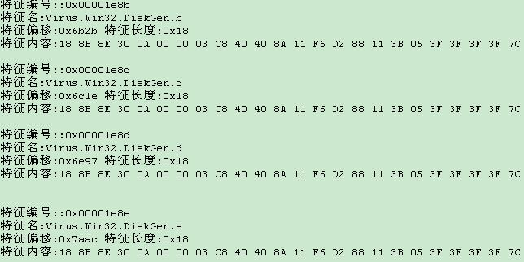
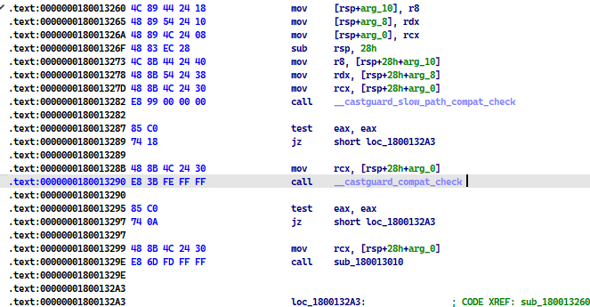

# 什么特征码

计算机病毒的特征码需要能够把病毒程序与一般的程序区分开来，即能够唯一标识一个或者一类多态病毒

要能够成为计算机病毒程序的指纹

每个杀毒软件公司都有自己的特征码提取方法和提取工具，这也是特别需要技术的地方，弄不好就造成误判，

将好文件当成病毒给杀了


一般来说，病毒特征码可能需要满足以下几个要求：

1), 不能从数据区提取，因为数据区的内容很容易改变，一旦病毒程序变更版本，改变了数据内容，特征码就会失效。而其它的区块则相对来说保险一些。

2), 在保持特征码的唯一性的前提下，应当尽量使得特征码短小精悍，从而减少检测过程中的时间与空间的复杂度，提高检测效率。

3), 经过详细的逆向分析之后选取出来的特征码，才足以将该病毒与其它病毒或正常程序相区别。

4), 病毒程序的特征码一定不能匹配到普通程序，比如选取病毒入口点的二进制代码，就必然出现误报的情况。

5), 从特征函数提取特征码,比如一些高频出现的解码函数,主打一个高频出现,不管病毒如何更新,该字节码序列是不变的


杀软可能选取多处特征码,交叉混合的匹配样本,当同时包含了多出特征,就会报毒


 


# 如何绕过特征码免杀 (一)


ps: 绕过md5校验的话,is就修改字节码或者增加文件大小之类的,会比较简单


绕过特征码, 其实就是需要我们不断的去猜测,特征码在哪里





然后我们去修改特征码的某一个字节,然后再让杀软去扫描,是否报毒

如果还在报毒,那么我们就再寻找关键位置,再次修改字节码,再次让杀软扫描


如何修改特征码:

1), 修改字节码,不能影响样本的正常运行

2), 可以采用等效的方法修改, 类似于 xor eax,eax == mov eax,0

其实这种方法算得上是效率比较低下的笨方法,因为是大海捞针


进一步

这又侧面的说明了什么: 如何寻找特征码便得很重要

于是出现了工具  常用的定位木马病毒特征码: CCL，MultiCCL，MYCC, VirTest

其实可以去百度一下MyCLL的用法,知道MyCll是干嘛的

可以发现,MyCll也是一个效率很低的一个方法

关于VirTest貌似是一个更加科学的方法,不过效率还是比较低的


ps: 其实就是根据杀软如何定位特征码,我们才可以更加有效的去猜测特征码位置


# 如何绕过特征码免杀 (二)

反正特征码定位到数据位置不容易修改（可以再试试后面的盲免杀）

因为我们很难精准定位到特征码的位置


## 数据


1 字符串，如果不影响程序逻辑，可以替换大小写；如果无关紧要的数据，随意替换；等等，看情况而定。
2 整数，如果不影响结果，替换值，清零等等操作。
3 地址，基本应该不能修改，具体看情况。
4 PE头数据，根据PE结构具体来看，无用数据清零或修改，有用数据看情况修改。


## 代码

1 如果特征码定位到代码（也通过IDA/OD等确认），在不改变程序功能基础上，应用各种方法修改。

2 等价替换汇编代码，如mov eax，0 可以换成xor eax，eax，直接结果相同，二进制代码不同。

3 交换代码顺序，在不影响逻辑的情况下。

4 代码块移位，将代码块移动不用的内存位置，通过加入jmp addr 跳过去执行，addr是新的代码块地址。

5 最后，终极修改方法，找到访问数据的代码，直接修改代码访问数据的地址，数据也可以放到其他地址了，

其实就如同修改源码一样修改，肯定没有修改源码那么容易（见后）。


# 基于源码->二进制文件的免杀


其实只是针对于样本开发者的角度而言

比如我们写了一个病毒出来

生成的时候,发现360报毒了

这个报毒可能是因为我们写了某一个函数导致的

于是我们可以通过在源码中修改某某函数

比如增加这个函数,减少这个函数,替换这个函数,魔改这个函数,混淆这个函数之类 来达到一个免杀的目的

```
1. sub1 //未报毒
2. sub1 sub2 //未报毒
3. sub1 sub2 sub3 //报毒
4. sub1 sub2 sub3(sub31) //未报毒
5. sub1 sub2 sub3(sub31 sub32) //报毒
6. sub1 sub2 sub3(sub31 sub32(sub321)) //报毒
```


# 杀软之常见的特征码结构


先了解一下常见的数据结构


病毒库结构: 名称表，包括壳名、包名、特征名 

```c
structVirInfo
{
    DWORD dwID;
    BYTE btLength;
    char VirName[btLength];
};
```


病毒库常见的PE库结构

```c
struct VirpeHeader
{
    WORD wUnknown;
    DWORD dwHeadSize;
    DWORD dwSize;
    WORD wTable1Count;
    WORD wdMaskCount;//表示共有多少条PE特征
    WORD wdUnknown4;
    DWORD dwTable1Off;
    DWORD dwTable2Off;
    DWORD dwTable3Off;
    DWORD dwTable4Off;
    DWORD dwTable5Off;//传统特征
    DWORD dwTable6Off //多模式特征
};
```


特征结构

```c
struct Sig 
{
    DWORD dwRecordID;//特征ID，用于关联特征名
    DWORD dwOffset;//特征偏移，用于定位病毒代码具体位置
    BYTE btLength;//特征长度，用于扫描匹配病毒代码长度
    BYTE btOffsetBaseAddress;//特征基地址，用于定位特征起始位置
    BYTE btVirMask[btLength];//病毒特征具体内容
};
```


二进制全文匹配: 也就是一一匹配.通常取出一些字节,然后和样本进行一个匹配

多模匹配:将恶意程序的明显字符串信息提取出，记录在病毒库中，与待检测样本进行多模匹配。


# 其它


## 关于pe文件杀软会关注哪些地方


1), pe头

2), p代码段: 一般放全局变量

3), p数据段: 

4), 资源段(杀软重点研究): ico,shellcode


同时杀软会参照样本PE文件和标准PE文件,从多个维度考查样本PE的合法性

比如

首先确定是不是pe文件

查看section是否异常

...


>   关于对pe的入口修改

不一定要一开始就修改ep

而是在执行ep的时候,再去新的节区

这里可能盯的比较紧


>   关于pe的IAT

一般不去导入表加载API,容易被检测敏感函数,所以一般动态加载API

比如说你有一段提取的代码 ,他会通过你有危险APi的导入和危险APi的调用来判断你是一个恶意程序


敏感的API:

```
KERNEL32.LoadLibraryA
KERNEL32.GetProcAddress
KERNEL32.VirtualProtect
KERNEL32.VirtualAlloc
KERNEL32.VirtualFree
ADVAPI32.OpenProcessToken
PSAPI.EnumProcesses
kernel32.GetCurrentProcess
SeDebugPrivilege
```


## 关于文件的静态免杀,可能匹配什么

MD5 匹配:文件哈希

FileName 匹配:文件名字

File Size匹配: 文件大小

File Path 匹配:

scode 匹配: 关键特征码,也就是程序如果没有那段字节码,就跑不起来

