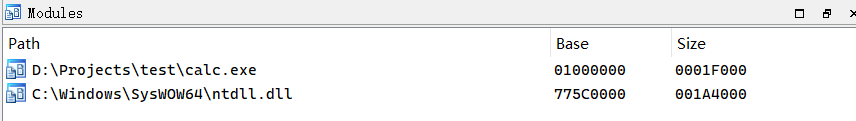

exe的执行,,

不是一开始就去往ep..还有很多基于进程的初始化

比如IAT表的初始化

当一个进程被创建的时候,首先被执行的是ntdll.dll的LdrInitializeThunk函数

ps: ntdll在进程创建的时候,就首先映射了

目前我无法判断ntdll和exe谁先映射

但是他们2个是最先映射的

可以看到,调试程序的时候,,,我们断在模块加载的时候

第一次停在了ntdll,,然后是其它的了

然后回来我们继续的讨论,,,

当一个进程被创建的时候,首先被执行的是ntdll.dll的LdrInitializeThunk函数

LdrInitializeThunk会调用LdrpInitializeProcess,

LdrpInitializeProcess,会继续调用LdrpWalkImportDescriptor对输入表进行一个处理