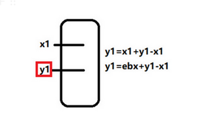
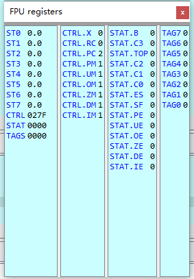

# CALL/POP .1


```assembly
DWORD* lp_apiAddr;

    __asm {
        push eax;
        push ebx;
        push ecx;

        call label_reloc;
    label_reloc:
        pop ebx;

        //重定位lpfuncAddr;
        lea eax, g_apiAddr;
        sub eax, label_reloc;
        add eax, ebx;

        lea ecx, lp_apiAddr;
        mov[ecx], eax;

        pop ecx;
        pop ebx;
        pop eax;

    }
```

他的原理是什么?

一个变量的真实地址 = 一个基址 + 一段偏移



比如y1地址的重定位,就是x1的地址+一个偏移量量

偏移量是一个相对距离,静态加载和动态加载都不会改变这个相对值

只是基址在发生变化,所以重定位就是新的基址+写死的偏移量

对方法1的小结

其实就是新的基址+一个固定的偏移

就我举得例子,它是通过现场获取当前基址,并现场计算写死的固定偏移

通过新的基址+固定偏移来获取

其实,大多数情况下,固定偏移是提前计算好了的,不需要我们那样现场计算

```c
        //重定位lpfuncAddr;
        lea eax, g_apiAddr;
        sub eax, label_reloc;
        add eax, ebx;

优化为
 
        mov eax,xxx ;xx是直接写死的,而不是通过计算
				add eax,ebx
```


# CALL/POP .2


```
E8FFFFFFFFC25890
```


执行后,代码会重构


这样的话,edx就可以获取地址 .text:00A65085


# 浮点运算型

浮点运算后位置保存在栈顶，通过POP操作可以获取其位置。


案例1

```assembly
 ; ---------------------------------------------------------------------------
.text:00A65084 D9 EE                         fldz
.text:00A65086 D9 74 24 F4                   fnstenv byte ptr [esp-0Ch]
.text:00A6508A 5B                            pop     ebx
```


案例2

```c
debug043:00E00000 DA C5                         fcmovb  st, st(5)
debug043:00E00002 B8 5B 43 B1 DA                mov     eax, 0DAB1435Bh
debug043:00E00007 D9 74 24 F4                   fnstenv byte ptr [esp-0Ch]
debug043:00E0000B 5D                            pop     ebp
```

其实具体东西就是00E00000进入了某个环境.然后后面取出来了


之前的一个例证讲解

```nasm
debug047:00B90000 fcmovb  st, st(5) ; 根据{CF标志位,[esp+4*0]和[esp+4*5]}来做一一些操作
debug047:00B90002 mov     eax, 0DAB1435Bh
debug047:00B90007 fnstenv byte ptr [esp-0Ch]
debug047:00B9000B pop     ebp
debug047:00B9000C xor     ecx, ecx
debug047:00B9000E mov     ecx, 56B1Ah
debug047:00B90013 add     ebp, 4
debug047:00B90016 xor     [ebp+17h], eax
```

第一条指令运行:  如果st0<st5,那么st5=st0,否则啥也没发生

指令运行前



运行后

.png)

其实到这里,我们还是很懵b 第一句话是干嘛的

ps: 后面一点点马上解释

执行fnstenv byte ptr [esp-0Ch]前

.png)

当 fnstenv byte ptr [esp-4*3] 执行之后

ps: 他就是把FPU的一部分环境拷贝到esp-4*3的地方

-1692448131072.png)

可以看到[esp]的地方,他的值=0x00BD0000,这个数据很特殊

也就是他的值就是shellcode开始的地方,也就是说这个是是一个EIP

我尝试运行了几遍,发现[esp]始终的执行一个shellcode起始地址

后面拷打了很多次chatgpt,他才告诉我这是为什么

首先是 提问

<aside> 💡 x86 fnstenv 会存入多少字节?

</aside>

`fnstenv`指令保存的字节数取决于使用的保存格式。在x86汇编中，有两种保存格式：

1. 短格式：`fnstenv [目标]`，它保存28个字节的FPU环境信息。
2. 长格式：`fnstenv [目标]`，它保存108个字节的FPU环境信息。

因此，`fnstenv`指令会存储28个字节或108个字节，具体取决于您选择的保存格式。

在大多数情况下，推荐使用较小的短格式，除非您需要完整的FPU环境信息。

然后,对于我们这里,他属于28字节的情况

<aside> 💡 然后问他,这28字节分别是什么

</aside>

1. 控制寄存器（Control Register，CW）：2个字节
2. 状态寄存器（Status Register，SW）：2个字节
3. 标签寄存器（Tag Register，TW）：2个字节
4. FPU指令指针偏移量（Instruction Pointer Offset）：2个字节
5. FPU指令指针选择器（Instruction Pointer Selector）：2个字节
6. 数据指针偏移量（Operand Pointer Offset）：2个字节
7. 数据指针选择器（Operand Pointer Selector）：2个字节
8. FPU状态寄存器（FPU Status Word）：2个字节
9. FPU控制寄存器（FPU Control Word）：2个字节
10. FPU标签寄存器（FPU Tag Word）：2个字节
11. FPU数据寄存器（FPU Data Registers）：8个字节

通过观察发现 数据指针选择器和FPU状态寄存器构成的4字节是shellcode的起始地址

于是问chargpt

<aside> 💡 数据指针选择器和FPU状态寄存器是否和当前运行的EIP有关系?

</aside>

数据指针选择器（Data Pointer Selector）和FPU状态寄存器（FPU Status Register）

与当前运行的EIP（Extended Instruction Pointer）在x86架构中是有关系的。

当执行FPU指令时，数据指针选择器会帮助确定从哪里加载或存储FPU数据寄存器的值。

而FPU状态寄存器则包含了FPU的运算状态和控制信息。这些寄存器的值会影响FPU指令的执行过程。

EIP则是指向当前正在执行的指令的指针。在程序执行期间，如果涉及到FPU操作，FPU数据的加载和保存可能会涉及到EIP的信息，

以确定正确的数据寄存器位置和正确的FPU状态。

因此，数据指针选择器和FPU状态寄存器与当前运行的EIP密切相关，用于在执行浮点运算时正确管理和控制FPU环境。

对于chatgpt的回答,只能说是了解一下,可能就真的是那么一回事情

这就是为什么shellcode一开始就要fcmovb st, st(5)

只是为了构造一个FPU指令,方便后面做一个环境的保存

至于为什么是[esp-0Ch],是为了刚好把那个FPU据指针选择器给pop出来


# 中断

说用int 2Eh 或者 int 2Ch 可以把下一条地址入ebx

没有实验成功


# 异常

通过异常,可以记录异常发生的位置eip

