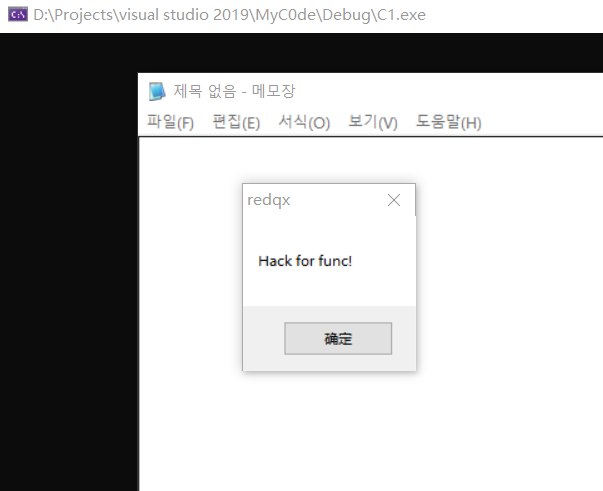

# 前言

dll注入也是一种shellcode注入

但是他是特殊的shellcode注入,因为他的shellcode是在内存中本身就存在的

而现在的shellcod是基于文件的,也就是说我们提供一个shellcode文件

然后对远程进程进行一个注入


代码和以前的dll注入没有太多的区别

我们仍然需要区分平台

比如x86的进程要注入x86的shellcode

x64的进程要注入x64的shellcode


其实就是读取shellcode文件内容,,,然后复制到在远程进程中

创建远程线程,,然后线程的代码就是shell从的


# main

首先还是拿到目标进程的PID

然后判断目标进程的架构

然后读取shellcode的内存

然后注入shellcode

```c++
int main(int argc, char* argv[])
{
    char* shellcode_path;
    char* lp_shellcode;
    char* TargetProcess;
    DWORD dwPID;
    HANDLE hProcess;
    DWORD is_x86 = 0;

    if (argc != 3)//pid button dllPath
    {
        //那就是手动输入的
#ifdef my_test
        TargetProcess = "notepad_86.exe";
        shellcode_path = "D:/shellcode.bin";
        dwPID = FindProcessID(TargetProcess);
#else
        log("USAGE: TargetName shellcode_path \n");//说明该如何使用该工具
        return 1;
#endif
    }
    else {

        TargetProcess = argv[1];
        shellcode_path = argv[2];
        dwPID = FindProcessID(TargetProcess);
    }
    //if (!Get_Privilege(SE_DEBUG_NAME, TRUE))//提权
    //{
    //    return 1;
    //}
    if (dwPID == 0xFFFFFFFF) {
        log("no find TargetProcess\n");
        return 0;
    }
    hProcess = OpenProcess(PROCESS_QUERY_INFORMATION, FALSE, dwPID);
    IsWow64Process(hProcess, &is_x86);
    CloseHandle(hProcess);


    if (!is_x86) {
        log("Target is X64!\n");
        return 0;
    }
    lp_shellcode = read2Mem(shellcode_path);
    if (inject_shellcode(dwPID, lp_shellcode, flen)) {
        log("(\"%s\") success!!!\n", argv[2]);
    }
    else {
        log("(\"%s\") failed!!!\n", argv[2]);
    }
    VirtualFree(lp_shellcode, 0, MEM_RELEASE);
    return 0;
}
```


# 效果如图


打开notepad_86.exe进程


然后运行我们的注入器

注入的shellcode内容是弹窗

