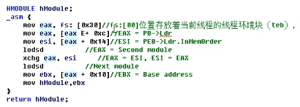
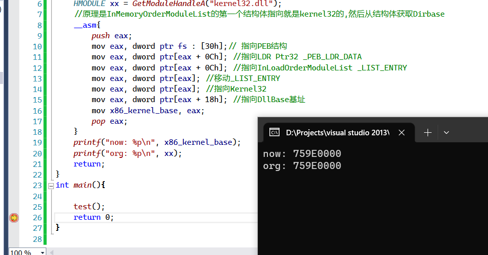
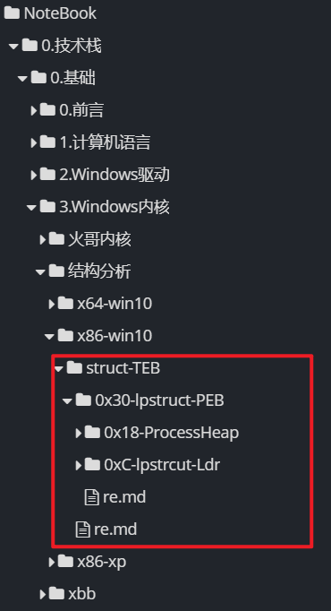
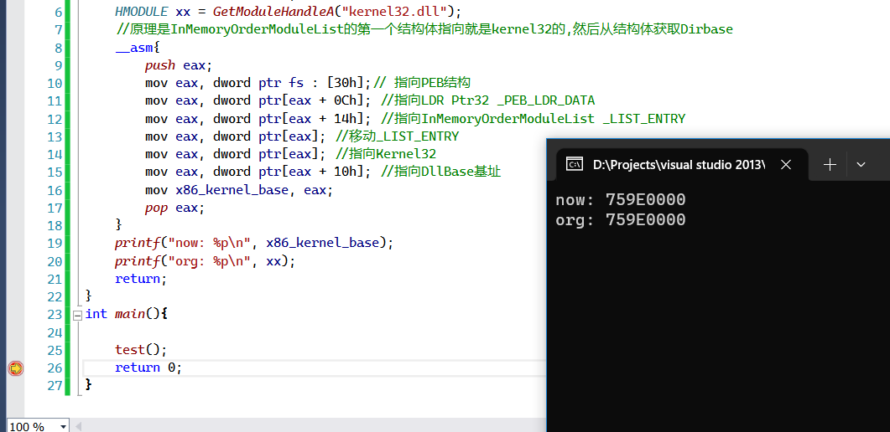
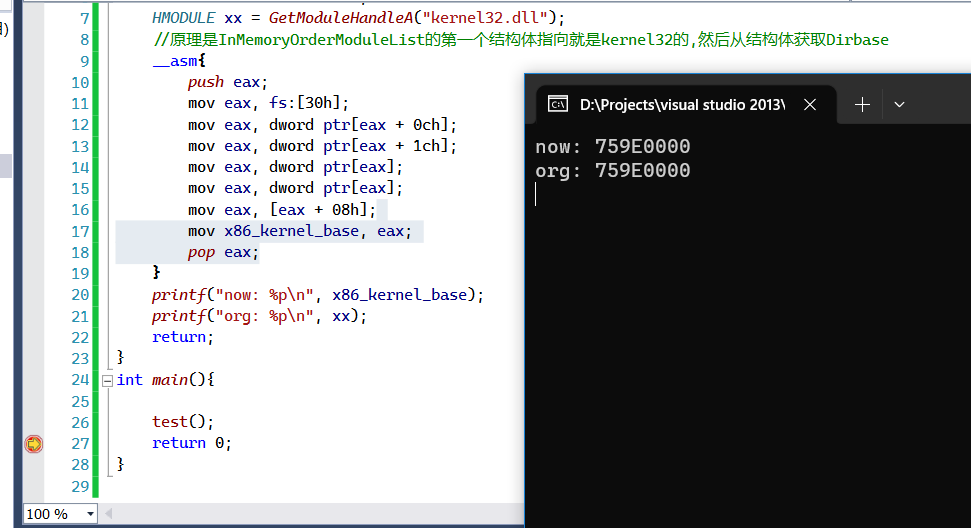

# 方法1: ESP


缺点：条件比较苛刻，需要把程序的ep指向我们的入口,然后在入口初获取栈的环境

该环境里面存放了一些我们需要的信息


在exe进入start的时候

栈的情况


这是进入exe模块EP的最初始栈的情况

然后通过该栈的地址768B00C9

往上找,从768B0000往上找,找到的第一个模块就是kernel32.dll的模块

所以的话,我们连导出表都不用判断了

详情参考` \code\way1_esp.c`

所以这里就涉及一个遍历问题

也就是给定地址,,,然后从该地址出发,,,寻找一些特定的标志


# 方法2: SEH

这种方法和方法1好像是类似的,,,现在不做记录

以后需要的话再回来看看


# 方法3: Ldr (热门方法)

通过PEB枚举当前进程空间中用户模块列表也可以获取Kernel32模块的基地址，

fs:[0]指向TEB，fs:[30h]指向PEB，PEB偏移0ch是LDR指针，

以下可以分别通过 `加载顺序、内存顺序、初始化顺序`获取Kernel32模块的基地址，

 

其实就是遍历自身模块, 有个结构体就专门记录了自身所有的模块




但是 基于 Ldr 的，它也有很多种书写形式


运行环境


编译环境

```c++
vs2013;
x86 debug
```


## 相关结构体


```c++
//0x30 bytes (sizeof)
struct _PEB_LDR_DATA
{
    ULONG Length;                                                           //0x0
    UCHAR Initialized;                                                      //0x4
    VOID* SsHandle;                                                         //0x8
    struct _LIST_ENTRY InLoadOrderModuleList;                               //0xc
    struct _LIST_ENTRY InMemoryOrderModuleList;                             //0x14
    struct _LIST_ENTRY InInitializationOrderModuleList;                     //0x1c
    VOID* EntryInProgress;                                                  //0x24
    UCHAR ShutdownInProgress;                                               //0x28
    VOID* ShutdownThreadId;                                                 //0x2c
}; 
```


## 加载顺序-dmeo1


源代码如下

```c++
#include <windows.h>
#include <stdio.h>
 
void test(){
	HMODULE x86_kernel_base;
	HMODULE xx = GetModuleHandleA("kernel32.dll");
	//原理是InMemoryOrderModuleList的第一个结构体指向就是kernel32的,然后从结构体获取Dirbase
	__asm{
		push eax;
		mov eax, dword ptr fs : [30h];// 指向PEB结构
		mov eax, dword ptr[eax + 0Ch]; //指向LDR Ptr32 _PEB_LDR_DATA
		mov eax, dword ptr[eax + 0Ch]; //指向InLoadOrderModuleList _LIST_ENTRY
		mov eax, dword ptr[eax]; //移动_LIST_ENTRY
		mov eax, dword ptr[eax]; //指向Kernel32
		mov eax, dword ptr[eax + 18h]; //指向DllBase基址
		mov x86_kernel_base, eax;
		pop eax;
	}
	printf("now: %p\n", x86_kernel_base);
	printf("org: %p\n", xx);
	return;
}
int main(){
 
	test();
	return 0;
}

```

具体分析,,东西都在注释里面...哈哈

运行结果如下




具体还要去参考相关的结构体



## 内存顺序-demo2


和之前的差不多

只不过换了一个结构体罢了

之前用的是`InLoadOrderModuleList _LIST_ENTRY`

这一次用的是`InMemoryOrderModuleList _LIST_ENTRY`

所以在一些遍历上就发生了变化,,,,但归根结底和fs有关

和一些结构体有关的

环境和way3-demo-1的

代码如下


```c++
#include <windows.h>
#include <stdio.h>
 
void test(){
	HMODULE x86_kernel_base;
	HMODULE xx = GetModuleHandleA("kernel32.dll");
	//原理是InMemoryOrderModuleList的第一个结构体指向就是kernel32的,然后从结构体获取Dirbase
	__asm{
		push eax;
		mov eax, dword ptr fs : [30h];// 指向PEB结构
		mov eax, dword ptr[eax + 0Ch]; //指向LDR Ptr32 _PEB_LDR_DATA
		mov eax, dword ptr[eax + 14h]; //指向InMemoryOrderModuleList _LIST_ENTRY
		mov eax, dword ptr[eax]; //移动_LIST_ENTRY
		mov eax, dword ptr[eax]; //指向Kernel32
		mov eax, dword ptr[eax + 10h]; //指向DllBase基址
		mov x86_kernel_base, eax;
		pop eax;
	}
	printf("now: %p\n", x86_kernel_base);
	printf("org: %p\n", xx);
	return;
}
int main(){
 
	test();
	return 0;
}
```


输出如下




## 初始化顺-demo3


```c++

#include <windows.h>
#include <stdio.h>
 
void test(){
	HMODULE x86_kernel_base;
	HMODULE xx = GetModuleHandleA("kernel32.dll");
	//原理是InMemoryOrderModuleList的第一个结构体指向就是kernel32的,然后从结构体获取Dirbase
	__asm{
		push eax;
		mov eax, fs:[30h];
		mov eax, dword ptr[eax + 0ch];
		mov eax, dword ptr[eax + 1ch];
		mov eax, dword ptr[eax];
		mov eax, dword ptr[eax];
		mov eax, [eax + 08h];
		mov x86_kernel_base, eax;
		pop eax;
	}
	printf("now: %p\n", x86_kernel_base);
	printf("org: %p\n", xx);
	return;
}
int main(){
 
	test();
	return 0;
}

```


输出如下




# 小结

对于方法1和方法2,,其实应该是找到了一个和kernel3.dll有关的模块地址

然后从该模块地址出发,,,往回遍历,,寻找到MZ头....就可以找到kernel3.dll的基地址

对于方法3,,有细分出3种方法,,都是根据下面这3个结构体来着

```c++
    struct _LIST_ENTRY InLoadOrderModuleList;                               //0xc
    struct _LIST_ENTRY InMemoryOrderModuleList;                             //0x14
    struct _LIST_ENTRY InInitializationOrderModuleList;                     //0x1c
```


对于方法3,,,,他需要你对下面这几个内核结构有基本的了解

不巧的是,下面的结构,,,,微软是不公开的,,,然而网上对此的描述也可能是错的

```c++
PEB;
TEB;
struct _LIST_ENTRY InLoadOrderModuleList;                               //0xc
struct _LIST_ENTRY InMemoryOrderModuleList;                             //0x14
struct _LIST_ENTRY InInitializationOrderModuleList;                     //0x1c
```

但是根据一些测试,,还是可以找到对应的结构

对于方法3,,可能还会延申出其它的很多方法..但是原理都是你要对内核相关的结构有所了解的


