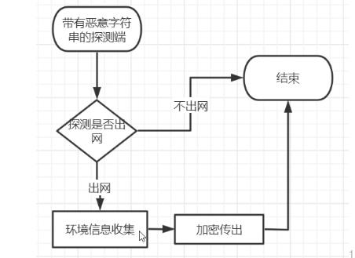

云沙盒测试,虚拟执行

为了绕过云沙箱,我们得逃逸

既然要逃逸我们就得知道我们是否处于云沙箱中

于是就要利用一些方法去检测运行环境,然后及时的逃逸




GitHub 大佬介绍 https://github.com/timwhitez


手法:

# 增加时间延迟

可以通过创建超过20分钟的样本自我介绍使机器多次运行来轻易绕过反逃逸技术


这个代码让微步云 分析很久,消耗平台的资源

```c
#include<Windows.h>
#include <stdio.h>
void CALLBACK TimerProc(HWND hWnd, UINT nMsg, UINT nTinerid, DWORD duTine)
{
	printf("hi i am sex-lover\n");
	return;
}
int main()
{
	SetTimer(0, 0, 1000, TimerProc);
	MSG msg;
	while (GetMessage(&msg, NULL, 0, 0))
	{
		if (msg.message == WM_TIMER)
			DispatchMessage(&msg);
	}
	return 0;
}


```

于是


虽然程序本身就没有什么危害,但是让沙箱分析了很久

说明这是一个有漏洞的地方

然后我们可以在自己的代码构思中

先加入很长很长的时间段,然后执行我们的执行我们的攻击代码

当攻击代码之所以不会被云沙箱检测出来,是因为攻击代码之前有一段类似于SetTimer的东西扰乱了云沙箱的检测


# API洪泛

另一种更加流行的方法是在循环中调用垃圾API来引入延迟，即所谓的API flooding


# Inline Code

因为沙箱无法很好地处理行内代码，因此会产生DOS条件。另一方面，许多沙箱无法检测此类行为

下面是恶意软件在过去纪念使用的基于时间的绕过技术增长图：


# 硬件检测


恶意软件广泛使用的另一类绕过技术就是对硬件进行指纹操作，尤其是对物理内存的大小、可用HD大小/类型和可用CPU核数进行检查

云沙箱的虚拟机和真机一定是有区别的,通过这些区别的检测

我们就可以及时的沙箱逃逸

关键字: 沙箱逃逸,GlobalMemoryStatusEx()
