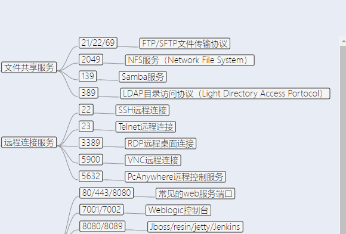
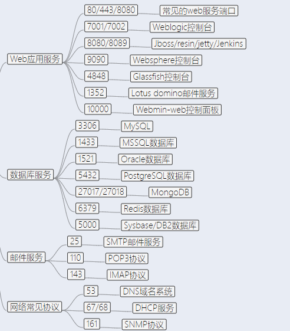
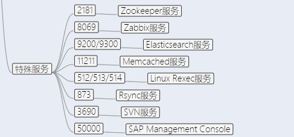

为什么要端口信息收集?

1), 查看开方的服务

2), 资产,管理后台

扫描目录和端口容易被封ip

# nmap 扫描

具体用法看以后积累了

```
┌──(kali㉿kali)-[~/Desktop]
└─$ nmap 172.28.0.1/24  
```


# masscan 扫描

这个工具和nmap类似,但是各有有点,

```
┌──(root㉿kali)-[/home/kali/Desktop]
└─# masscan 172.168.0.1 -p 1-65535 --rate 1000 -oL ports
```


# 常见端口

这个以后遇到忘记了,就翻翻笔记,或者百度一下






