域名下有子域名

于是需要去收集


收集就是搜资产,其中管理后台这个东西会大有用处

通过不同的方式去搜索,搜到的东西可能相同,也可能不同


关键字: 子域名挖掘	


# 通过字典爆破


## OneForAll

下载: https://github.com/shmilylty/OneForAll/releases

使用:


先下载依赖

```
python -m pip install -U pip setuptools wheel -i https://mirrors.aliyun.com/pypi/simple/
pip install -r requirements.txt -i https://mirrors.aliyun.com/pypi/simple/
```


简单使用

```
python oneforall.py --help
```


对某个网站扫描

```
python oneforall.py --target cuit.edu.cn run
```

如果要多对个网站扫描

```
python oneforall.py --targets ./example.txt run
```

./example.txt是指定路径的txt文件,文件内容是网站的URL


扫描结果 

缓存文件: OneForAll-0.4.5\results\temp

最后会生成excel文件: OneForAll-0.4.5\results


## subDomainsBrute

下载链接:https://github.com/lijiejie/subDomainsBrute/releases

用法

```
python subDomainsBrute.py -t 20 baidu.com -o baidu.txt
```

-t 说的是20个线程

baidu.com是目标域名

-o 指定输出文件


有个比较好的字典,叫做 top2000.txt , 以后去下载看看


## 在线网站爆破

关键字: 在线子域名收集

https://phpinfo.me/domain/

https://site.ip138.com/

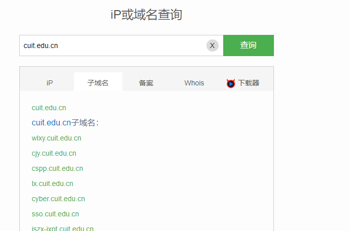

# 通过证书搜集

## 以chorme为例子

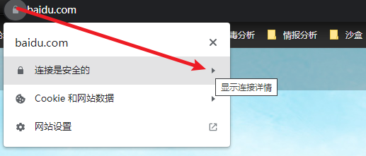

然后

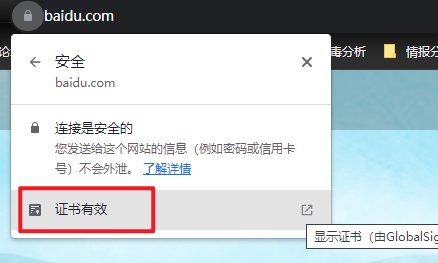

然后

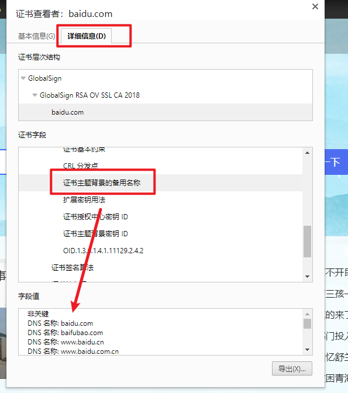


## 证书网站


证书网站1:

```
https://crt.sh/
```

demo

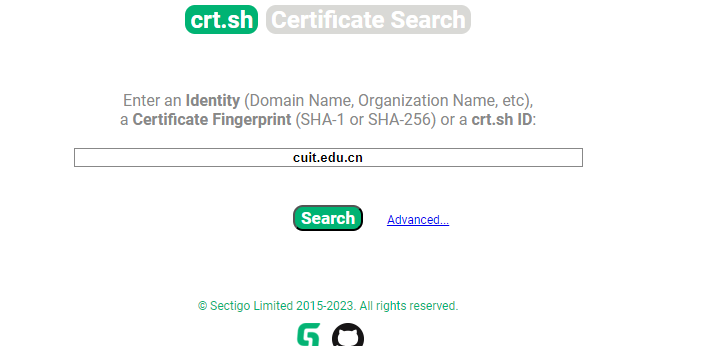

结果

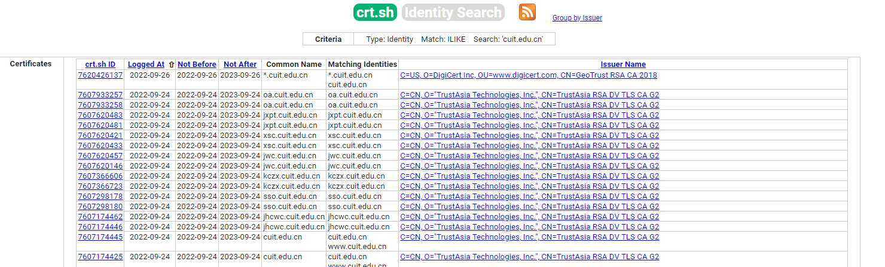


证书网站2:

```
https://search.censys.io/
```


demo

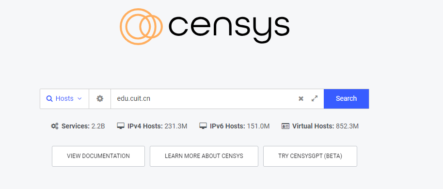

结果

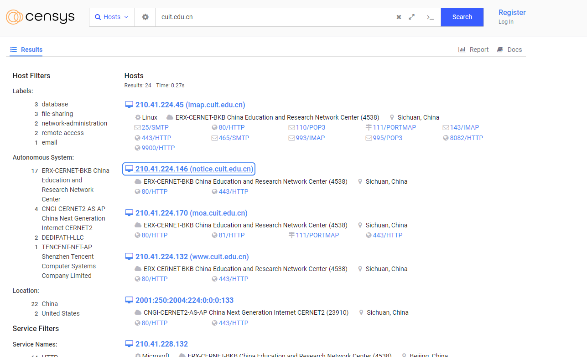


# 谷歌搜索 Google hacking


site:找到与指定网站有联系的URL

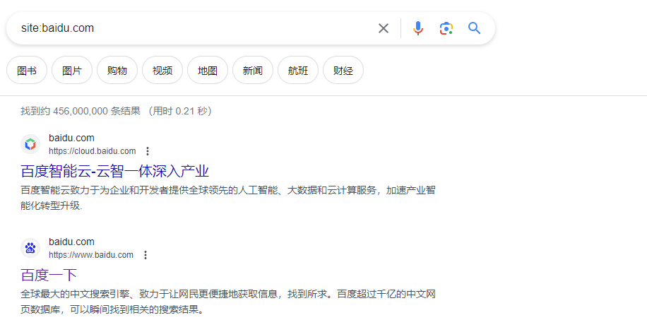

intitle: 返回所有网页标题中包含关键词的网页。

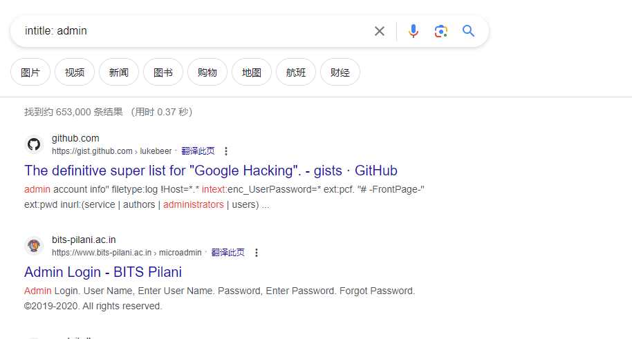

inurl: 只搜索网页链接含有关键词的页面。

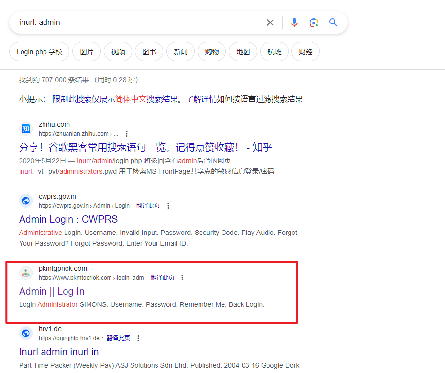

intext:只搜索网页正文部分含有关键词的页面。

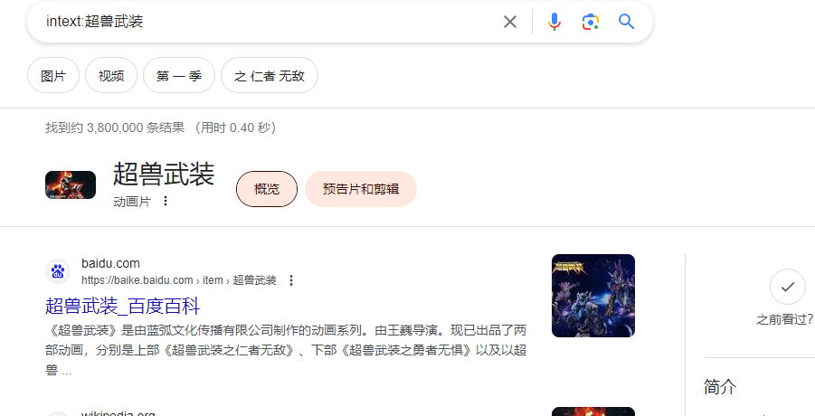


具体的谷歌用法

```
自己百度
手册: Web\Information_Gathering\Subdomain_Collection\googlehacking使用手册.txt
```


# 其它途径

网站的crossdomain.xml文件

返回包中的Access-Control-Allow-Origin头

返回包中的CSP (Content-Security-Policy)头

网站robots文件

网站sitemap文件

微步: https://x.threatbook.cn/


# 会遇到的问题

## 泛解析

