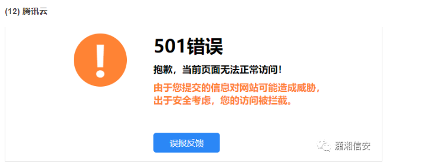
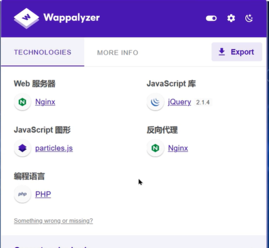

# waf识别


**不同的WAF,有他不同的拦截界面**

可参考 https://blog.csdn.net/zhangge3663/article/details/110945853




**同时不同的WAF,也会有不同的响应头**

云盾:响应头包含yundun关键字;页面源代码有errors.aliyun.com

安全狗:响应头包含waf2.0、Safedog等字样

腾讯云:阻止响应页面，包含waf.tencent-clound.com阻止响应代码405 method not allow

安全宝:恶意请求时返回405恶意代码响应头包含X-Powered-by:Anquanbao

百度云加速:响应头包含Yunjiasu-ngnix

创宇盾:恶意请求时页面URL:365cyd.com、365cyd.net


也可以使用工具去探测目标的WAF:wafw00f  

```
┌──(kali㉿kali)-[~/Desktop]
└─$ wafw00f https://baidu.com
```


# cms识别

CMS（Content Management System）即“网站内容管理系统”，用于管理网站后台，以及编辑网站前台


识别方法:

潮汐指纹: http://finger.tidesec.net/


whatweb工具:

```
┌──(kali㉿kali)-[~/Desktop]
└─$ whatweb 110.242.68.3
```


Wappalyzer浏览器插件:




或者去网页的源代码看标签找:

关键字搜索: meta name = "generator"


# 通过API接口去发现

涉及工具 sourcemap, JSFinder.py
