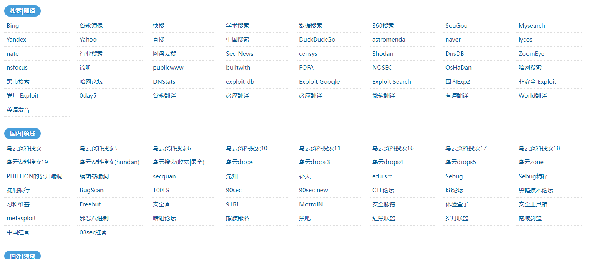
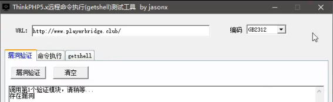

http://www.xiaodi8.com/hack/

# 通俗意义上的社工

# CMS识别工具 ：

云悉指纹识别：https://www.yunsee.cn

https://w.ddosi.workers.dev/

http://whatweb.bugscaner.com

https://github.com/Lucifer1993/cmsprint

https://github.com/M4tir/Github-Monitor

# 端口扫描

nmap

https://github.com/hellogoldsnakeman/masnmapscan-V1.0

# 子域名扫描

御剑

WebPathBrute

子域名挖掘机:  layer子域名探测

Maltego（kali自带）、

各类挖掘子域名的网站：如 https://www.t1h2ua.cn/tools/

# 目标系统识别

# 流量监听

>   流量监听:

针对某个应用程序抓包的工具: WSExplorer

# 漏洞扫描

漏洞扫描: 给一个域名就可以实现漏洞获取

# 数据库工具

数据库查看: 

easyAccess

