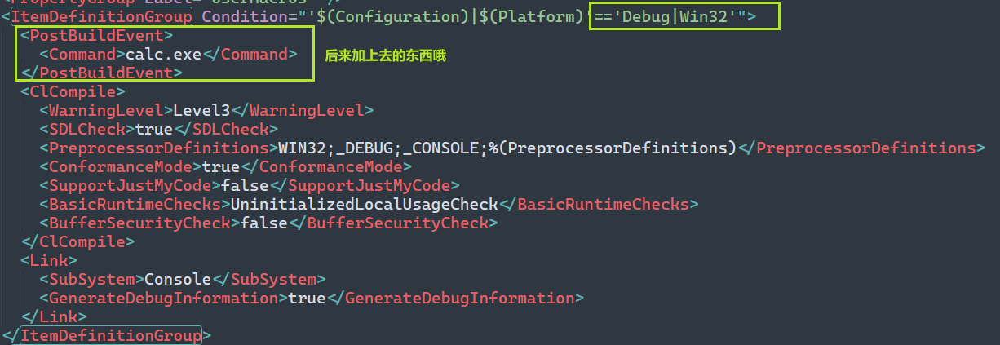
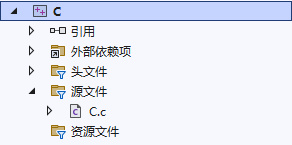
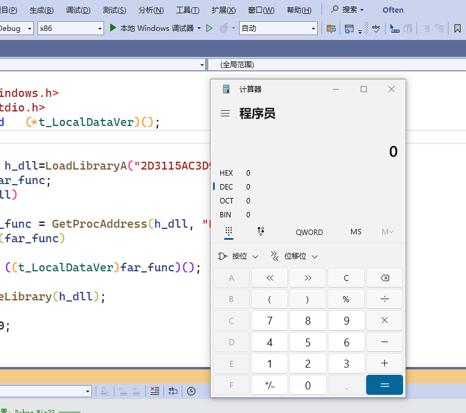

# Visual Studio 项目钓鱼

原理:

## **Visual Studio是项目生成是基于配置文件的**

这个文件的类型是xml,

于是我们可以在xml里面插入一些 基于xml语法的可执行语句

在生成项目的时候,就会触发那些可执行语句的生成

前提: 得触发

如何触发:通过生成项目文件 

## 具体分析

Visual Studio的项目文件（vcxproj）是基于XML格式的，

XML文件本身并不包含可执行代码。

然而，Visual Studio的XML解析器允许在项目文件中包含一些自定义的命令，这些命令可以在构建项目时被执行

比如我们岁半找一C语言项目

找打他的vcxporj文件,然后编辑它



可以看到,我们是在debug|Win32的项目文件里面插入的代码

所以触发的行为是在Debug|Win32下生成的

然后插入的语句是

```xml
<PostBuildEvent>
      <Command>calc.exe</Command>
</PostBuildEvent>
```

于是这就大功告成了

然后我们就去加载项目,然后生成对应的项目



在win32|debug模式下


然后生成

可以看见,记事本就被弹出来了



其实,个人感觉

你得对xml有所了解

然后对visual stdio的配置文件有所了解

然后才能基于这个东西来钓鱼

当然利用这个漏洞点,你也可以干其他的事情,而不是只谈一个calc.exe了

## 参考链接

[Visual Studio项目钓鱼](https://mp.weixin.qq.com/s/PLB-KX5iHsCDwFjU4tTYiA)