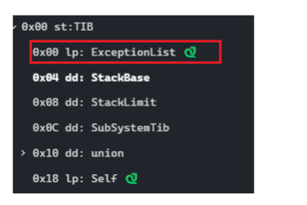

# [12] IAT 导入函数地址表

准确的说他是导入表的一部分

它指向了某个dll的IAT(FirstThunk)

第一次我发现是kernel32

PE文件中所有导入函数jmp指令操作数的集合，组成了另外一个数据结构，

这个结构就是导入函数地址表( Import Address Table，IAT)。该地址表是数据目录的第13个数据目录项。


# [11] 绑定导入表


```
typedef struct _IMAGE_THUNK_DATA
{
    union
     {
         PBYTE ForwarderString;
         PDWORD Function;      //被导入的函数的入口地址
         DWORD Ordinal;       // 该函数的序数
         PIMAGE_IMPORT_BY_NAME AddressOfData;   // 一个RVA地址，指向IMAGE_IMPORT_BY_NAME
     }u1;
} IMAGE_THUNK_DATA32;
```

```
struct _IMAGE_BOUND_FORWARDER_REF {
    DWORD   TimeDateStamp;
    WORD    OffsetModuleName;
    WORD    Reserved;
} IMAGE_BOUND_FORWARDER_REF, *PIMAGE_BOUND_FORWARDER_REF;
```

绑定导入表 成员

```
struct _IMAGE_BOUND_IMPORT_DESCRIPTOR
{
    DWORD   TimeDateStamp;//时间戳

    WORD    OffsetModuleName;//指向dll的名字

    WORD    NumberOfModuleForwarderRefs;//对应成员的数目
    // 表示该动态链接库中的函数实现字节码存储在另外一个动态链接库中
} IMAGE_BOUND_IMPORT_DESCRIPTOR,  *PIMAGE_BOUND_IMPORT_DESCRIPTOR;
```

有无绑定导入表是根据导入表的时间戳来判断的

绑定导入表一般位于0x400以内的地方,也就是section header 结束之后


TimeDateStamp

该字段的值必须与要引用的DLL的文件头IMAGE_FILE_HEADER.TimeDateStamp字段值相吻合，

否则就会促使加载器去重新计算新IAT，这种情况一般发生在DLL版本不同时或者DLL映像被重定位时

OffsetModuleName

该地址既不是RVA,也不是VA

是一个基于绑定导入表起始地址的偏移量

比如绑定导入表的地址是0x250

OffsetModuleName=0x30

那么对应dll的名字就在0x280


# [13] 延迟导入表

https://blog.csdn.net/evileagle/article/details/12718845

和dll加载有关

以前dll的加载是,有很多dll干活,把所有dll都喊进屋,到谁干活谁就出来, ps:屋子可能不太好装下怎么多人

延迟导入就是准备很多dll干活,不先把他们领进门,让他们所有人在外面等着,干活时,喊谁,谁就进来

延迟加载导入是一种合理利用进程加载机制提高进程加载效率的技术，

使用延迟加载导入能跳过加载前对引入函数的检测及加载后对IAT的修正，

从而避免出现诸如“无法找到组件”的错误提示，提高程序的适应性。

及时即用?


```
typedef struct _IMAGE_DELAYLOAD_DESCRIPTOR
{
    union {
        DWORD AllAttributes;// 属性,说必须为0
        struct
        {
            DWORD RvaBased : 1;             // Delay load version 2
            DWORD ReservedAttributes : 31;
        } DUMMYSTRUCTNAME;
    } Attributes;

    DWORD DllNameRVA;                       // 指向dll的名字,好像是一个VA地址
    DWORD ModuleHandleRVA;                  // 指向dll的模块句柄
    DWORD ImportAddressTableRVA;            // IAT
    DWORD ImportNameTableRVA;               // INT
    DWORD BoundImportAddressTableRVA;       // 绑定该表的RVA 可选
    DWORD UnloadInformationTableRVA;        // 卸载该表的RVA 可选
    DWORD TimeDateStamp;                    // 0 if not bound,
    // Otherwise, date/time of the target DLL

} IMAGE_DELAYLOAD_DESCRIPTOR, *PIMAGE_DELAYLOAD_DESCRIPTOR;
```

不使用延迟加载

```
ml -c -coff He1loworld.asm
link -subsystem : windows Hellowor1d.obj
He1loworld
```

使用延迟加载

```
ml -c -coff Helloworld.asm
link -subsystem:windows -delayload:MyD11.dll delayimp.lib HelloWorld.obj
Helloworld
```

那么link -subsystem:windows -delayload:MyD11.dll delayimp.lib HelloWorld.obj干了什么?

首先，将一个函数_delayLoadHelper嵌入PE文件的可执行模块。

其次，从可执行模块的导入表部分删除MyDl.dll 及相关信息，这样，当进程初始化的时候，

操作系统的加载程序就不会显式加载该动态链接库了。

最后，在PE中把刚才删除的相关信息重新构造好，以便告诉_delayLoadHelper哪些函数是从MyDll.dll中导出的。

在调用API的时候


然后出现就出现了区别

不使用该技术就直接前往该dll

使用该技术,去往某个函数,然后LoadLibiary和GetProcessAddress,如果再次调用不再load和get

为什么使用了延迟导入表技术可以实现任何地方都可以轻松运行?

因为他把dll文件作为资源放进了自己那里,然后需要的时候再调用资源?

关于这个书中有代码讲解,我没有去实现,,,,QWQ,还是去写一下吧,万一有用呢

关于延迟导入的dll卸载,可以使用-delay:unload选项

这是一个可选项,具体深入还不知道


# [10] 加载配置表 | 异常处理表


根据自己写的exe,发现好像那个表没什么明显的用处

书上讲了很多和内核相关的东西,暂时看不懂(也就是和内核的一些关键函数和流程的分析)

和SEH有关:



ExceptionList:


下面这个表和书上的表有点不同哟

大体相同

```
typedef struct _IMAGE_LOAD_CONFIG_DIRECTORY32 {
    DWORD   Size;
    DWORD   TimeDateStamp;
    WORD    MajorVersion;//主版本号
    WORD    MinorVersion;//次版本号
    DWORD   GlobalFlagsClear;//标志1 需要被清除的
    DWORD   GlobalFlagsSet;//标志2 需要被初始化的
    DWORD   CriticalSectionDefaultTimeout;//最大超时限制
    DWORD   DeCommitFreeBlockThreshold;//释放内存数量
    DWORD   DeCommitTotalFreeThreshold;//空闲内存数量
    DWORD   LockPrefixTable;                // VA 使用locl前缀的指令地址
    DWORD   MaximumAllocationSize;//最大分配粒度
    DWORD   VirtualMemoryThreshold;//最大虚拟内存大小
    DWORD   ProcessHeapFlags;//进程堆标志
    DWORD   ProcessAffinityMask;//函数参数
    WORD    CSDVersion;//版本标识
    WORD    DependentLoadFlags;
    DWORD   EditList;                       // VA cookies指针
    DWORD   SecurityCookie;                 // VA 指向safe handler 处理程序列表
    DWORD   SEHandlerTable;                 // VA
    DWORD   SEHandlerCount;//safe handler
    DWORD   GuardCFCheckFunctionPointer;    // VA
    DWORD   GuardCFDispatchFunctionPointer; // VA
    DWORD   GuardCFFunctionTable;           // VA
    DWORD   GuardCFFunctionCount;
    DWORD   GuardFlags;
    IMAGE_LOAD_CONFIG_CODE_INTEGRITY CodeIntegrity;
    DWORD   GuardAddressTakenIatEntryTable; // VA
    DWORD   GuardAddressTakenIatEntryCount;
    DWORD   GuardLongJumpTargetTable;       // VA
    DWORD   GuardLongJumpTargetCount;
    DWORD   DynamicValueRelocTable;         // VA
    DWORD   CHPEMetadataPointer;
    DWORD   GuardRFFailureRoutine;          // VA
    DWORD   GuardRFFailureRoutineFunctionPointer; // VA
    DWORD   DynamicValueRelocTableOffset;
    WORD    DynamicValueRelocTableSection;
    WORD    Reserved2;
    DWORD   GuardRFVerifyStackPointerFunctionPointer; // VA
    DWORD   HotPatchTableOffset;
    DWORD   Reserved3;
    DWORD   EnclaveConfigurationPointer;    // VA
    DWORD   VolatileMetadataPointer;        // VA
    DWORD   GuardEHContinuationTable;       // VA
    DWORD   GuardEHContinuationCount;
    DWORD   GuardXFGCheckFunctionPointer;    // VA
    DWORD   GuardXFGDispatchFunctionPointer; // VA
    DWORD   GuardXFGTableDispatchFunctionPointer; // VA
    DWORD   CastGuardOsDeterminedFailureMode; // VA
} IMAGE_LOAD_CONFIG_DIRECTORY32, *PIMAGE_LOAD_CONFIG_DIRECTORY32;
```


# [14] CLR运行头

CLR运行头数据所在的节通常名字是.cormeta

# [15] 系统保留