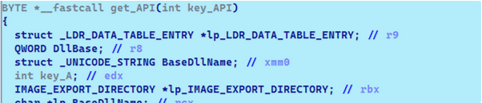
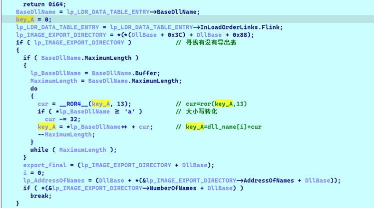
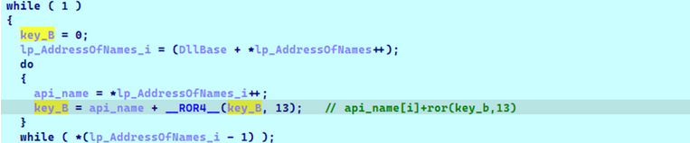
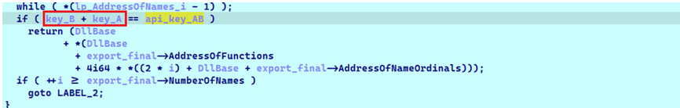

#  

比如加载一个API

我们要提供dll名字和api函数的名字

如何隐藏?

经历1

以前遇到过一个编码的,懒得写了,是韩国APT的某个样本

经历2

 

传递进来的是一个4字节的数值,这个数值对于了某个dll的某个api

正常来说,dll和api的字符串总和会远远大于4字节

但是,如果我们用一个算法,其实可以压缩到只有字节

用4字节确定一个dll

 

用4字节确定一个api

 

然后用8字节确定一个api+dll

 