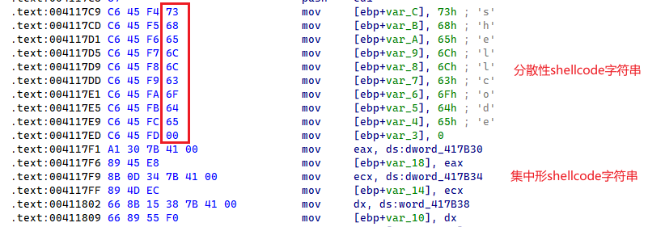

# 防特征码


一种防止特征码提取或者扫描额技术

```c
char xx[]={'s','h','e','l','l','c','o','d','e',0}; //分散行shellcode字符串
char xx2[] = "shellcode";//集中形shellcode字符串
```




可以看到反汇编效果

其中第一种字符串形式来说,就不是很好写yara规则

第二种字符串形式相对来说,yara规则写起来更加方便

这样的话,就让反病毒工程师不好定位,同时也样本开发者也很好的利用了字符串