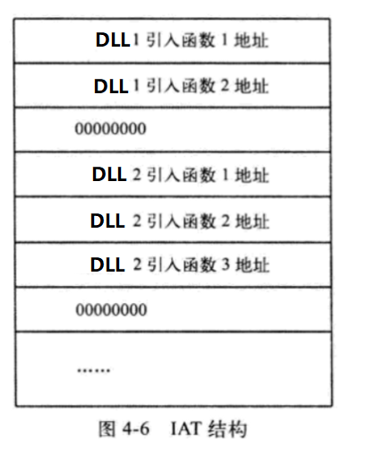

准确的说他是导入表的一部分

导入表中指向的所有API都在这个表里面出现过

他的dll是根据字母顺序

他的dll加载的API也是根据字母的顺序

所以kernel32.dll在这个表中不是第一个,因为字母k不是排列在前面的

同时kernel32.dll的导出函数LoadLibiaryA也不是第一个,因为字母L不是排列在前面的

数据目录表的[1].导入表各个dll的各个APi都会在[12].IAT 表集合在一起存放

