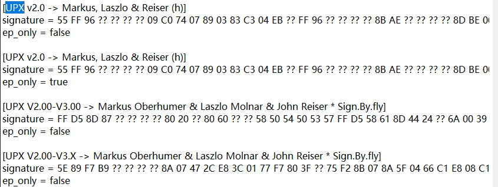
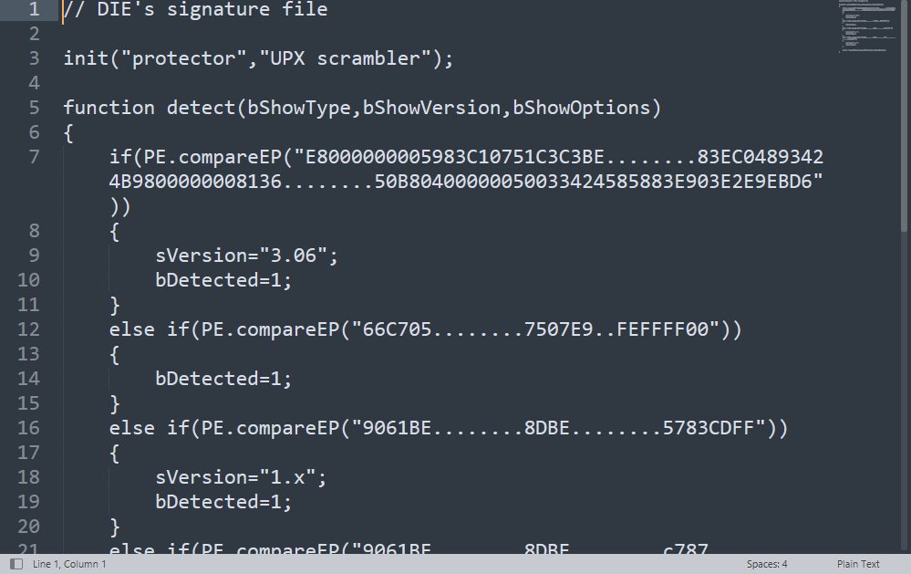

分为加密壳 和 压缩壳

常见的压缩壳: UPX, aSpack, TMD

常见的加密壳: 

常见的查克工具: peid, exeinfo 

有些壳还是蛮神奇的,可以去学习他的手法

比如很神奇的TMD壳,对API的一些模拟和代理

查壳的原理

1), 特征码识别

比如peid的 PEiD 0.95\userdb.txt 文件,就记录了很多特征

比如Die的 die_win64_portable_3.08\db\PE

# TMD壳

随机全段名,有些区段吗甚至是空的

反内存dump

节区位置调换
