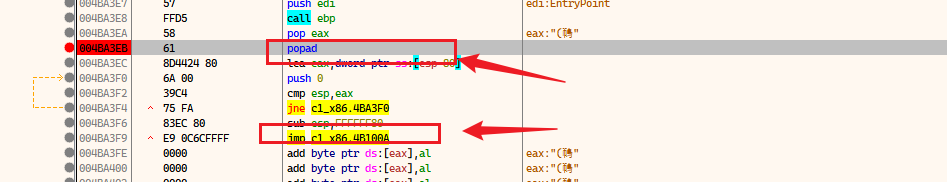
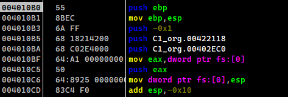

寻找特征指令

```assembly
pushad
popad
jmp大跳转
```


# UPX


## 32位


也就是类似于一个文本搜索的CTRL F指令

搜索特征码

```
pushad
popad
jmp大跳转
```

找到后下断点


### 搜索特征码

> xdbg搜索 CTRL F


找打后下断点

搜索结果


下断点




下断点后,jmp过去就是OEP

然后就是利用插件脱壳


> OD搜索 CTRL F


然后你就找到关键位置去往OEP

下断点后,jmp过去就是OEP

然后就是利用插件脱壳


### x32_OD :  插件脱壳 




在OEP: 004010B0右键一下


然后


分别选取方法1/方法2点击脱壳

2个方法都试一下,可能有些方法不行


### x32_dbg : Scylla脱壳

一样的运行到OEP,打开x64dbg自带的插件Scylla


#### step1

点击它


然后点击dump

ps: 一般插件的OEP和输出文件自动填写完毕

ps: 输出文件不是最后的成品,还需要修复


#### step2

不关闭Scylla

继续操作插件


ps: 然后保证插件的高级搜索是打开的,一般都是打开的,所以下面这个图片不用看


点击2下, 


注意点击fixdump的时候,需要选择一个文件

该文件是step1 dump出来的文件

最后运行成功


## 64位


借助 IDA+ x64dbg 脱壳

当然他的特征还是那些 pushad,popad,jmp大跳转

但是x64没有类似于些pushad,popad的指令吧

至少我没有遇到过

所以jmp大跳转就是唯一的特征

当然 pushad,popad 与之取代的是push很多下,pop很多下

IDA结合x64dbg

他的起始流程图也和x86不一样


进入函数`UPX1:00007FF72543C2CB call    sub_7FF72543C320`看看


在rep retn的地方,我们会进入一个和x86下差不多的环境

那里有大跳转的特征

ps: 可能我们遇到的流程图或者平坦化图有差异,但是那些特征是不变的

当我们在IDA里面都清楚了这些地方了

去x64dbg进行Scylla脱壳还是一样的操作

参考前面的步骤,实践发现可行


# Aspack


## x86


### xdbg


然后搜索popad ->CTRL F

搜索结果


那就都在对应的地方下断点,


然后F9,会在某一个popad停止下来,然偶通过ret去玩OEP


 修复后运行成功


### OD


一样有pushad

所以我们寻找与之对应的popad,直接CTRL F

ps: 它不会像xdbg那样把所有的popad罗列出来, 只能说CTRL F, 每次CTRL F都会去查下一个popad的搜索结果

有些鸡肋的OD, 只能搜一个,,,垃圾


