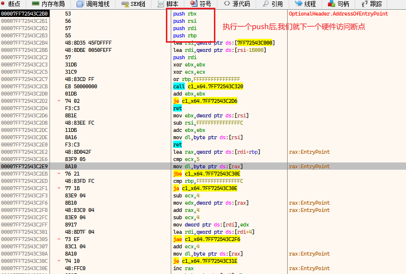
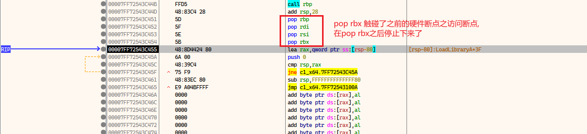
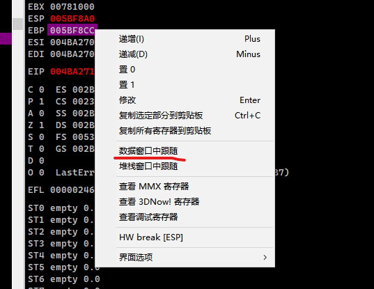
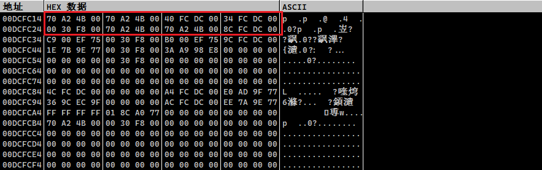
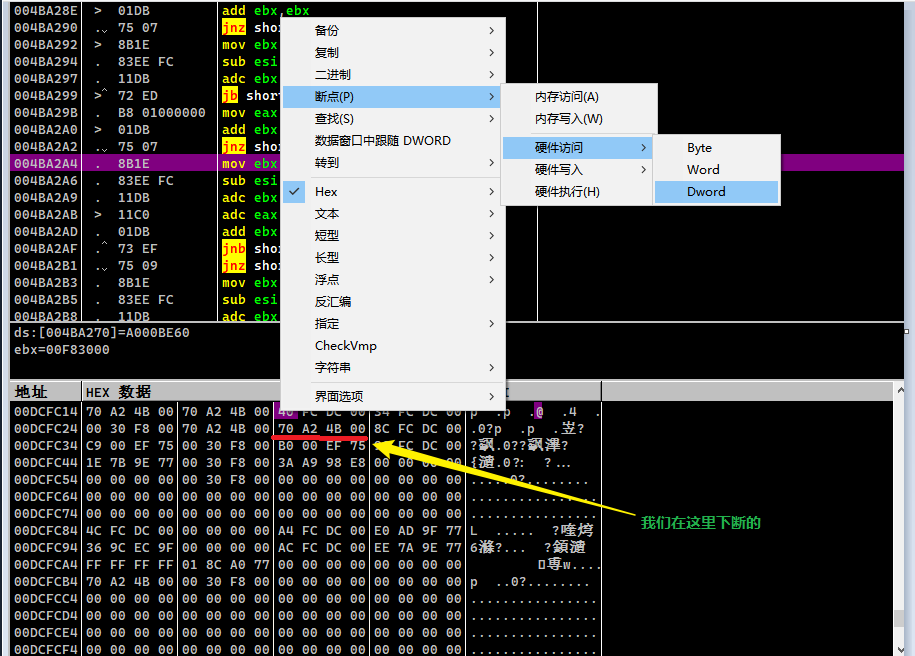
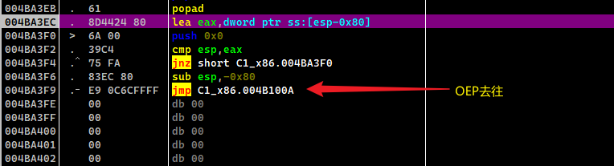

# ESP定理

自我理解:

比如离开家和进入家里,我们都会进入一扇门

如果我们在门那里设置一个访问断点

那么就可以找到它什么时候离开家的, 因为离家出走还是回家,都会访问那一个门

找到OEP后,具体的利用插件dump,参考level1

那么ESP定理中

pushad就是进门

popad就是离开门

差不多那样比喻手法

# upx

## x64 

程序的ep如下

先F7一下,进入门

下硬件断点

> ps: 关于什么是硬件断点,与之对应的什么是软件断点
>
> 这个和调试器原理有关,软件断点一般是0xCC的可执行断点
>
> 功能: 硬件断点>软件断点
>
> 硬件断点包含 访问断点,写入断点,当然可执行断点也算一种访问断点,自我认为

下断点如图

在哪里下断点? esp指向的那一块内存

比如我们在栈出口就可以找到这个内存

为了扩大断点命中率,当popad的时候,好触发断点

我下了8字节断点,好像也没必要,但是喜欢下大点的范围

ps: 栈窗口示意

然后F9

然后图中的jmp就是去玩OEP了

具体脱壳见level1

## x86 

在pushad后,我们一样的去下硬件断点

找到esp指向的内存

在 x86 架构中，`pushad` 指令用于将一组通用寄存器（EAX、ECX、EDX、EBX、ESP、EBP、ESI、EDI）的值依次入栈。

每个寄存器的大小为 4 字节，因此`pushad`指令将总共入栈 32 字节的数据。

所以我们在32字节以内任意地方下断点都可以

下断

在popad的时候,触发了访问断点

然后就是去玩OEP脱壳了

# Aspack

