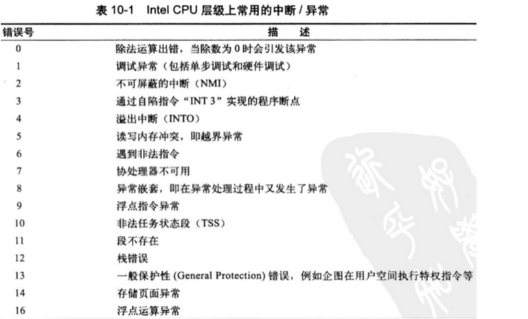
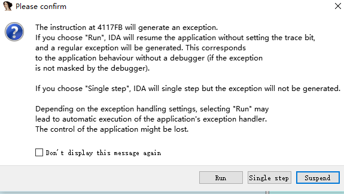

# 前言


异常处理函数都可以去调试

可能有些异常处理函数是用线程的方式去实现的,不好及时发现并调试

有些异常处理函数是你没有下F2断点,也不好调试,甚至我们找不到异常处理函数呢


不管如何利用异常去触发一个反调试

其目的都是让调试器去干扰一个流程的执行

有些流程调试器甚至都无法干扰,还会g


 


利用API去主动触发一个异常

```c
VOID RaiseException (
	DWORD dwExceptionCode,//异常代码
	DwORD dwExceptionFlags,//继续执行标志
	DWORD nNumberofArguments,//参数个数
	CONST DWORD *lpArguments//[指向参数缓冲区的指针
);
```


# 中断


## TF异常

Trap Flag（陷阱标识）位于EFLAGS寄存器内，如果TF设置为1，

当 TF 标志位被设置为 1 时，CPU 在每执行完一条指令后会触发调试异常（Debug Exception），使得程序运行以单步模式执行，

这可以帮助调试人员逐条执行程序代码，对程序的每一步进行跟踪和调试。

每执行一条指令后，CPU 将会暂停，并引发一个调试中断异常，使得调试器有机会检查和修改 CPU 寄存器、内存等信息。

在实际的调试过程中，通常不会直接观察到 TF 标志位被设置为 1。

这是因为调试器会负责处理 TF 标志位，**并根据需要进行设置和清除。**




遇到TF异常后

选择Single step, 不会有什么可怕的事情发生,IDA会去处理这个异常, 结果是继续单步运行, 

如果选择run, IDA不会去处理那个异常,不再控制由TF=1导致的异常


Example

基于手动写入SEH

```c
#define _CRT_SECURE_NO_WARNINGS

#include <stdio.h>
#include <windows.h>
#include <stdlib.h>

void DynAD_SingleStep()
{
	printf("Trap Flag (Single Step)\n");
	char dbg[] = "Find You";
	char title[] = "redqx";
	__asm {

	install_SEH:
		push handler;
		push DWORD ptr fs : [0] ;
		mov DWORD ptr fs : [0] , esp;

		pushfd; //把所有的寄存器入栈
		or dword ptr ss : [esp] , 0x100; //对栈中寄存器的TF数据做一个修改
		popfd; //把栈中修改的数据放入寄存器
		
		nop;
		//触发异常 这个异常如果不解决的话,IDA会来到这里,然后崩溃
		xor eax, eax;
		push eax;
		lea ebx, title;
		push ebx;
		lea ebx, dbg;
		push ebx;
		push eax;
		call MessageBoxA;
		mov eax, 0xFFFFFFFF;
		jmp eax;//然后触发其它异常,导致崩溃

	handler :
		mov eax, dword ptr ss : [esp + 0xc] ;//获取第3个参数 ContextRecord
		mov ebx, remove_SEH;//把EIP指向最后的安全退出函数
		mov dword ptr ds : [eax + 0xb8] , ebx;//ContextRecord->EIP= remove_SEH
		xor eax, eax;
		retn;

	remove_SEH :
		pop dword ptr fs : [0] ;//pop到
		add esp, 4;
	}
	MessageBox(NULL, "where are you\n", "redqx", MB_OK);
}

int main()
{
	DynAD_SingleStep();
	puts("hELLO WorLD");
	return 0;
}
```


基于try except

```c
#define _CRT_SECURE_NO_WARNINGS

#include <stdio.h>
#include <windows.h>
#include <stdlib.h>

void test()
{
	BOOL isDebugged = TRUE;
	__try
	{
		__asm
		{
			//这里本身就是一个异常的触发
			pushfd
			or dword ptr[esp], 0x100 // set the Trap Flag
			popfd                    // Load the value into EFLAGS register
			nop
		}
	}
	__except (EXCEPTION_EXECUTE_HANDLER)//如果调试器不处理,那么在异常那里继续执行,但是该异常不是一个错误异常?不会再次触发错误死循环?
	{
		isDebugged = FALSE;
	}
	if (isDebugged)//调试器处理后,如果选择不处理,那么该BOOL值会是1,否则会是0
	{
		MessageBox(NULL, "Find You", "redqx", MB_OK); //确实会被运行
		exit(-1);
	}
	MessageBox(NULL, "Where Are You?", "redqx", MB_OK); //确实会被运行
	return;
}

int main()
{
	test();
	puts("hELLO WorLD");
	return 0;
}
```


之前是通过EFLAG的TF标志位让程序出现异常

我们也可以通过icebp指令来设置一个和之前效果类似的异常

运行`ICEBP`(`0xF1`)指令将会产生一个单步异常,

如果通过单步调试跟踪程序,

调试器会认为这是单步调试产生的异常,从而不执行先前设置的异常处理例程

```c
#include <stdio.h>
#include <windows.h>
DWORD CheckDebug()
{
	__try
	{
		__asm{
			__emit 0xF1;
		}
	}
	__except (EXCEPTION_EXECUTE_HANDLER)
	{
		return FALSE;//交给程序自身处理
	}
	return 1; 
}

int main()
{
	if (CheckDebug())
	{
		printf("Check You\n");
	}
	else
	{
		printf("Where are you\n");
	}

	return 0;
}
```


## int 03


### int 3

陷阱异常 就是怎么执行它,都会出错

嵌入汇编引起异常

问题来了:

我安装的异常为什么是int3的解决方案????

其实就是在关键地方触发

```
            int 3 //异常1
            //如果不处理异常,会来到这里
            mov eax, 0xFFFFFFFF
            jmp eax    //异常2
```

实际的代码可以参考单步异常int1那个例子写,修改的部分很少很少

### int CD03

双字节操作码`0xCD03`也可以产生`INT 3`中断,在`WinDbg`调试器内,

由于断点通常是单字节机器码`0xCC`,

因此`WinDbg`会捕获这个断点然后将`EIP`加`1`字节,导致程序崩溃

实际的代码可以参考单步异常int1那个例子写,修改的部分很少很少

```
#include <stdio.h>
#include <windows.h>
int DbgCheck()
{
    __try
    {
        __asm
        {
            __emit 0xCD
            __emit 0x03
        }
    }
    __except (1)
    {
        return FALSE;
    }
    return TRUE;
}
```

## int 0x2D

第 0x2d（45） 号中断处理函数是 KiDebugService

int 2d 本来是被内核 ntroskrnl.exe 运行 `DebugServices` 用的,

但是也可以在RING 3模式下使用它.

在调试模式中执行`INT 2D`指令,下一条指令的第一个字节将被忽略;

使用`StepInto(F7)`或者`StepOver(F8)`命令跟踪`INT 2D`指令,

程序不会停在下一条指令开始的地方,而是一直运行,就像`RUN(F9)`一样.

也就是在程序没有`int 0x2D`后面一些地方下断点的话

程序会跑飞

如果在一个正常的程序中使用 int 2d ,将会发生异常,

所以也就是:

程序正常运行引出异常

程序被调试运行不会抛出异常

```c
    push   offset _seh
    push   fs:[0]
    mov    fs:[0], esp		 ;install SEH
    int      2dh             ;如果有调试器,正常运行;否则,会触发异常
    nop
    pop     fs:[0]
    add     esp, 4
    ;检测到调试器
    _seh: ;溢出处理
    ;未检测到调试器
```

另外就是关于int 0x2D发生异常后,该指令后一字节会被忽略的问题

这个关键的一个字节可以用于修改流程

流程的修改需要自己去精巧的构造

如果要去构造的话,有一些地方得注意

1. 正常运行int 0x2D 得有异常处理函数
2. 调试运行,得注意流程的构造

x86 Example

```c
#include <stdio.h>
#include <windows.h>

void ant_int2D()
{
    BOOL    bDebugging = FALSE;
    int     mY_Echo = 0;
    _asm {
    install_SEH:
            pusha
            lea esi, mY_Echo
            mov ecx, [esi]
            push handler
            push DWORD ptr fs : [0]
            mov  DWORD ptr  fs : [0] , esp
            xor ecx,ecx
            int 0x2d
            inc ecx
            //如果发生异常,这个int 0x2d后面那个字节inc ecx 不会被执行
            //如果没发生异常,int 0x2d后面那个字节是会被执行的
            mov[esi], ecx
            mov bDebugging, 1

            jmp remove_SEH

            handler : //异常处理函数不会有参数的压入??
            mov eax, dword ptr ss : [esp + 0xc]
            mov dword ptr ds : [eax + 0xb8] , offset remove_SEH
            mov bDebugging, 0
            xor eax, eax
            retn

            remove_SEH :
            pop dword ptr fs : [0]
            add esp, 4
            popa
    }
    if (bDebugging)
        MessageBox(NULL, "Find YOu", "Xsir", MB_OK);
    else
        MessageBox(NULL, "where are you", "Xsir", MB_OK);
}

int main()
{
    ant_int2D();
    system("pause nul");
    return 0;
}
```

把上面那个代码编译后

IDA就会出现一些提示的信息

```
int sub_9018B0()
{
  __asm
  {
    pushaw
    int     2Dh; Windows NT - debugging services: eax = type
    popaw
  }
  return sub_90139D("=> %d Debugging!!!\n\n", 1);
}
```

X64 Example

直接在x64的C语言里面调用汇编生成的东西

6哇

文件如下

tets.asm

```
.code

__int2d proc
    int 2dh
    nop
	ret
__int2d endp

end
```

tets.asm我们得修改一下文件的生成选项

右键`test.asm`,然后点击`属性`

注意是x64哟


然后设置一下自定义生成工具的选项


涉及的操作

```
ml64 /Fo $(IntDir)%(fileName).obj /c %(fileName).asm
$(IntDir)%(fileName).obj
```

src.c

```
// Test_Console_1.cpp : 此文件包含 "main" 函数。程序执行将在此处开始并结束。
//

#include <stdio.h>
#include <Windows.h>

extern void __int2d();

int isDebugger = 1;

// 我们的异常接管函数
int CALLBACK VectoredHandler(_In_ PEXCEPTION_POINTERS ExceptionInfo)
{

	isDebugger = FALSE;;
	// 如果引发异常的是一个断点
	if (ExceptionInfo->ExceptionRecord->ExceptionCode == EXCEPTION_BREAKPOINT)
	{
		// 忽略该异常，继续执行
		return EXCEPTION_CONTINUE_EXECUTION;
	}

	// 继续向上一层 seh 查找异常处理方法
	return EXCEPTION_CONTINUE_SEARCH;
}

int main()
{
	// 注册 veh，1代表第一个被调用（非零都是第一个被调用）
	PVOID Handle = AddVectoredExceptionHandler(1, VectoredHandler);

	// 使用 int 2dh 触发异常
	__int2d();

	// 删除 veh
	if (Handle)
	{
		RemoveVectoredExceptionHandler(Handle);
	}

	// 判断调试器
	if (isDebugger == TRUE)
	{
		MessageBox(0, "Find You", "Xsir", 0);
	}
	else
	{
		MessageBox(0, "Where are You", "Xsir", 0);
	}
	return 0;
}
```

然后我们的vs2022就可以生成运行了

基于相同的原理

```
// Test_Console_1.cpp : 此文件包含 "main" 函数。程序执行将在此处开始并结束。
//

#include <stdio.h>
#include <Windows.h>

BOOL isDebugger = TRUE;

// 我们的异常回调处理函数
LONG CALLBACK VectoredHandler(_In_ PEXCEPTION_POINTERS ExceptionInfo) {
    isDebugger = FALSE;

    // 如果这个异常属于断点异常
    if (ExceptionInfo->ExceptionRecord->ExceptionCode == EXCEPTION_BREAKPOINT) {
        // 因为 int3 属于陷阱异常，中断完成后要回到产生异常的下一条指令（否则会一直产生 int3 陷入死循环）
#ifdef _WIN64
        ExceptionInfo->ContextRecord->Rip++;
#else
        ExceptionInfo->ContextRecord->Eip++;
#endif
        // 忽略异常继续执行
        return EXCEPTION_CONTINUE_EXECUTION;
    }

    // 继续向上一层 seh 查找异常处理方式
    return EXCEPTION_CONTINUE_SEARCH;
}

int main()
{
    // 注册 veh
    PVOID Handle = AddVectoredExceptionHandler(1, VectoredHandler);

    // 手动触发异常
    __debugbreak();//自动的int 3

    // 删除 veh
    RemoveVectoredExceptionHandler(Handle);

    // 判断调试器
    if (isDebugger == TRUE)
    {
       printf("发现调试器\n");
    }
    else
    {
        printf("没有调试器\n");
    }

    system("pause");
    return 0;
}
```

# 基于VEH UEF VCH

## VCH

也就一个断点的检测

```
#include <stdio.h>
#include <string.h>
#include <stdlib.h>
#include <windows.h>

LONG CALLBACK CheckDebug(PEXCEPTION_POINTERS ExceptionInfo)
{
    PCONTEXT ctx = ExceptionInfo->ContextRecord;
    if (ctx->Dr0 != 0 || ctx->Dr1 != 0 || ctx->Dr2 != 0 || ctx->Dr3 != 0)
    {
        printf("Stop debugging program!");

    }
    ctx->Eip += 2;
    return EXCEPTION_CONTINUE_EXECUTION;
}
int main()
{
    AddVectoredExceptionHandler(0, CheckDebug);
    __asm int 1h;//触发异常
    return 0;
}
```

## UEF

就有一个疑惑

发生异常,然后跑去处理异常,异常处理之后,可能会再回来

这个过程中,真的保存了线程的结构体吗(保存环境)

没看懂

```
#include <stdio.h>
#include <windows.h>

LONG WINAPI ExceptionFilter(PEXCEPTION_POINTERS pExcept)
{
    //.text:00411F8F 89 00                      mov[eax], eax
    //.text : 00411F91 68 00 7D 41 00           push    offset aNotDebugging; "  => Not debugging...\n\n"
    pExcept->ContextRecord->Eip += 2;
    return EXCEPTION_CONTINUE_EXECUTION;
}

void func()
{
    SetUnhandledExceptionFilter((LPTOP_LEVEL_EXCEPTION_FILTER)ExceptionFilter); //正常执行才会有的处理函数
    __asm
    {
        xor eax, eax;
        mov dword ptr[eax], eax //触发一个异常
    }
    MessageBox(0, "Where are you?", "Xsir", 0);
    return;
}

int main()
{
    func();
    return 0;
}
```

```
// Test_Console_1.cpp : 此文件包含 "main" 函数。程序执行将在此处开始并结束。
//

#include <stdio.h>
#include <Windows.h>

// 如果有调试器，则不会执行这个函数
BOOL bIsBeinDbg = TRUE;
LONG WINAPI UnhandledExcepFilter(PEXCEPTION_POINTERS pExcepPointers)
{
    bIsBeinDbg = FALSE;
    return EXCEPTION_CONTINUE_EXECUTION;
}

int main()
{
    // 注册异常处理函数
    LPTOP_LEVEL_EXCEPTION_FILTER Top = SetUnhandledExceptionFilter(UnhandledExcepFilter);

    // 主动抛出一个异常
    RaiseException(EXCEPTION_FLT_DIVIDE_BY_ZERO, 0, 0, NULL);

    if (bIsBeinDbg == TRUE)
    {
        printf("发现调试器\n");
    }
    else
    {
        printf("没有调试器！\n");;
    }

main_end:
    return 0;
}
```

IDA的翻译

破解的方法很多

1.不用f7,用f2+f9

2.修改最后的计算结果

3.操作跳转指令

# 另类异常

# OutputDebugString进化(成功)

从Windows 10开始，Windows修改了`OutputDebugString`函数的实现，

改成带有特定参数的`RaiseException`调用。

因此，现在调试输出异常必须由调试器来处理

我们可以使用两种异常类型来检测是否存在调试器，

分别为`DBG_PRINTEXCEPTION_C`（`0x40010006`）

以及`DBG_PRINTEXCEPTION_W`（`0x4001000A`）

```
#include <stdio.h>
#include <string.h>
#include <stdlib.h>
#include <windows.h>
#define DBG_PRINTEXCEPTION_WIDE_C 0x4001000A

void checkDbg()
{

    char outputString[] = "Can You See Me?";
    ULONG_PTR args[4] = { 0 };

    args[0] = (ULONG_PTR)strlen((char*)outputString) + 1;
    args[1] = (ULONG_PTR)outputString;
    __try
    {
        RaiseException(DBG_PRINTEXCEPTION_WIDE_C, 0, 4, args);
        MessageBox(0, "Find you", "Xsir", 0);
    }
    __except (EXCEPTION_EXECUTE_HANDLER)
    {
        MessageBox(0, "Where Are you?", "Xsir", 0);
    }
}
int main()
{
    checkDbg();
}
```

因此，如果异常没有被处理，就意味着没有附加调试器。

`DBG_PRINTEXCEPTION_W`用于宽字符输出，

`DBG_PRINTEXCEPTION_C`用于`ansi`字符。

这意味着在使用`DBG_PRINTEXCEPTION_C`的情况下，

`arg[0]`会保存`strlen()`的结果，而`args[1]`在指向`ansi`字符串（`char *`）

# Ctrl C异常 (失败)

当用户按下Ctrl+C或Ctrl+Break并且控制台窗口处于focus位置时，

Windows会检查是否有这个事件的处理程序。所有的控制台进程都有一个默认的处理函数，

调用kernel32！ExitProcess()函数。

然而，我们可以为这些事件注册一个自定义的处理程序，它忽略了Ctrl+C或Ctrl+Break信号。

然而，如果一个控制台进程正在被调试，而CTRL+C信号没有被禁用，

系统会产生一个DBG_CONTROL_C异常。通常这个异常会被调试器拦截，

但是如果我们注册一个异常处理程序，我们将能够检查DBG_CONTROL_C是否被引发。

如果我们在自己的异常处理程序中拦截了DBG_CONTROL_C异常，

它可能表明该进程正在被调试。

C++代码：(未运行成功)

```
bool g_bDebugged{ false };
std::atomic<bool> g_bCtlCCatched{ false };

static LONG WINAPI CtrlEventExeptionHandler(PEXCEPTION_POINTERS pExceptionInfo)
{
    if (pExceptionInfo->ExceptionRecord->ExceptionCode == DBG_CONTROL_C)
    {
        g_bDebugged = true;
        g_bCtlCCatched.store(true);
    }
    return EXCEPTION_CONTINUE_EXECUTION;
}

static BOOL WINAPI CtrlHandler(DWORD fdwCtrlType)
{
    switch (fdwCtrlType)
    {
    case CTRL_C_EVENT:
        g_bCtlCCatched.store(true);
        return TRUE;
    default:
        return FALSE;
    }
}

bool IsDebugged()
{
    PVOID hVeh = nullptr;
    BOOL bCtrlHadnlerSet = FALSE;

    __try
    {
        hVeh = AddVectoredExceptionHandler(TRUE, CtrlEventExeptionHandler);
        if (!hVeh)
            __leave;

        bCtrlHadnlerSet = SetConsoleCtrlHandler(CtrlHandler, TRUE);
        if (!bCtrlHadnlerSet)
            __leave;

        GenerateConsoleCtrlEvent(CTRL_C_EVENT, 0);
        while (!g_bCtlCCatched.load())
            ;
    }
    __finally
    {
        if (bCtrlHadnlerSet)
            SetConsoleCtrlHandler(CtrlHandler, FALSE);

        if (hVeh)
            RemoveVectoredExceptionHandler(hVeh);
    }

    return g_bDebugged;
}
```

# 鼠键勾取(失败)

函数user32!BlockInput()可以阻止所有的鼠标和键盘事件，这是禁用调试器的一个相当有效的方法。

在Windows Vista和更高版本中，这个调用需要管理员权限。

我们还可以检测是否有钩住user32!BlockInput()和其他反调试调用的工具存在。

该函数只允许阻断输入一次。第二次调用将返回FALSE。如果该函数无论输入多少都返回TRUE，可能表明存在一些拦截方案

```
#define EVENT_SELFDBG_EVENT_NAME "SelfDebugging"
#define _CRT_SECURE_NO_WARNINGS
#include<windows.h>
#include<stdio.h>

DWORD IsHooked()
{
    DWORD bFirstResult = 0, bSecondResult = 0;
    __try
    {
        bFirstResult = BlockInput(TRUE);
        bSecondResult = BlockInput(TRUE);
    }
    __finally
    {
        BlockInput(0);
    }
    return bFirstResult && bSecondResult;
}

int main(int argc, char** argv)
{

    if (IsHooked())
        printf("Find You\n");
    else
        printf("where are you\n");
    return 0;
}
```


# 故意触发错误(非异常)

win32 编程

A P I

```c
CloseHandle((HANDLE)0xBAAD); //引起异常
LoadLibiary("O(∩_∩)O");//返回值确定
```

CloseHandl会触发异常的(算是中级或者高级的异常)

```c
#include <stdio.h>
#include <string.h>
#include <stdlib.h>
#include <windows.h>

EXCEPTION_DISPOSITION ExceptionRoutine(
    PEXCEPTION_RECORD ExceptionRecord,
    PVOID             EstablisherFrame,
    PCONTEXT          ContextRecord,
    PVOID             DispatcherContext)
{
    if (EXCEPTION_INVALID_HANDLE == ExceptionRecord->ExceptionCode)
    {
        printf("Stop debugging program!\n");

    }
    return ExceptionContinueExecution;
}
int main()
{
    __asm
    {
        // set SEH handler
        push ExceptionRoutine
        push dword ptr fs : [0]
        mov  dword ptr fs : [0] , esp
    }
    CloseHandle((HANDLE)0xBAAD);
    __asm
    {
        // return original SEH handler
        mov  eax, [esp]
        mov  dword ptr fs : [0] , eax
        add  esp, 8
    }
    puts("Where are you?\n");
    return 0;
}
```

