# 给模块下断点

# DllMain断点

## x86的dll

### 常规情况下

其实就是基于Dllmain的一些特征,然后根据特征去寻找到关键位置,然后下断点

我们拿着以前的一个例子看看

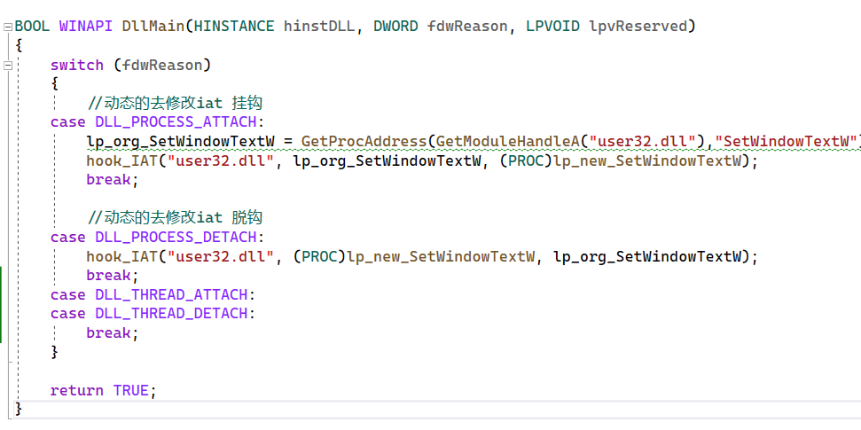

比如上面这个dll

他的特征就是一个switch case

然后case的情况是0-3,也就是小于4

于是根据这些特征我么就可能找到一个dll的main函数

```c
//文件名：test.idc
#include <idc.idc>
static main()
{
    auto x,y,dll_start,dll_end;
    auto FBin,FBin2;
    dll_start=0x6bfb0000;
    dll_end=dll_start+0x00020000;
    FBin = "83 BD";
    FBin2 ="55 8B EC";
    Message("|-----BEGIN-----|\n");
    for (x = FindBinary(dll_start,SEARCH_DOWN,FBin);x < dll_end;x = FindBinary(x,0x03,FBin))
    {    
        x=x+6;
        if(Byte(x)<4)
        {         
            x=x+1;
            if(Byte(x)==0x74)
            {
                y = FindBinary(x,SEARCH_UP,FBin2);
                if(y!=0&&y!=-1)
                {
                    Message("%X\n",y);
                }         
               // AddBpt(地址); //添加一个断点
            }
        }
    }
    Message("|------END------|\n");
}
```

可以看到它其实是在定位一些字节

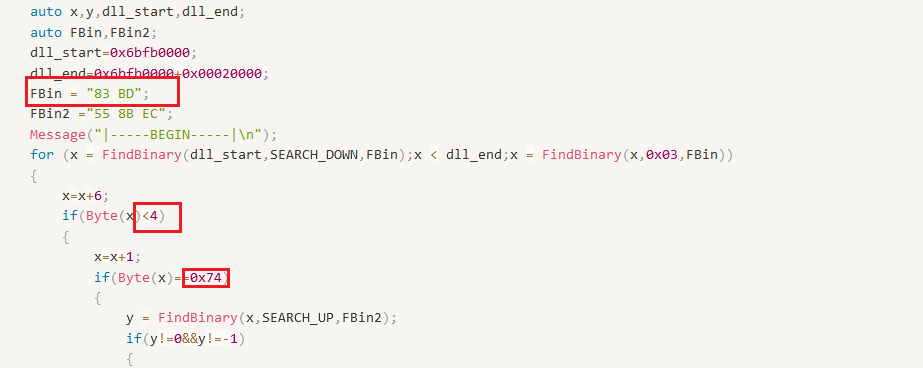

这些特征都是基于汇编的字节码

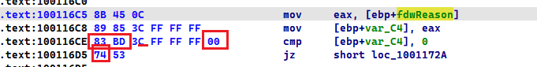

当匹配到这些特征后,又往上找

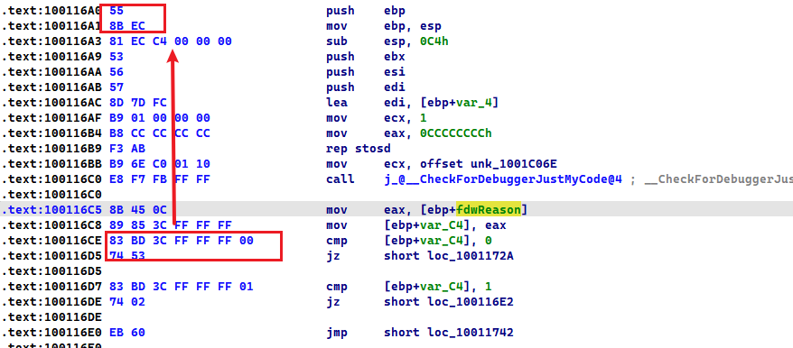

找到后,就是Dllmain的东西

我们以远程现场之dll注入为例子

把目标进程调试选项设置为当dll载入的时候,停止下来

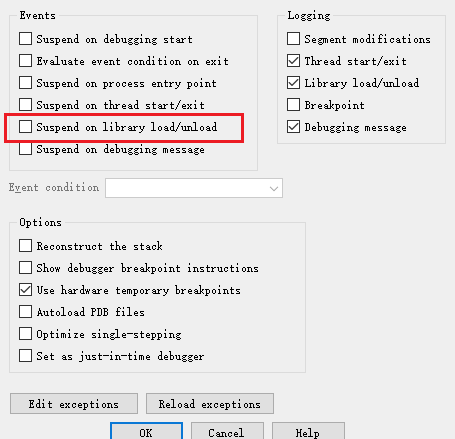

当停下来之后, 我们的dll就被注入进去了

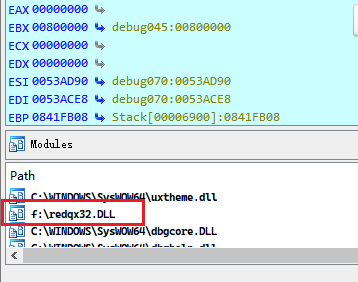

然后就派上我们的IDC脚本

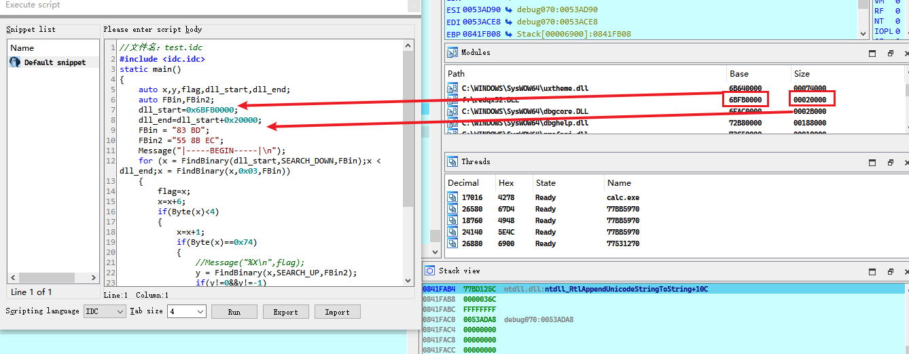

运行如下

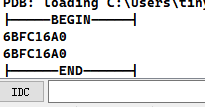

去往对应的地址,C一下,再P一下

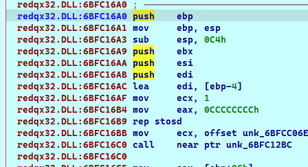

于是我们的Dllmain就找到了

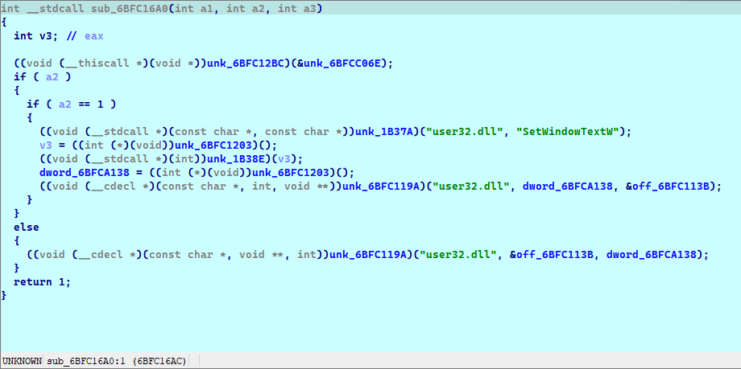

### 其它情况

其实就是拿到dll后,具体的分析

比如下面这个dll就不再符合之前的情况了

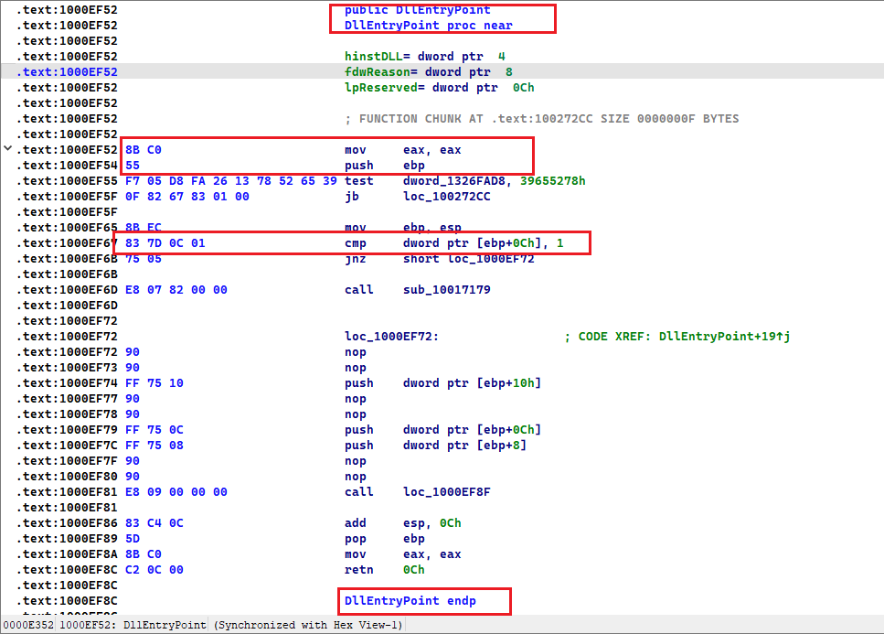

他的标志是 83 7D 0C 01 

所以最好的办法,还是直接知道标志,然后开找

于是就使用第二套脚本

```c
//文件名：test.idc
#include <idc.idc>
static main()
{
    auto x,dll_start;
    auto FBin;
    
    dll_start=0x6B7C0000;
    FBin = "8B C0 55 F7 05";
    Message("|-----BEGIN-----|\n");
    x = FindBinary(dll_start,SEARCH_DOWN,FBin);
    if(x!=-1)
    {
        Message("%x\n",x);
    }

    Message("|------END------|\n");
}
```

其实之前的查找是假设自己只知道一些特征,然后根据那些特征去匹配

如果我们都知道具体的值了,就直接精准匹配

但是有个小bug

你匹配的越精准,就越不容易找打

比如,我们有

```c
F7 05 D8 FA 26 13 78 52 65 39
```

但是最好别匹配这么多

也就匹配

```c
F7 05 D8 FA
```

亲自尝试过,发现过于精准会引起idc的烦劳

## x64的dll

后来遇到x64的dll,看来不得不去下断点

关于switch case 还是一样的匹配

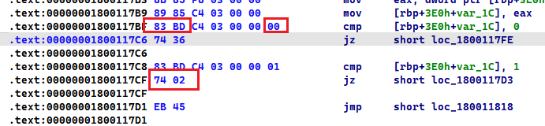

只不过x64的dll面开头不再是push ebp了

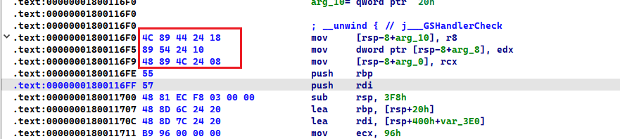

获取那3个参数就是一个特征

```c
//文件名：test.idc
#include <idc.idc>
static main()
{
    auto x,y,dll_start,dll_end;
    auto FBin,FBin2;
    dll_start=0x00000001800116F0;
    dll_end=dll_start+0x000100;
    FBin = "83 BD";
    FBin2 ="4C 89 44 24 18 89 54 24 10 48 89 4C 24 08";
    Message("|-----BEGIN-----|\n");
    for (x = FindBinary(dll_start,SEARCH_DOWN,FBin);x < dll_end;x = FindBinary(x,0x03,FBin))
    {    
        x=x+6;
        if(Byte(x)<4)
        {         
            x=x+1;
            if(Byte(x)==0x74)
            {
                y = FindBinary(x,SEARCH_UP,FBin2);
                if(y!=0&&y!=-1)
                {
                    Message("%X\n",y);
                }         
               // AddBpt(地址); //添加一个断点
            }
        }
    }
    Message("|------END------|\n");
}
```

# 函数的断点

## x86函数

### 基于push ebp特征

他是往回找0x55字节罢了

```c
//文件名：test.idc
#include <idc.idc>
static main()
{
    auto x,dll_start,dll_end;
    dll_start=0x10002F3C;
    dll_end=dll_start  -  0x000200 ;
    Message("|-----BEGIN-----|\n");
    for (x = dll_start ;x > dll_end;x = x -1 )
    {    
        
        if(Byte(x)==0x55)
        {
            Message("%x\n",x);
        }
    }
    Message("|------END------|\n");
}
```