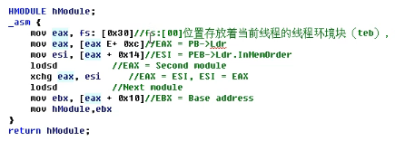
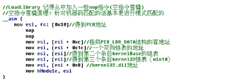

# 寻找kernel32基地址

# 内存分布示意图

# 如何寻找 kernel32

# 方法1: ESP

缺点：条件比较苛刻，需要获取ep那个时候的环境

way1是从一个最高可读地址往低处遍历模块,然后遍历他的导出表情况,然后遍历是否有GetProessAddress()情况

在exe进入start的时候

栈的情况

这是进入exe模块EP的最初始栈的情况

然后通过该栈的地址768B00C9

往上找,从768B0000往上找,找到的第一个就是kernel32.dll的模块

所以的话,我们连导出表都不用判断了

ps:有些强制类型转化没有写出来

通过方法way1升级版我们可以实现函数的导入

参考代码在。./res/way1_esp.c

# 方法2: SEH

# 方法3: Ldr

其实就是遍历自身模块, 有个结构体就专门记录了自身所有的模块

但是 基于 Ldr 的，它也有很多种书写形式

