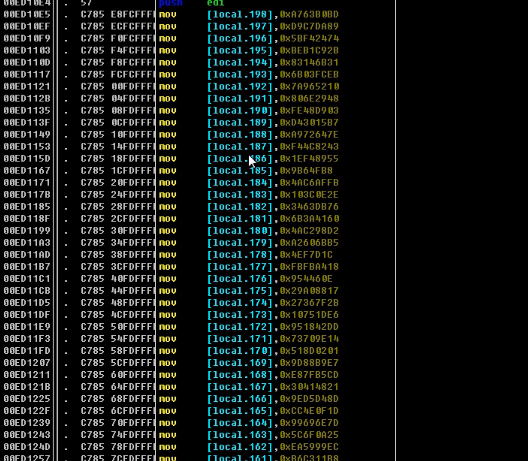

其实就是一个行为的分析,判断是不是一个恶意的行为

比如先调用OpenProcess,然后又调用了VirtualAlloc,然后又CreateRemoteThread

杀软就会根据这个特征匹配或者判断出,你将要干嘛,然后把你Kill掉

逃过机器学习:

通过异常的方式,比如SEH的try catch

比如你在局部对战开辟了很大的栈空间就会被杀

比如下面这个shellcode放在栈里面

经过实践，如果把shellcode存放于全局不会被啥

ps： 一个正常的对战哪里这么长呀
