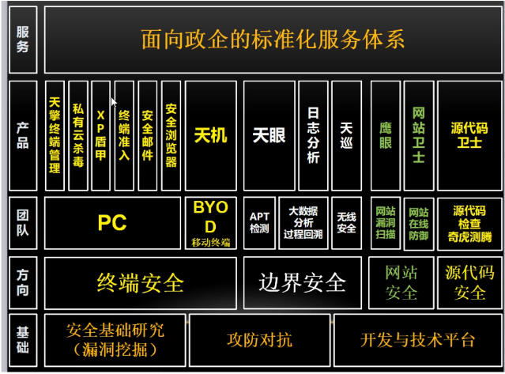
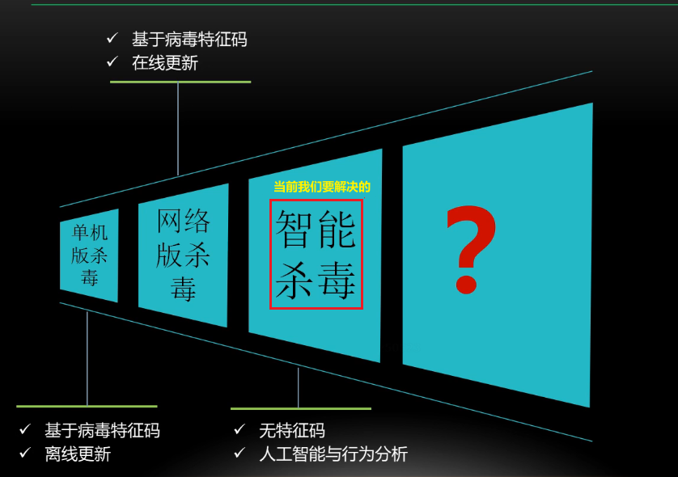
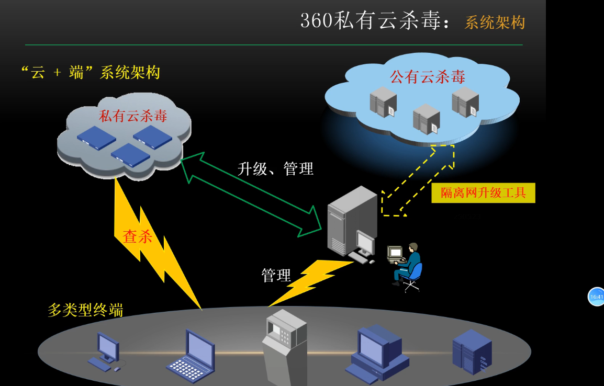
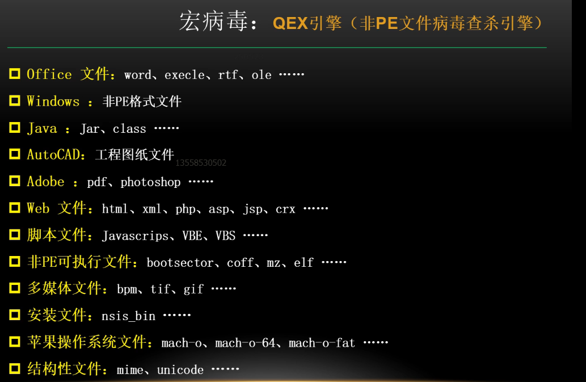
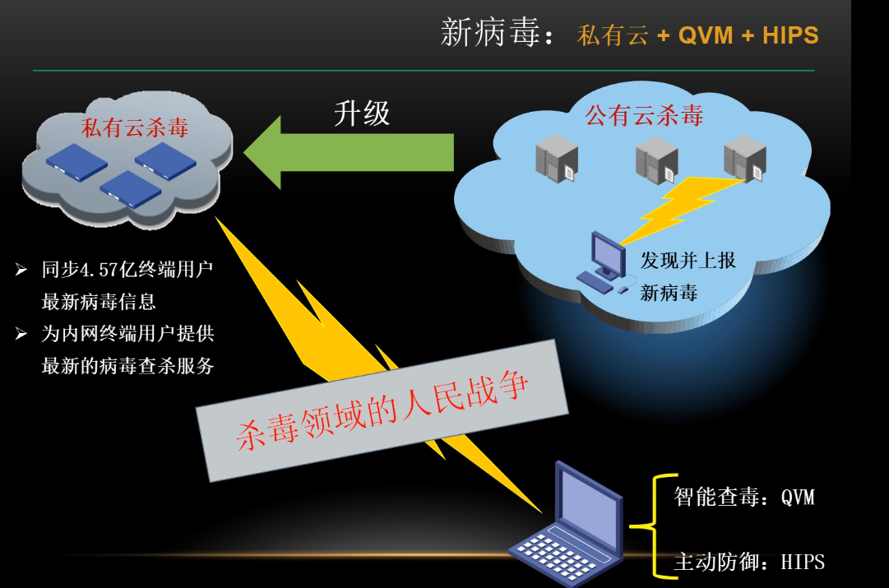
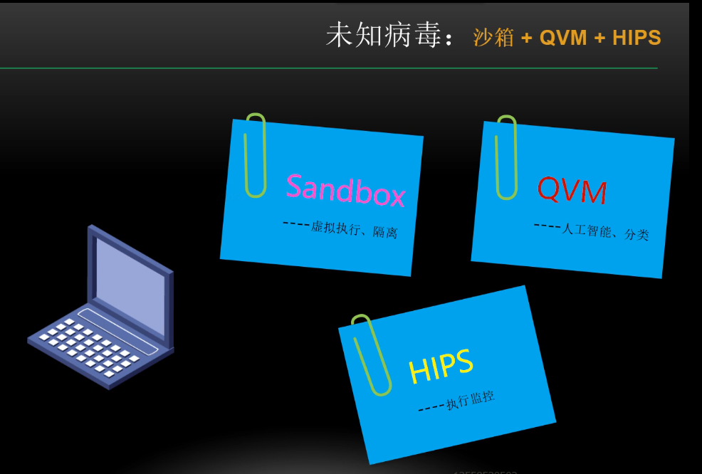
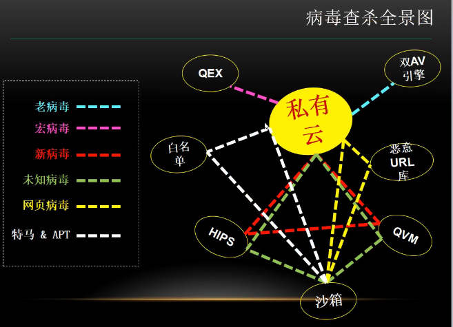

## 我们的的对手是谁?

Ty2y 杀毒软件开发手册: https://www.ihonker.com/thread-30189-1-1.html

源代码 https://github.com/w2sft/Ty2yAntiVirus

私有云杀毒..

终端安全EDR,边界安全..

杀软的演变

360架构

ps: 我们的样本可不可以做到断网的操作,比如我们用clash经常遇到的情况就是没有网

QVM是一套基于人工智能,深度学习的杀毒引擎

下面是3个维度查杀我们的样本

