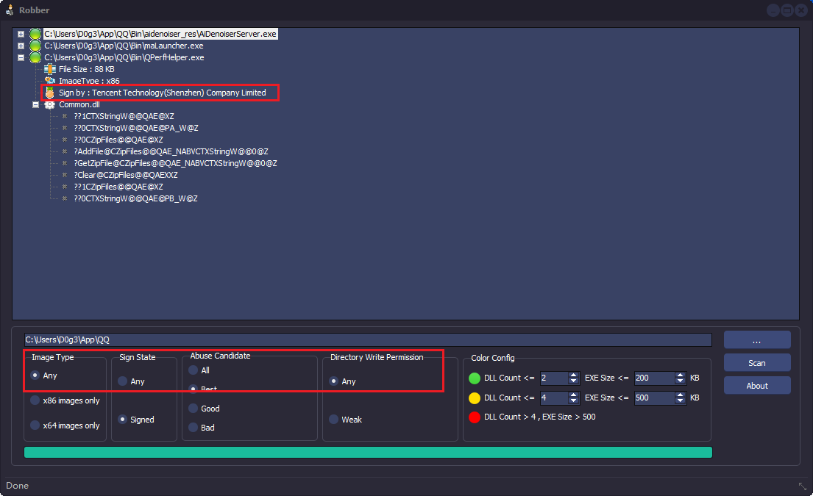

 


基础部分在 0.技术栈\1.安全\二进制安全\Windows篇\0.逆向篇\2.Injecter_Hook

# 动态加载漏洞: LoadLibrary


路径加载的漏洞

DllMain 执行漏洞

虽然杀软可以也可以校验dll的正确性,也可以反Hook


# Hook操作

其中有很多对DLL的Hook操作

在对函数模拟这一方面: 对一个类和类的函数模拟就比较恶心

## 1), 文件的劫持

容易玩火自焚,玩不好,把系统搞崩溃


分为2种情况


> 大概原理:

```
xxx.exe
yyy.dll
```

劫持后

```
xxx.exe
yyy.dll (假的dll)
zzz.dll (原身是yyy.dll,被rename了)
```

然后xxx.exe要做的所以事情都可以通过yyy.dll做一个代理转发

然后 这个过程代理转发中又可以做很多的坏事情

但是因为得真实模拟yyy.dll所以玩不好导致自焚,期间还要处理多线程问题


相关项目:

https://github.com/strivexjun/AheadLib-x86-x64


## 2) 老套的Hook


比如对导入表下手,修改IAT的成员

比如inline Hook

其中比较麻烦的是对所有的导出函数做一个处理,容易导致程序崩溃

 


# 白名单文件负载黑DLL

这个操作虽然是基于白名单, 也就是说载体是白名单文件

但是利用的技术仍然是前面几种


白名单文件: 一个文件的哈希值被信任

可以是带有Microsoft的二进制文件，例如office软件

也可以是Microsoft系统目录中二进制文件

也可以是第三方认证签名程序


## 常见的白名单程序

```
Rundll32.exe、Msiexec.exe、MSBuild.exe、InstallUtil.exe、
Mshta.exe、Regsvr32.exe、Cmstp.exe、CScript.exe、
WScript.exe、Forfiles.exe、te.exe、Odbcconf.exe、
InfDefaultInstall.exe、Diskshadow.exe、PsExec.exe、
Msdeploy.exe、Winword.exe、Regasm.exe、Regsvcs.exe
、Ftp.exe、pubprn.vbs、winrm.vbs、slmgr.vbs、
Xwizard.exe、Compiler.exe、IEExec.exe、
MavInject32、Presentationhost.exe、Wmic.exe、
Pcalua.exe、Url.dll、zipfldr.dll、Syncappvpublishingserver.vbs
```

具体更多白名单文件也可以去 https://lolbas-project.github.io/ 看看


 

## DLL是如何被加载的

1), 导入表加载,

2), exe模块LoadLibrary一个dll, 其中也可能会存在DLL的哈希校验, 也可能存在DLL加载路径是一个写死的路径

3), dll模块去LoadLibrary一个dll, 其中也可能会存在DLL的哈希校验, 也可能存在DLL加载路径是一个写死的路径


## 关于主动加载DLL的一个h校验


比如说是否在当前目录下的dll

比如路径是否在360文件夹下

比如文件的MD5值是否正确

比如文件大小是否正确

ps: 导入表加载不可能存在hash校验


## 如何判断有没有hash校验


看是否能够运行到LoadLIrary,如果运行到LoadLIrary

就说明我们就可以直接加载DLLMain了


## 如何判断LoadLIbrary的路径是不是写死的路径

> 方法1:直接运行

你把exe单独拖到任意路径,

如果看到exe仍然可以运行

那么大概说明该DLL的路径不是写死的

ps: 如我是开发着,在第一次安装的时候,我就会记录当前文件位置环境并写死到全局的环境变量

,那么exe在任意地方加载dll都可以对环境做一个检查,

要么直接导向全局变量的环境

要么判断当前环境是否异常


> 方法2:调试

对LoadLibraryA/W下断点,看写入的路径是不是一个绝对路径


>方法3:静态查看

其实就是拖进IDA看


案例:

https://mp.weixin.qq.com/s/1WEglPXm1Q5n6T-c4OhhXA

https://mp.weixin.qq.com/s/XPrBK1Yh5ggO-PeK85mqcg


## 一款工具,可以寻找当前环境的白名单文件

https://github.com/MojtabaTajik/Robber

比如你给他一个目录给他扫描

他就会返回哪些是被签名的文件


比如我么扫描QQ的目录为例子,就可以看到他的很多签名文件

