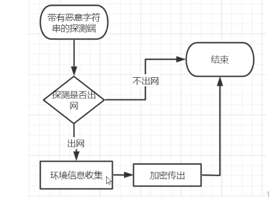
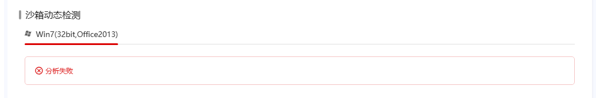

沙盒测试,虚拟执行

比如他会对你上传的exe进一个一个远程线程注入,然后检查你自己的有些行为


做到你打我3下,我还你7下

和他们玩捉迷藏

反正在思维方面要活跃起来




GitHub 大佬介绍 https://github.com/timwhitez


手法:

增加时间延迟


这个代码让微步云 分析很久,消耗平台的资源

```c
#include<Windows.h>
#include <stdio.h>
void CALLBACK TimerProc(HWND hWnd, UINT nMsg, UINT nTinerid, DWORD duTine)
{
	printf("hi i am sex-lover\n");
	return;
}
int main()
{
	SetTimer(0, 0, 1000, TimerProc);
	MSG msg;
	while (GetMessage(&msg, NULL, 0, 0))
	{
		if (msg.message == WM_TIMER)
			DispatchMessage(&msg);
	}
	return 0;
}


```

于是




虽然程序本身就是没有的消耗时间的资源哈
