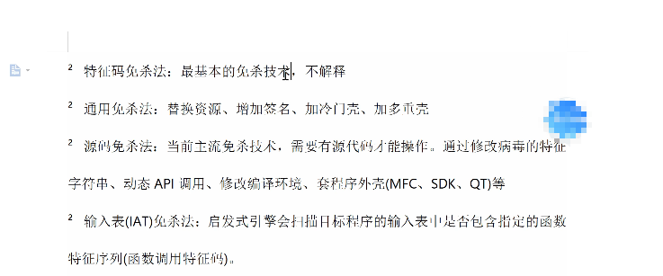

首先加壳 只是增加了危险指数,但是不一定会被杀

所以不要说加壳就已经过时了

可用于 动态查杀和静态查杀

加壳,加花

加壳容易被贴上高危恶意程序,也就是杀软的反汇编引擎,深度学习系统,AI人工智能就会检测到

但是加壳不一定有错,只不过是加壳看,容易被杀

加壳:

会有壳的一些特征码,对于可以脱壳的,此刻呢,我们就可以去混淆特征码这些什么操作的

对于无法脱壳的引擎,当然可以让绕过静态反汇编

加花 

:可以绕过静态的反编译

可以对多种壳了解一下

比如怎么用,有什么效果,

UPX,Aspack,北斗

还有就是各种壳都可以尝试去脱壳.去逆向一下

首先加壳 只是增加了危险指数,但是不一定会被杀

提交到的一些开源的加壳软件

关键字: jiake , stubdll

